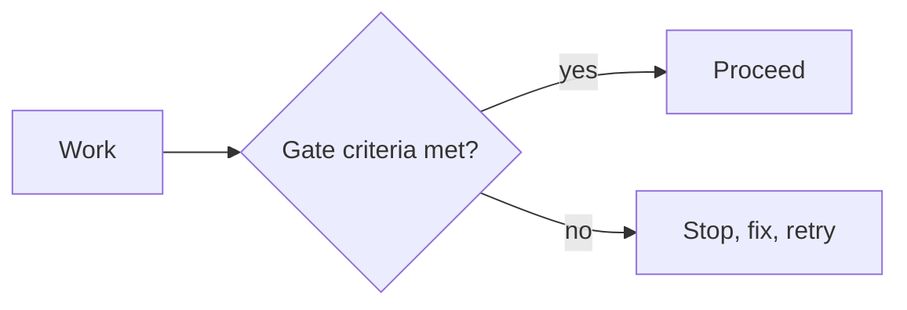
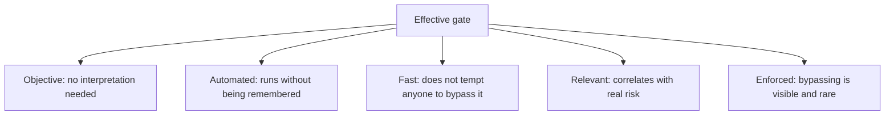

# Quality Gates

A **quality gate** is a criterion that must be met before work proceeds to the next stage.
Its purpose is to make the standard explicit and automatic, so that it does not get
renegotiated at the moment it is most inconvenient.

## Gates along the path

| Gate | Typical criteria |
|---|---|
| **Definition of ready** | Acceptance criteria that can pass or fail, dependencies known, small enough to finish |
| **Pull request** | Tests pass, review approved, no new high-severity static findings, coverage of changed lines maintained |
| **Merge to main** | Integration suite green, contracts verified, build reproducible |
| **Release candidate** | Key journeys pass, no open critical or high defects, performance budgets met, security scan clean |
| **Deployment** | Smoke checks pass after deploy, rollback tested and available |
| **Definition of done** | Tested, documented, deployed, monitored, and no known critical defects |

## What makes a gate work

An unmet criterion must actually stop the work. A gate that is routinely overridden is not a
gate, it is a warning message with extra ceremony, and its existence gives false assurance
to everyone reading the process document.

## Choosing criteria that survive contact

| Weak criterion | Better criterion |
|---|---|
| Code quality is acceptable | No new high-severity static analysis findings |
| Sufficient test coverage | Coverage of changed lines at or above the threshold |
| Performance is adequate | Key endpoint p95 not regressed by more than 10% against baseline |
| Security has been considered | No new critical or high vulnerabilities in dependencies |
| Testing is complete | All planned high-risk conditions executed, remaining risks recorded and accepted |

Gate on the **delta** wherever possible. A project-wide coverage threshold on a legacy
codebase is either impossible or gamed, whereas "do not make the changed lines worse" is
fair, achievable and still improves the codebase over time.

## Failure modes

| Failure | Effect |
|---|---|
| **Too many gates** | The pipeline becomes slow, and people batch changes to avoid it |
| **Subjective criteria** | Arguments at the worst possible moment |
| **Routine overrides** | The gate stops meaning anything, but the process document still claims it |
| **Vanity metrics** | Effort goes to the number rather than to the risk, for example coverage farming |
| **Gates without owners** | A red gate nobody owns stays red |
| **Late-only gates** | All the friction lands just before release, which is where schedules break |

The last one is worth stating plainly: gates should be distributed along the path, weighted
early. A single large gate before release is a phase gate, and it produces exactly the
crunch that [shift-left](Shift-Left%20Testing.md) exists to avoid.

## Keeping them honest

- **Review the criteria periodically.** A gate that has never failed is either redundant or
  set too low.
- **Track overrides.** A rising override rate is the earliest signal that a gate is
  mis-tuned or too slow.
- **Tie each gate to a risk.** If nobody can say which failure a gate prevents, delete it.
- **Automate the evidence, not the judgement.** Where a human decision is genuinely needed,
  such as accepting residual risk, record who accepted it and what they accepted.

## Check Your Understanding

<quiz>
What distinguishes a real quality gate from a warning?

- [ ] It is defined in the team's process documentation
- [x] Unmet criteria actually stop the work, and bypassing it is visible and rare
> Correct. A routinely overridden gate provides false assurance while costing time.
- [ ] It is evaluated by a person rather than automatically
- [ ] It runs only at release time
</quiz>

<quiz>
Why prefer gating on a delta rather than an absolute value?

- [ ] Because absolute thresholds are harder to compute
- [x] Because delta gates are achievable on legacy codebases and still enforce improvement, while absolute thresholds are either impossible or gamed
> Correct. "Do not make the changed lines worse" is fair and effective.
- [ ] Because deltas are less sensitive to flaky tests
- [ ] Because absolute thresholds cannot be applied to security findings
</quiz>
