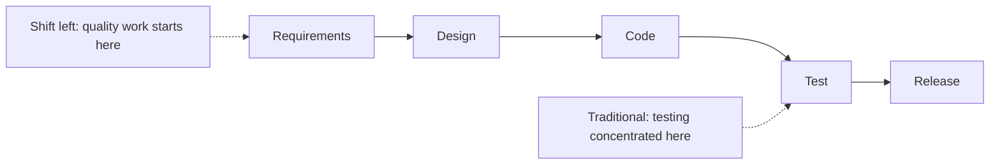
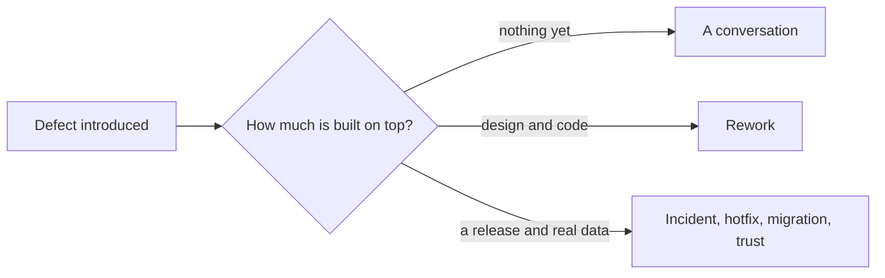

# Shift-Left Testing

**Shift-left testing** moves quality activity earlier in the life cycle, toward the left of
a timeline drawn from requirements to release. The motivation is the cost curve: a defect
gets more expensive the more work is built on top of it.

## What actually moves left

The phrase is often reduced to "write more unit tests", which misses most of it.

| Activity | Moved to |
|---|---|
| Reviewing requirements for ambiguity and missing rules | Refinement, before estimation |
| Agreeing concrete examples and acceptance criteria | Before development, see [ATDD](../Testing%20Approaches/Acceptance%20Test-Driven%20Development.md) |
| Writing tests | Before or with the code, see [TDD](../Testing%20Approaches/Test-Driven%20Development.md) |
| Static analysis, type checking, secret scanning | Editor and pre-merge |
| Security threat modelling | Design |
| Accessibility decisions | Design system and component level |
| Performance budgets | Per-commit checks on key endpoints |
| Testers' involvement | Story refinement rather than after code complete |

The first two rows deliver the most value and involve no automation at all. The cheapest
defect to fix is one that a fifteen-minute conversation prevented from being built.

## Why it works

Nothing about the defect changes. What changes is the amount of dependent work that must be
unwound, which is why the cost grows with time rather than with complexity.

## Common misreadings

| Misreading | Reality |
|---|---|
| "Shift left means testers write code" | It means testing perspectives arrive earlier. Some of it is conversation, not code |
| "Shift left replaces later testing" | System, acceptance and production testing still exist. See [shift right](Shift-Right%20Testing.md) |
| "Shift left is just more unit tests" | Requirement review and example mapping usually return more |
| "Shift left means no testers" | It means testers work upstream, where their skill at finding ambiguity pays most |
| "Automate everything early" | Automating an unstable interface early costs more than it saves |

## Making it real

- **Involve testers in refinement.** Their question is "how would I know this works", and
  asking it before estimation changes the story rather than the release.
- **Define ready as well as done.** A story is not ready without acceptance criteria that
  can pass or fail.
- **Put fast checks in the inner loop.** Type checks, linters and unit tests on save give
  feedback in seconds, which is where they change behaviour.
- **Gate early and cheaply.** Static analysis and unit tests on every pull request cost
  minutes and reject a large class of defect before anything expensive runs.
- **Feed defects back upstream.** Every escaped defect should answer "which earlier activity
  could have caught this", which is [root cause analysis](../Defects/Root%20Cause%20Analysis.md)
  aimed at the process.

## Check Your Understanding

<quiz>
Which shift-left activity typically returns the most for the least effort?

- [ ] Adding unit tests to legacy modules
- [x] Reviewing requirements and agreeing concrete examples before development starts
> Correct. It prevents whole classes of defect at conversation cost, with no automation involved.
- [ ] Running the full end-to-end suite on every commit
- [ ] Automating the user interface early in the project
</quiz>

<quiz>
Why does a defect become more expensive the later it is found?

- [ ] Because later defects are inherently more complex
- [x] Because more dependent work has been built on top of it, and all of that has to be unwound along with the fix
> Correct. The defect itself does not change, only the amount of work resting on it.
- [ ] Because testing teams charge more than developers
- [ ] Because later defects are found by users rather than testers
</quiz>
