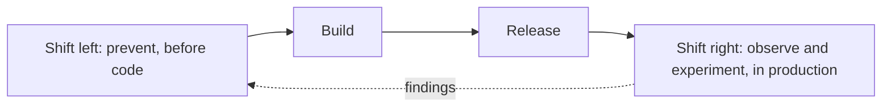
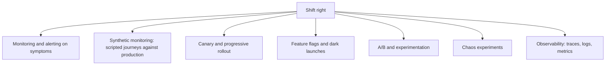
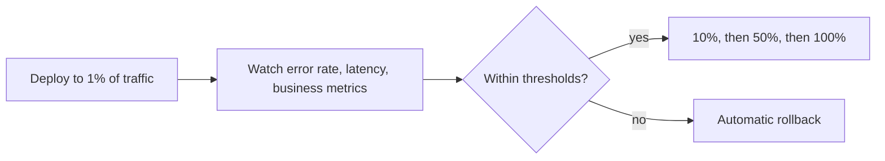

# Shift-Right Testing

**Shift-right testing** extends quality activity into production: observing, experimenting
and verifying against real users, real data and real infrastructure.

It is not the opposite of [shift left](Shift-Left%20Testing.md). Both are needed, because
they cover different things: shift left prevents defects cheaply, shift right finds what no
pre-production environment can reproduce.

## What only production can tell you

| Question | Why staging cannot answer it |
|---|---|
| How does it behave under real traffic patterns? | Synthetic load models what you imagined, not what users do |
| What does real data look like? | Production data is messier, larger and stranger than any fixture |
| Do real users succeed at the task? | Only real users have real intent |
| How does it fail when a dependency degrades? | Real degradation is partial, intermittent and correlated |
| Is the feature worth having? | Usage is the only honest answer |

## The techniques

| Technique | Verifies |
|---|---|
| **Monitoring on symptoms** | That real behaviour matches expectations, continuously |
| **Synthetic journeys** | That the critical path works right now, even at low traffic hours |
| **Canary release** | That a new version behaves on a small share of real traffic, with automatic rollback |
| **Dark launch** | That new code handles real production load before anyone sees its output |
| **A/B experiment** | Whether the change actually improves the outcome it was built for |
| **Chaos experiment** | That resilience mechanisms work when a real dependency fails |

## Canary releasing as a test

The essential parts are the metrics and the automatic rollback. A canary nobody watches is
just a slow deployment, and one that requires a human to notice a problem at 3am is a canary
that fails when it matters.

## Prerequisites

Shift right is dangerous without groundwork, because the experiments run on real users.

- **Observability first.** Testing in production without the ability to see what happened is
  guessing with real consequences.
- **Fast, reliable rollback.** The value depends on being able to undo quickly.
- **Feature flags with a kill switch**, so exposure can be withdrawn without a deploy.
- **Error budgets or explicit thresholds**, so "is this acceptable" is decided in advance
  rather than during an incident.
- **Data protection.** Real data means real obligations, and test traffic must not corrupt
  real records or trigger real charges.

See [testing in production](Testing%20in%20Production.md) for the practices in detail.

## Check Your Understanding

<quiz>
What is the relationship between shift left and shift right?

- [ ] Shift right replaces pre-release testing once monitoring is mature
- [x] They are complementary: shift left prevents defects cheaply, shift right finds what no pre-production environment can reproduce
> Correct. Real traffic, real data and real failure modes are only available in production.
- [ ] Shift right applies only to non-functional requirements
- [ ] Shift left applies to developers and shift right to operations
</quiz>

<quiz>
What makes a canary release a genuine test rather than a slow deployment?

- [ ] Deploying to a small percentage of servers first
- [x] Watching defined metrics against thresholds with automatic rollback when they are breached
> Correct. Without automated observation and rollback, nothing is being verified.
- [ ] Running the end-to-end suite against production after deployment
- [ ] Enabling the feature for internal users before customers
</quiz>
