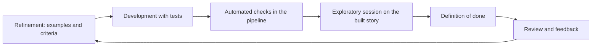
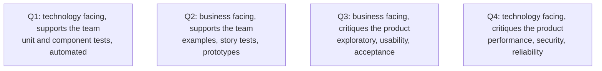

# Testing in Agile

In [agile](../../Methodologies/Agile/index.md) delivery there is no testing phase, because
there is no phase at the end to put it in. Testing happens inside every iteration, on work
that is incomplete, by the whole team.

## What changes compared with phase-based testing

| | Phase-based | Agile |
|---|---|---|
| **When** | After construction | Continuously, per story |
| **Who** | A separate team | The whole team |
| **Planning artefact** | A test plan document | [Definition of done](../../Methodologies/Scrum/Definition%20of%20Done.md) plus acceptance criteria |
| **Regression** | A manual pass before release | Automated, on every commit |
| **Entry criteria** | Formal handover | The story is ready |
| **Exit criteria** | Sign-off | Done means done, every time |

## The agile testing quadrants

Brian Marick's model, still the clearest way to check nothing is being ignored.

| Quadrant | Automation | Common failure |
|---|---|---|
| Q1 | Fully automated | Rarely neglected |
| Q2 | Mostly automated | Skipped when stories go to development without examples |
| Q3 | Manual by nature | Squeezed out by sprint pressure, which is where surprises come from |
| Q4 | Tooling assisted | Deferred until a production incident forces it |

A team doing only Q1 and Q2 ships software that passes its own expectations and fails on the
ones nobody had.

## Testers in an agile team

The role moves upstream rather than disappearing.

- **Refinement.** Asking "how would we know this works" before estimation, which changes the
  story rather than the release.
- **Examples.** Contributing the edge cases in the [three amigos](../Testing%20Approaches/Acceptance%20Test-Driven%20Development.md)
  conversation.
- **Exploratory testing.** The work automation cannot do, on each new story.
- **Test architecture.** Deciding what belongs at which level and keeping the
  [pyramid](../Automated%20Testing/Test%20Automation%20Pyramid.md) upright.
- **Coaching.** Helping developers test better, which scales further than testing personally.

## Practices that keep it working

| Practice | Purpose |
|---|---|
| **Definition of done includes tests** | Prevents a growing tail of untested "finished" work |
| **No separate testing sprint** | A hardening sprint is a phase gate rediscovered |
| **Slice stories thin** | Small stories are testable within the iteration |
| **Test in-iteration, not next iteration** | Testing a sprint behind recreates the handoff |
| **Automate regression continuously** | Otherwise manual regression grows until it consumes the iteration |
| **Fix red immediately** | A broken build blocks the whole team by design |

The classic anti-pattern is testing running one iteration behind development. It looks like
agile and behaves exactly like a phase gate, with the added cost that developers have moved
on by the time defects arrive.

## Check Your Understanding

<quiz>
A team develops in one sprint and tests that work in the next. What is the problem?

- [ ] Nothing, provided both sprints have a definition of done
- [x] It recreates the handoff and the phase gate, with feedback arriving after the developers have moved on
> Correct. Stories should be tested within the iteration in which they are built.
- [ ] It requires more automation than testing in the same sprint
- [ ] It prevents the use of the agile testing quadrants
</quiz>

<quiz>
Which testing quadrant is most often squeezed out by sprint pressure, and why does it matter?

- [ ] Q1, because unit tests take developer time
- [x] Q3, the business-facing critique work such as exploratory and usability testing, which is where unanticipated problems are found
> Correct. Automated quadrants only confirm expectations the team already had.
- [ ] Q2, because examples are agreed during refinement
- [ ] Q4, because performance tooling is expensive
</quiz>
