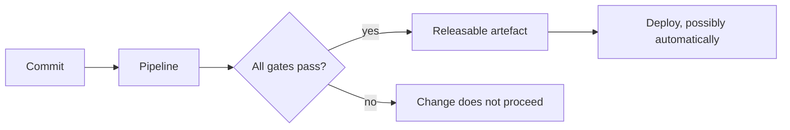
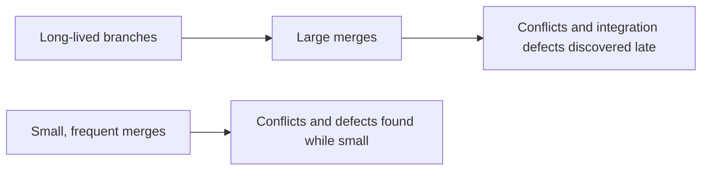

# Testing in CI/CD

Continuous integration and continuous delivery change what testing is for. In a phase-based
process, testing produces a report for a release decision. In CI/CD, testing *is* the
release decision, made automatically, many times a day.

[Automated testing in CI/CD](../Automated%20Testing/Automated%20Testing%20in%20CI-CD.md)
covers the pipeline mechanics. This page is about what that implies for a testing strategy.

## What CI/CD demands of a test strategy

| Demand | Consequence |
|---|---|
| **Every commit is a release candidate** | Manual regression cannot be in the path, at any size |
| **Feedback in minutes** | The [pyramid](../Automated%20Testing/Test%20Automation%20Pyramid.md) shape is mandatory, not advisory |
| **Automated decisions** | Every gate must be objective, with no human interpretation |
| **No stabilisation phase** | Quality must be continuous, since there is no window to fix it in later |
| **Zero tolerated flakiness** | An unreliable gate is not a gate, see [flaky tests](../Test%20Quality/Flaky%20Tests.md) |

The first row is the hardest for teams moving from a phase-based process: any manual step in
the release path caps deployment frequency at how often people can perform it.

## Continuous integration means integrating

CI is not "we have a build server". It is everyone merging to trunk at least daily, with an
automated suite proving the trunk still works.

Long-lived feature branches defer exactly the integration risk that CI exists to surface,
which is why trunk-based development and feature flags usually accompany it.

## Deciding what gates and what does not

| Runs | Gates the merge | Reason |
|---|---|---|
| Lint, type check, unit | Yes | Seconds, and highest defect density per second |
| Integration and API | Yes | Minutes, catches the seams |
| Key end-to-end journeys | On merge to main | Slow, and small in number |
| Full compatibility matrix | No, scheduled | Too slow, low marginal value per run |
| Performance and security scans | Threshold-based, scheduled | Long-running, needs trend context |
| Exploratory testing | No | Human, not a gate, but still required before release |

Exploratory work sits outside the pipeline and is not optional. A fully automated pipeline
verifies expectations the team already had, and that is precisely the coverage exploratory
testing extends.

## Continuous delivery and continuous deployment

| | Continuous delivery | Continuous deployment |
|---|---|---|
| **Every passing build is** | Releasable | Released |
| **Release decision** | Human, one button | Automatic |
| **Additional requirement** | Confidence in the gates | Plus fast rollback, canary, monitoring |

Moving from the first to the second is not a tooling change, it is a statement that the
automated gates are trusted enough to release without a human. That trust has to be earned
with data: escaped defect rate, gate reliability and rollback time.

## Where testing continues after the gate

The pipeline ends at deployment, quality work does not. Post-deploy smoke checks, canary
analysis, monitoring and alerting are the continuation, and they are covered in
[shift-right testing](Shift-Right%20Testing.md) and
[testing in production](Testing%20in%20Production.md).

## Check Your Understanding

<quiz>
Why can manual regression testing not sit in the release path under continuous delivery?

- [ ] Because manual testing is less accurate than automation
- [x] Because any manual step caps release frequency at how often people can perform it, and every commit is meant to be a release candidate
> Correct. Manual effort still belongs in the process, as exploratory work outside the gating path.
- [ ] Because pipelines cannot record manual results
- [ ] Because manual testing cannot produce objective pass or fail verdicts
</quiz>

<quiz>
What actually distinguishes continuous deployment from continuous delivery?

- [ ] The presence of automated end-to-end tests
- [x] Releasing without a human decision, which requires enough trust in the gates plus fast rollback, canary analysis and monitoring
> Correct. It is a statement about trust in the evidence, not a tooling upgrade.
- [ ] Deploying multiple times per day rather than weekly
- [ ] Using feature flags instead of long-lived branches
</quiz>
