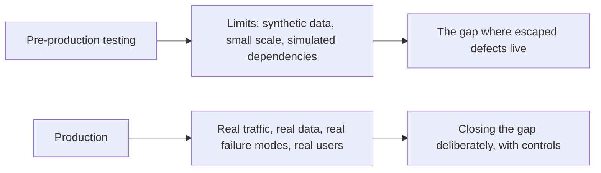
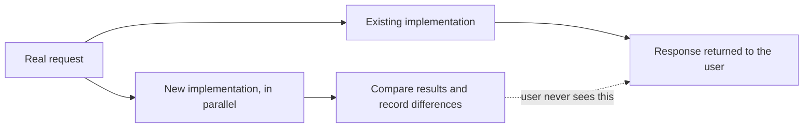

# Testing in Production

**Testing in production** means deliberately verifying behaviour in the live environment,
under real traffic, real data and real infrastructure. It is the concrete form of
[shift-right testing](Shift-Right%20Testing.md).

The phrase sounds reckless and is not, provided the groundwork exists. What is reckless is
the alternative that most teams practise by default: releasing to production and finding
out from users.

## The practices

| Practice | What it verifies | Main control |
|---|---|---|
| **Post-deploy smoke checks** | The deployment is live and serving correctly | Automatic rollback on failure |
| **Synthetic monitoring** | Critical journeys work right now, including at low-traffic hours | Alerting on failure |
| **Canary release** | A new version behaves on a small traffic share | Metric thresholds, automatic rollback |
| **Dark launch** | New code handles real load before its output is shown | Output discarded, comparison logged |
| **Feature flags** | Exposure controlled per user, cohort or percentage | Kill switch without a deploy |
| **A/B experiment** | Whether the change improves the intended outcome | Predefined metrics and duration |
| **Chaos experiment** | Resilience mechanisms work against real failure | Small blast radius, automatic abort |
| **Monitoring and alerting** | Continuous verification against real usage | Symptom-based alerts, error budgets |

## Dark launching, worth understanding

The new code path handles genuine production traffic, at full scale, with real data, while
the user still receives the old result. Differences are logged and analysed. For risky
rewrites of pricing, search or ranking logic this gives evidence that no staging environment
could produce.

## The preconditions

Testing in production without these is not a strategy, it is an outage schedule.

| Precondition | Why |
|---|---|
| **Observability** | Without traces, metrics and logs you cannot tell what happened |
| **Fast, tested rollback** | Everything else depends on being able to undo quickly |
| **Feature flags with a kill switch** | Withdraw exposure without waiting for a deploy |
| **Defined thresholds and error budgets** | "Is this acceptable" decided beforehand, not during |
| **Small blast radius** | Percentage rollouts and internal cohorts first |
| **Test data hygiene** | Synthetic traffic must not create real charges, emails or records |
| **Incident response** | Someone is watching, and knows what to do |

The test data row causes real damage when it is skipped. Synthetic journeys that place real
orders, send real emails or hit real payment endpoints have all happened, and each of them
is a self-inflicted incident.

## What it does not replace

Production verification finds what pre-production cannot. It does not substitute for cheap
early checks, because finding in production a defect a unit test would have caught means
paying the highest possible price for it. The two ends of the pipeline cover different
classes of problem, and a team that leans entirely on either one is exposed on the other.

## Check Your Understanding

<quiz>
What does dark launching verify that a staging environment cannot?

- [ ] That the user interface renders correctly for real users
- [x] That new code handles genuine production traffic, scale and data, by running it in parallel while the user still receives the existing result
> Correct. Differences between old and new are logged and analysed with no user exposure.
- [ ] That the deployment pipeline completes successfully
- [ ] That rollback works under load
</quiz>

<quiz>
Which precondition is most often skipped and causes self-inflicted incidents?

- [ ] Defining error budgets before the experiment
- [x] Test data hygiene, when synthetic traffic creates real orders, emails or payment charges
> Correct. Production testing acts on real systems, so the data path needs the same care as the code path.
- [ ] Running canaries before full rollout
- [ ] Recording which version each cohort received
</quiz>
