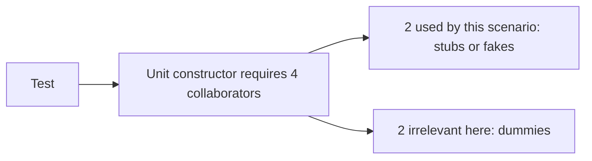
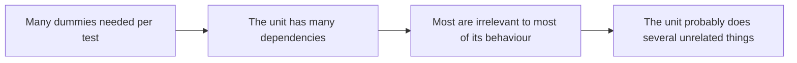

# Dummies

A **dummy** is a [test double](index.md) passed only to satisfy a signature. It is
never called, and if it were, failing loudly would be the correct response.



It is the simplest of the five doubles and the one most often written by accident, usually
as `None`, an empty object, or a bare instance with no configuration.

```python
def test_calculates_total_without_touching_notifications():
    checkout = Checkout(
        pricing=StubPricing(rate=0.9),
        orders=InMemoryOrders(),
        notifier=DummyNotifier(),   # this scenario sends nothing
        clock=FixedClock("2026-01-01"),
    )
    assert checkout.total(cart_of(100)) == 90
```

## Make it fail loudly

The one design decision a dummy has: what happens if it is called.

| Behaviour | Effect |
|---|---|
| **Raises on any call** | The best default, a silent assumption becomes a visible failure |
| **Returns `None` silently** | The unit may proceed with wrong data, and the test still passes |
| **`null` passed directly** | Fails with a confusing null error somewhere deep in the call stack |

A dummy that throws documents the intent exactly: "this scenario must not use the
notifier". If the code later starts sending notifications during a total calculation, the
test fails immediately and points at the real change in behaviour.

## Dummies as a design signal



Needing three dummies to construct an object in order to test one small method is the
constructor telling you that the class has more than one responsibility. The fix belongs in
the production code, by splitting the class or passing the dependency to the method that
actually needs it, not in more elaborate test setup.

This is the same design feedback that
TDD is prized for, arriving through
a different symptom.

## Reducing dummy noise

- **Test data builders.** A builder with sensible defaults lets each test override only what
  matters: `CheckoutBuilder().with_pricing(stub).build()`.
- **Default fakes in the builder.** Making the default a throwing dummy keeps unused
  collaborators honest while removing the setup from every test.
- **Optional parameters** with safe defaults, where the production design allows it.

The goal is that the test body shows the scenario and nothing else. Every line of setup that
is not part of the scenario is noise a future reader has to skip past.

## Check Your Understanding

<quiz>
What should a dummy do if it is unexpectedly called?

- [ ] Return a sensible default value so the test can continue
- [x] Raise an error, so a silent assumption becomes a visible failure that names the unexpected interaction
> Correct. A dummy documents that this scenario must not use the collaborator, and a throwing dummy enforces it.
- [ ] Record the call for later inspection, like a spy
- [ ] Delegate to the real implementation
</quiz>

<quiz>
A test needs three dummies just to construct the object under test. What is the most useful reading?

- [ ] The testing framework needs better default construction support
- [x] The class has too many dependencies for the behaviour being tested, which is a design signal to split it or move the dependency to the method that needs it
> Correct. The fix belongs in the production code, not in more elaborate test setup.
- [ ] The dummies should be replaced with mocks
- [ ] The test should be moved to the integration level
</quiz>
