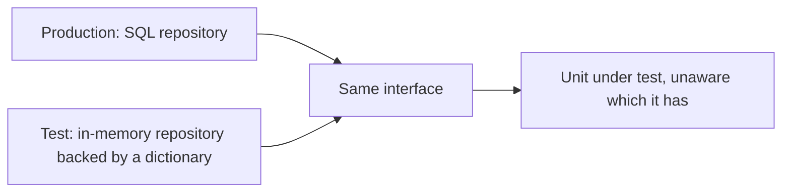
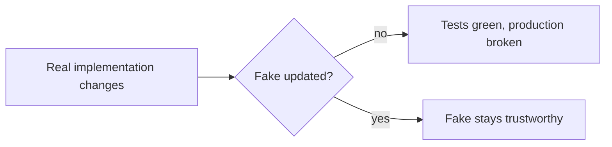

# Fakes

A **fake** is a [test double](index.md) with a real working implementation, just a
simplified one that is unsuitable for production. An in-memory repository, an in-process
message bus, an email sender that appends to a list.



Unlike a [stub](Stubs.md), a fake actually behaves: save then load returns what was saved,
a duplicate key is rejected, a query filters correctly. That behaviour is what makes it
usable across many tests without per-test configuration.

## Why fakes beat piles of stubs

| | Stubs everywhere | One shared fake |
|---|---|---|
| **Setup per test** | Configure every call the unit might make | Insert the data the scenario needs |
| **Unforeseen calls** | Return defaults or blow up | Behave correctly |
| **Readability** | Setup dominates the test | The scenario is visible |
| **Maintenance** | Every interface change touches many tests | One place to update |
| **Realism** | Encodes assumptions about the real thing | Encodes actual behaviour, simplified |

```python
class InMemoryOrders(OrderRepository):
    def __init__(self):
        self._rows = {}

    def save(self, order):
        if order.id in self._rows:
            raise DuplicateOrder(order.id)
        self._rows[order.id] = order

    def by_customer(self, customer_id):
        return [o for o in self._rows.values() if o.customer_id == customer_id]
```

Thirty lines written once replaces stub configuration in a hundred tests, and the duplicate
rejection means tests exercise the same rule the real repository enforces.

## The fidelity problem

A fake is only as useful as its resemblance to the real thing, and every fake drifts.



Two defences:

1. **A shared [contract test](../Testing%20Approaches/Contract%20Testing.md) suite** run against both the real implementation and the fake.
   The same test cases, two implementations, so any divergence fails immediately. This is
   the single most valuable practice around fakes.
2. **Integration tests against the real thing.** Fakes make unit tests fast, they never
   remove the need to exercise the real database, broker or provider at the
   [integration level](../Test%20Levels/Integration%20Testing.md).

## Where fakes fit well

| Dependency | Fake |
|---|---|
| Repository or data store | In-memory collection with the same query semantics |
| Message broker | In-process queue with the same delivery guarantees |
| Email or SMS sender | Collector that records what would have been sent |
| Clock | Controllable clock that advances on command |
| File storage | In-memory or temporary directory implementation |
| Payment provider | Simplified simulator covering approve, decline and timeout |

The controllable clock is the highest value of these. It converts every time-dependent
test, expiry, retries, scheduling, from slow and flaky into fast and deterministic.

## When not to fake

- **When the real thing is fast enough.** A containerised database that starts in seconds
  is usually better than an in-memory imitation of it, because it is the actual engine.
- **When the fake would need the real logic.** If faithfully faking something means
  reimplementing it, you are writing a second production system with no tests of its own.
- **When the fidelity risk is the point.** Migrations, SQL dialect, constraint behaviour and
  transaction semantics must be tested against the real engine, never against a fake.

## Check Your Understanding

<quiz>
What makes a fake different from a stub?

- [ ] A fake is provided by the framework rather than hand-written
- [x] A fake has a real, simplified implementation that behaves correctly across calls, while a stub only returns preconfigured answers
> Correct. That behaviour is why one fake can serve many tests with no per-test configuration.
- [ ] A fake asserts on the calls it receives
- [ ] A fake can only be used at the integration level
</quiz>

<quiz>
How is the risk of a fake drifting away from the real implementation best managed?

- [ ] By regenerating the fake from the interface before each release
- [x] By running one shared contract test suite against both the real implementation and the fake, so any divergence fails immediately
> Correct. Integration tests against the real dependency remain necessary as well.
- [ ] By keeping the fake in the same file as the production class
- [ ] By replacing the fake with mocks once the interface stabilises
</quiz>
