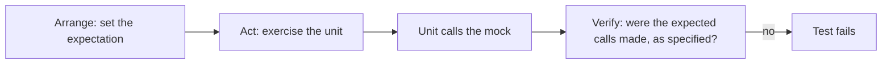
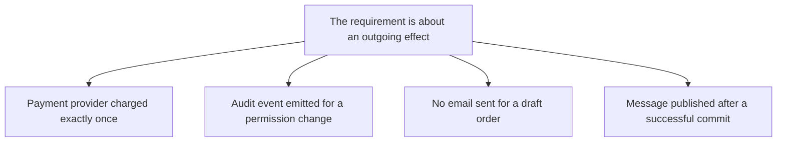

# Mocks

A **mock** is a [test double](index.md) programmed in advance with the calls it
expects to receive, which fails the test if those expectations are not met. It is the only
double that carries its own assertion.



## Mock and stub are not the same

| | [Stub](Stubs.md) | Mock |
|---|---|---|
| **Purpose** | Provide input the test needs | Verify an outgoing call happened |
| **Assertion** | On the result of the unit | On the calls received by the double |
| **A test fails when** | The outcome is wrong | The expected interaction did not occur as specified |
| **Direction** | Incoming query | Outgoing command |

The direction row is the practical rule: **stub queries, mock commands**. A query returns
data and is not itself the point, so it should be stubbed. A command produces an effect
outside the unit, so the call is the observable behaviour and may be mocked.

## When a mock is right



Each of these has no inspectable state inside the unit. The call *is* the behaviour, so
asserting on it is asserting on the requirement, not on an implementation detail.

```python
def test_charges_provider_once(payment_gateway):
    checkout = Checkout(payment_gateway)
    checkout.place(cart_of(120))
    payment_gateway.charge.assert_called_once_with(amount=120, currency="EUR")
```

The "exactly once" part matters. A retry defect that charges twice is exactly the kind of
bug this test exists to catch, and asserting only that `charge` was called would miss it.

## When a mock is wrong

| Situation | Better choice |
|---|---|
| The dependency returns data the unit needs | [Stub](Stubs.md) |
| A whole repository or database is involved | [Fake](Fakes.md), such as an in-memory implementation |
| The call is an internal implementation detail | Assert on the outcome instead |
| The dependency is fast and deterministic | Use the real object |
| You want to check a call happened, without pre-programming | [Spy](Spies.md) |

## The over-mocking trap

Mocks encode an expectation about *how* the unit does its work, which is why they are the
double most likely to break during refactoring and the one most likely to pass while the
system is broken.

- **Do not mock what you do not own.** A mock of a third-party client asserts your
  assumptions about their API, not their actual behaviour. Wrap the third party in your own
  interface, mock that, and verify the real contract separately with a
  contract test.
- **Do not mock value objects or pure functions.** Construct them.
- **Do not assert on call order** unless the order is genuinely part of the requirement.
- **A mock returning a mock** is a design signal: the unit is reaching through one object to
  reach another, and the fix belongs in the production code.

## Check Your Understanding

<quiz>
Which rule best captures when to mock rather than stub?

- [ ] Mock anything slow, stub anything fast
- [x] Stub incoming queries that provide data, mock outgoing commands whose occurrence is itself the requirement
> Correct. Asserting on a query couples the test to how the unit gathers data, which is implementation detail.
- [ ] Mock the dependencies you own, stub the ones you do not
- [ ] Always mock, since mocks can also return canned values
</quiz>

<quiz>
Why is mocking a third-party client library risky?

- [ ] Third-party libraries are usually too complex to mock accurately
- [x] The mock encodes your assumptions about their API, so the test passes even when those assumptions are wrong
> Correct. Wrap the third party in an interface you own, mock that, and verify the real contract separately.
- [ ] Mocking external libraries is prohibited by most licences
- [ ] It makes the test suite slower than using the real client
</quiz>
