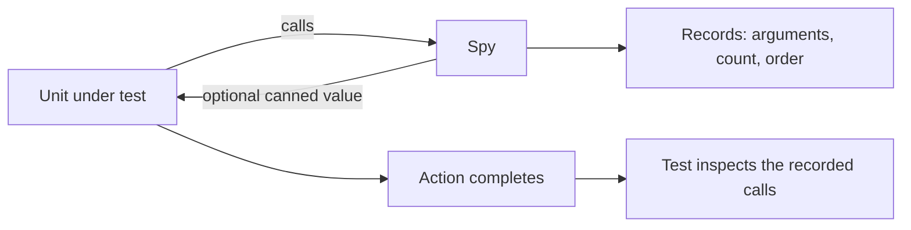
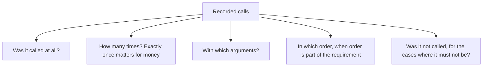

# Spies

A **spy** is a [test double](index.md) that records how it was called so the test
can inspect those records afterwards. It sits between a [stub](Stubs.md) and a
[mock](Mocks.md): it can return canned values like a stub, and it enables verification like
a mock, but the assertion is written after the action rather than configured before it.



## Spy and mock

The difference is when the expectation is stated.

| | [Mock](Mocks.md) | Spy |
|---|---|---|
| **Expectation set** | Before the action | Not set, calls are inspected after |
| **Fails on** | An unmet or unexpected expectation | Whatever the test chooses to assert |
| **Reads as** | Arrange, act, verify expectations | Arrange, act, assert |
| **Unexpected calls** | Typically a failure | Recorded, ignored unless asserted |

The practical consequence is readability. A spy keeps the familiar arrange-act-assert shape
and asserts only what the test cares about, while a mock puts part of the assertion up in
the arrangement, which is harder to follow when tests grow.

```python
def test_notifies_customer_on_dispatch():
    notifier = SpyNotifier()
    dispatch(order, notifier)
    assert notifier.calls == [("order_dispatched", order.customer_id)]
```

## Partial spies, and why to be careful

Some frameworks can wrap a *real* object and record its calls while still executing the
real behaviour. That is occasionally useful, for instance to confirm a cache was consulted
while the real cache still works.

It is also a common way to write a misleading test: if the spy wraps the object under test
itself, the test starts asserting on the unit's internal calls, which is verifying
structure rather than behaviour. Spy on collaborators, never on the unit being tested.

## What to assert on



The negative assertion is the one most often forgotten and one of the most valuable: no
email on a draft order, no charge on a validation failure, no publish before the
transaction commits.

## Practice notes

- **Assert on effects the requirement mentions**, not on every call the spy happened to
  record. A spy makes over-specification easy, and an over-specified test breaks on
  harmless changes.
- **Prefer a spy over a mock** when the interaction is worth checking but is not the whole
  point of the test, since the test stays in a readable order.
- **Prefer a [fake](Fakes.md)** when the double needs behaviour as well as recording, for
  example an email collector that also lets you read the messages back.
- **Keep spies simple.** A hand-written spy is often ten lines and clearer than framework
  configuration.

## Check Your Understanding

<quiz>
What is the main difference between a spy and a mock?

- [ ] A spy cannot return values, while a mock can
- [x] A mock has its expectations configured before the action, while a spy records calls and the test asserts on them afterwards
> Correct. That keeps the test in arrange-act-assert order, which usually reads better.
- [ ] A spy always wraps a real object, a mock never does
- [ ] A spy is used at the integration level, a mock at the unit level
</quiz>

<quiz>
Which spy assertion is most often forgotten and most valuable?

- [ ] That the call happened at least once
- [x] That a call did **not** happen, such as no charge on a validation failure or no email for a draft order
> Correct. Negative assertions catch a class of defect with real financial and reputational cost.
- [ ] That the arguments were of the correct type
- [ ] That calls occurred in a specific order
</quiz>
