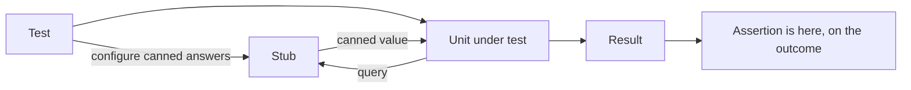
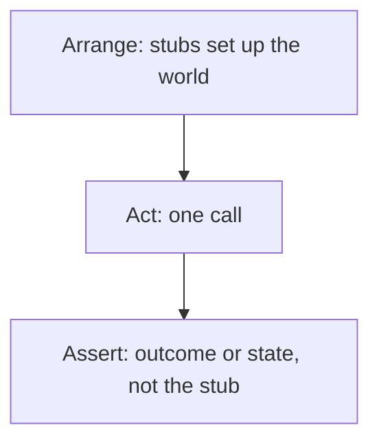

# Stubs

A **stub** is a [test double](index.md) that returns canned answers to the calls
made during a test. It exists to supply the input the unit needs, so the test can assert on
what the unit *did with it*.



The assertion sits on the result, never on the stub. That is what separates a stub from a
[mock](Mocks.md).

## What stubs are for

| Need | Example |
|---|---|
| Data the unit depends on | An exchange rate provider returning a fixed rate |
| A deterministic clock | `now()` fixed to a specific timestamp |
| A specific error path | A repository raising a timeout on demand |
| A state hard to reach for real | An account already flagged as delinquent |
| A dependency not built yet | A stub of the pricing service, replaced later |

The error path row is the underrated one. Failure handling is the least tested code in most
systems precisely because triggering the failure for real is awkward, and a stub makes it a
one-line arrangement.

```python
def test_uses_cached_rate_when_provider_times_out():
    provider = StubRateProvider(raises=Timeout)
    converter = Converter(provider, cache={"EUR": 1.09})
    assert converter.to_eur(100) == 109
```

## Stub the state, then assert on behaviour

The pattern that keeps tests robust: use stubs to put the world in the state the scenario
describes, then assert only on the outcome.



Because nothing is asserted about the stub, the test says nothing about how the unit
obtained its data. If the unit is refactored to fetch the rate differently while producing
the same result, the test still passes, which is exactly the behaviour wanted from a
regression suite.

## Stub, fake and mock

| | Stub | [Fake](Fakes.md) | [Mock](Mocks.md) |
|---|---|---|---|
| **Logic inside** | None, canned answers | Real but simplified | None, expectations |
| **Handles unforeseen calls** | Returns defaults or fails | Behaves correctly | Usually fails |
| **Good for** | One or two specific answers | A whole subsystem such as a repository | Verifying an outgoing command |

The switch point is worth knowing: once a stub needs several coordinated canned answers and
starts tracking what it returned earlier, it is turning into a fake. Write the fake instead,
once, and share it across tests.

## Pitfalls

- **Stubbing the unit under test.** Partially stubbing the object being tested means the
  test verifies the stub, not the code.
- **Over-specified stubs.** A stub configured to respond only to one exact argument list
  becomes a hidden interaction assertion, and it fails on harmless changes.
- **Stale stubs.** A stub whose real counterpart has changed shape keeps returning the old
  format, so the suite is green while production is broken. Contract tests or a shared fake
  built from the real interface prevent this.
- **Stubbing everything.** If nearly every collaborator needs a stub, the unit has too many
  dependencies, and the test is reporting a design problem.

## Check Your Understanding

<quiz>
What distinguishes a stub from a mock?

- [ ] A stub can only return primitive values
- [x] A stub supplies canned input and the test asserts on the outcome, while a mock carries expectations about the calls it receives and fails when they are not met
> Correct. Stubs are for state verification, mocks for behaviour verification.
- [ ] A stub is generated automatically, a mock is hand-written
- [ ] A stub replaces infrastructure, a mock replaces domain objects
</quiz>

<quiz>
A stub has grown to track earlier calls and return different values depending on them. What should happen?

- [ ] Convert it to a mock with ordered expectations
- [x] Replace it with a fake: a simplified working implementation, written once and shared across tests
> Correct. Once canned answers need coordination and memory, real simplified logic is both simpler and more reliable.
- [ ] Split the test into several smaller ones, each with a simpler stub
- [ ] Use the real dependency instead, regardless of speed
</quiz>
