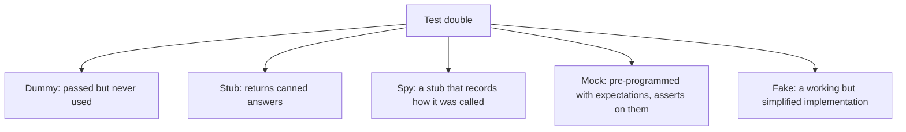
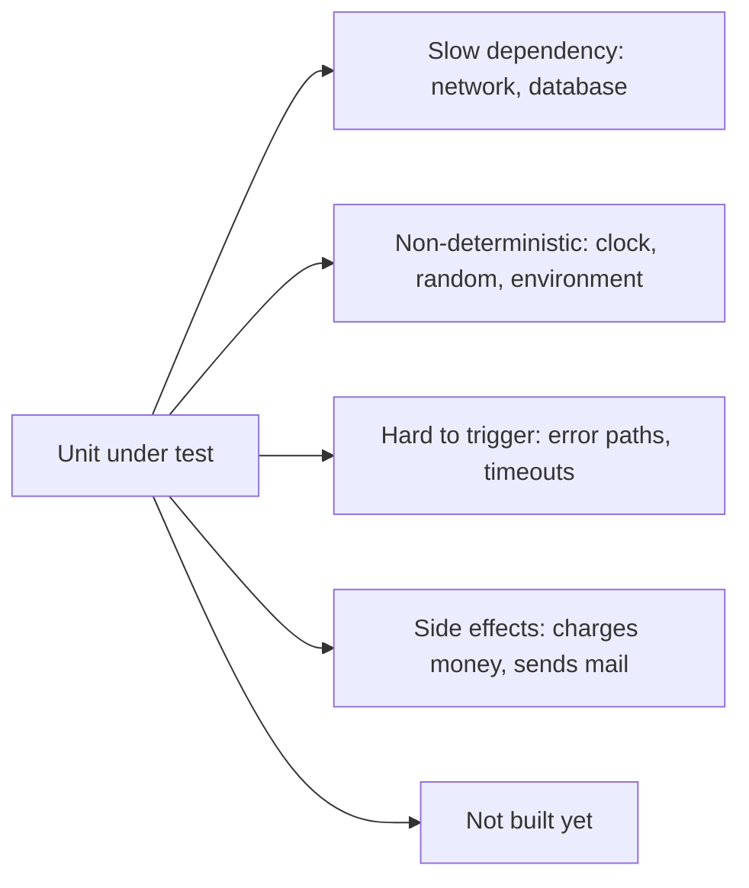
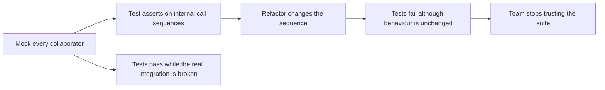
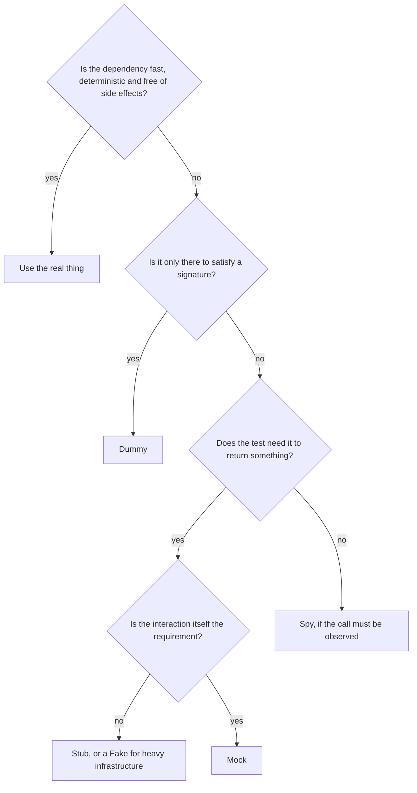

# Test Doubles

A **test double** is any object substituted for a real dependency in a test, the way a stunt
double stands in for an actor. The term is Gerard Meszaros's, and it exists because
"mock" had become a name for all five kinds, which made conversations about testing
imprecise.

| Double | Provides behaviour | Records calls | Asserts on calls | Typical use |
|---|---|---|---|---|
| [Dummy](Dummies.md) | no | no | no | Fill a required parameter |
| [Stub](Stubs.md) | yes, canned | no | no | Supply input the test needs |
| [Spy](Spies.md) | yes | yes | after the fact | Check something was called, without pre-programming |
| [Mock](Mocks.md) | yes | yes | yes, built in | Verify an interaction is the point of the test |
| [Fake](Fakes.md) | yes, real logic | no | no | Replace slow infrastructure |

## Why substitute anything

Those five are the legitimate reasons. Anything fast, deterministic and side-effect free
should be used for real, because a real collaborator tests the real integration for free.

## State verification and behaviour verification

The distinction that decides which double to use.

| | State verification | Behaviour verification |
|---|---|---|
| **Asserts on** | The result or resulting state | The calls that were made |
| **Uses** | Stubs and fakes | Mocks and spies |
| **Survives refactoring** | Yes | Often not |
| **Right when** | The outcome is what matters | The interaction *is* the outcome |

Prefer state verification. Reach for behaviour verification when the call itself is the
requirement: "the payment provider is charged exactly once", "the audit event is emitted",
"no email is sent when the order is a draft". In those cases there is no state to inspect,
so the call is the observable effect.

## Over-mocking, the standard failure

Two costs, and the second is worse. A suite of heavily mocked tests can be entirely green
while the system does not work, because every assumption encoded in the mocks was wrong in
the same way the code was.

Symptoms worth acting on: a test with more setup than assertion, a mock returning a mock,
or a test that must change whenever a private method is renamed.

## Choosing quickly

## Check Your Understanding

<quiz>
When is behaviour verification with a mock the right choice over state verification?

- [ ] Whenever the dependency is slow
- [x] When the interaction itself is the requirement, such as charging a payment provider exactly once, so there is no resulting state to inspect
> Correct. Otherwise assert on the outcome, since state verification survives refactoring.
- [ ] Whenever the unit has more than two dependencies
- [ ] When the real dependency has not been implemented yet
</quiz>

<quiz>
A test suite mocks every collaborator, is entirely green, and the deployed system is broken. What happened?

- [ ] The mocks were configured with the wrong return types
- [x] The mocks encoded the same wrong assumptions as the code, so nothing ever exercised the real integration
> Correct. Mocks verify that the code calls what the author expected, not that the collaboration actually works.
- [ ] The tests ran in the wrong order
- [ ] Coverage was measured before the mocks were applied
</quiz>
