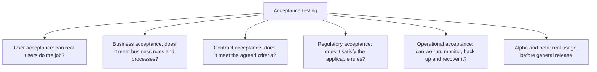
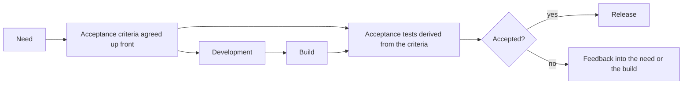

# Acceptance Testing

**Acceptance testing** answers whether the system is good enough to be accepted by the
people it was built for. It is the [validation](../Quality%20Fundamentals/Verification%20and%20Validation.md)
level: the reference is the user's need or the contract, not the internal specification.

A system can pass every [system test](System%20Testing.md) and fail acceptance, because
the specification itself can be wrong.

## Forms of acceptance testing



| Form | Performed by | Typical exit evidence |
|---|---|---|
| **User acceptance** | Real users or their representatives | Task success on realistic scenarios |
| **Business acceptance** | Product owner, business analysts | Business rules confirmed on real cases |
| **Contract acceptance** | Customer, against agreed criteria | Signed acceptance record |
| **Regulatory** | Compliance, auditors | Compliance evidence pack |
| **Operational acceptance** | Operations and SRE | Runbooks, backup and restore proven, alerting verified |
| **Alpha and beta** | Selected external users | Usage data and defect reports from real conditions |

Operational acceptance is the one most often skipped, and its absence shows up during the
first incident rather than during the release.

## Acceptance criteria come first

The criteria are agreed **before** the work starts, otherwise acceptance becomes a
negotiation about what was really meant.



Good criteria are specific and decidable:

- Weak: "the report should be fast and easy to use".
- Usable: "a user with no training produces the monthly reconciliation report in under
  three minutes, and the report matches the ledger totals for the same period".

The second can pass or fail. The first can only be argued about.

## Automating acceptance

[ATDD](../Testing%20Approaches/Acceptance%20Test-Driven%20Development.md) and
[BDD](../Testing%20Approaches/Behavior-Driven%20Development.md) turn criteria into
executable examples written in business language before development starts.

```gherkin
Scenario: free shipping applies at the threshold
  Given a cart totalling 50
  When the customer views the checkout
  Then the shipping cost is 0
```

The benefit is not the syntax, it is that a business person, a developer and a tester had
to agree on a concrete example before code existed. Most requirement defects surface in
that conversation rather than in the resulting automation.

The failure mode is writing these scenarios *after* the code, at which point they are
verbose integration tests with an expensive parser attached.

## Keeping acceptance honest

- **Real users, real data, real tasks.** An acceptance session where a product owner
  clicks through a scripted demo validates nothing.
- **Do not use it as a second system test pass.** Finding functional defects here means
  the lower levels are too weak, and this level is the most expensive place to find them.
- **Accept explicitly, including the risks.** Acceptance is a decision, and it should
  record what was not covered and who accepted it.
- **Continue validating after release.** Usage data, funnel drop-off and support tickets
  are acceptance testing that never stops. See
  [testing in production](../Quality%20in%20the%20SDLC/Testing%20in%20Production.md).

## Check Your Understanding

<quiz>
Why must acceptance criteria be agreed before development starts?

- [ ] Because regulators require documented criteria
- [x] Because otherwise acceptance becomes a negotiation about what was meant, and the requirement defect is discovered at the most expensive possible moment
> Correct. Agreeing concrete examples up front is where most requirement misunderstandings surface.
- [ ] Because automated acceptance tests cannot be written afterwards
- [ ] Because the product owner cannot attend later sessions
</quiz>

<quiz>
A team finds many functional defects during user acceptance testing. What does this most likely indicate?

- [ ] Users are testing outside the agreed scope
- [x] Lower test levels are too weak, since functional defects should be caught before the most expensive level
> Correct. Acceptance should be validating fit for purpose, not acting as a late functional test pass.
- [ ] The acceptance criteria were too detailed
- [ ] The system testing environment was too realistic
</quiz>
