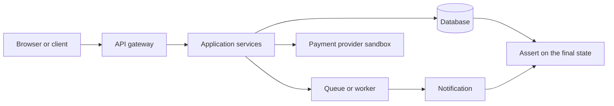
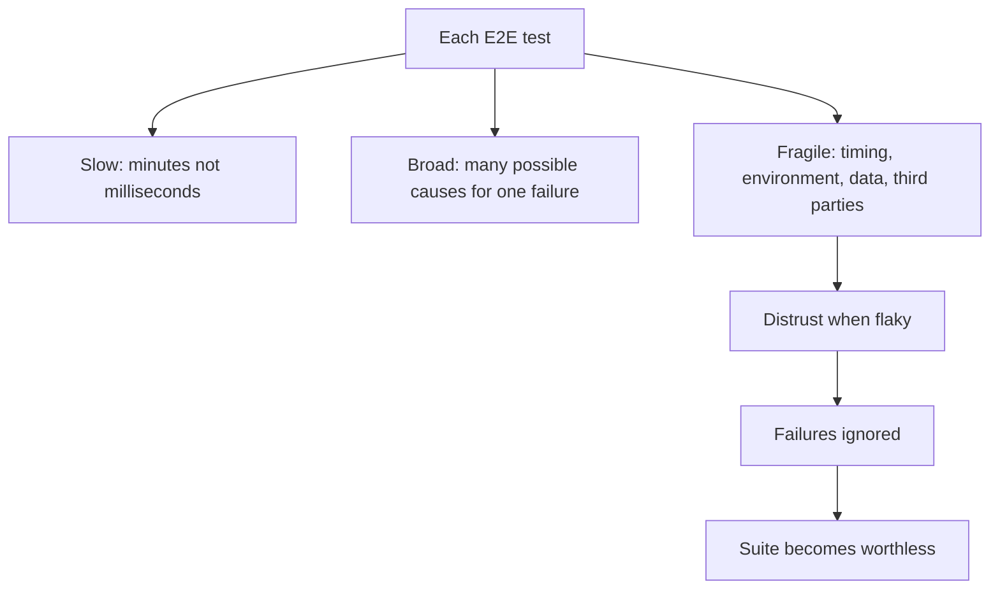
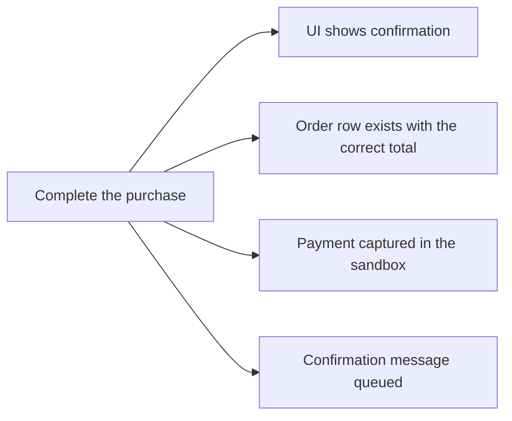

# End-to-End Testing

An **end-to-end (E2E) test** drives a complete user journey through the real deployed
system, from the entry point a user actually touches to the persistent effects the
journey should leave behind.

Nothing between the endpoints is replaced, which is both the value and the cost.

## E2E compared with its neighbours

| | Integration test | End-to-end test | Acceptance test |
|---|---|---|---|
| **Scope** | Two or three components | Whole deployed system | Whole system, from the user's viewpoint |
| **Entry point** | An internal interface | The real client interface | The real client interface |
| **Reference** | The component contract | The specified journey | The user's actual need |
| **Speed** | Seconds | Minutes | Varies, often manual |
| **Failure diagnosis** | Localised | Requires investigation | Requires conversation |

E2E and [acceptance](Acceptance%20Testing.md) often use the same mechanics. They differ in
purpose: E2E asks whether the assembled journey works, acceptance asks whether the
journey is the right one.

## Why they must be few

That last chain is how most E2E suites die. A suite that fails randomly trains people to
re-run it, and a suite that is always re-run until green catches nothing.

The pyramid puts few tests here
for exactly this reason. A useful rule: E2E covers the journeys whose breakage would stop
the business, and nothing else. Checkout, login, signup, payment. Not field validation,
not error message wording, not every permutation of a form.

## Making them survivable

| Problem | Practice |
|---|---|
| **Timing flakiness** | Wait for a condition, never for a fixed duration. No sleeps |
| **Fragile selectors** | Address elements by stable test identifiers, not by CSS paths or text |
| **Shared data collisions** | Each run creates its own users and records, and does not depend on pre-existing rows |
| **Third-party outages** | Use provider sandboxes, and verify the real contract separately with contract tests |
| **Slow feedback** | Run them in parallel, after the fast suites, and gate deploys rather than every commit |
| **Hard diagnosis** | Capture screenshots, videos, network logs and server logs on failure automatically |

Any E2E test that fails intermittently and cannot be fixed quickly should be quarantined
rather than tolerated. One tolerated flaky test is enough to start the distrust chain
above.

## Asserting the whole journey

The common weakness is stopping at the visible screen. A checkout test that asserts only
"thank you" was rendered misses an order never written, a payment never captured, and a
confirmation never sent.

Assert the effects, not only the appearance. A journey is defined by what it leaves
behind.

## Check Your Understanding

<quiz>
Why should end-to-end tests be limited to a small number of critical journeys?

- [ ] Because tools cannot drive more than a few browser sessions
- [x] They are slow, broad and fragile, so a large suite produces slow feedback and ambiguous failures, and tolerated flakiness destroys trust in all of it
> Correct. Checks that a lower level can make belong at that lower level.
- [ ] Because they cannot assert on database state
- [ ] Because they duplicate acceptance testing exactly
</quiz>

<quiz>
A checkout E2E test asserts only that the confirmation page appeared. What is the flaw?

- [ ] The assertion is too slow to evaluate
- [x] It checks appearance rather than effects, so a missing order record, an uncaptured payment or an unsent confirmation would still pass
> Correct. A journey is defined by the persistent effects it leaves, so those are what the test must assert.
- [ ] Confirmation pages should never be asserted on
- [ ] The test should use a fixed wait before asserting
</quiz>
