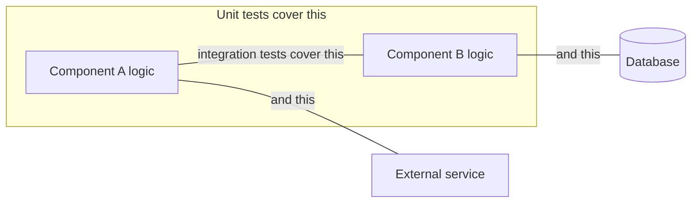
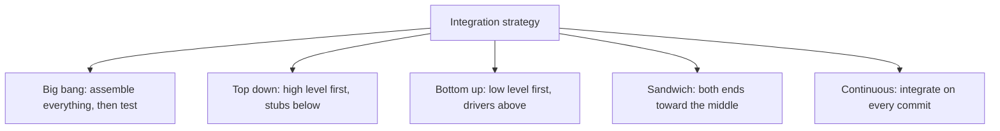
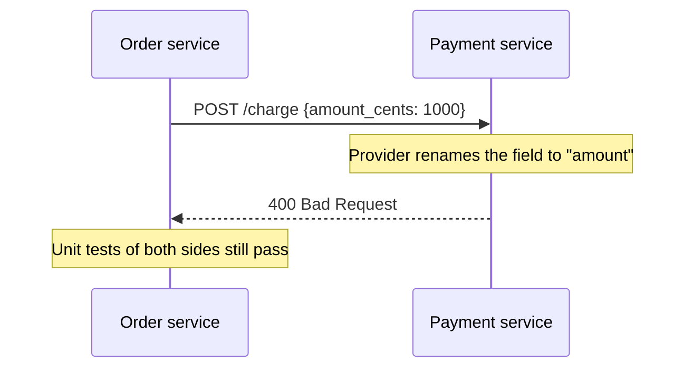

# Integration Testing

**Integration testing** checks that separately built parts work together. Its target is
not the logic inside a component, that is [unit testing](Unit%20Testing.md), but the
seams: wiring, contracts, serialisation, transactions, protocols, and every assumption
two components made about each other without checking.

## Two flavours

| | Component integration | System integration |
|---|---|---|
| **Between** | Modules inside one deployable | Separate systems or services |
| **Examples** | Service with repository, controller with service | Order service with payment provider, app with message broker |
| **Owned by** | The development team | The team plus whoever owns the other side |
| **Main risk** | Wiring and data mapping | Contract drift, protocol and version mismatch |

## Integration strategies

| Strategy | Needs | Trade-off |
|---|---|---|
| **Big bang** | Nothing until the end | Failures are ambiguous, everything is suspect at once |
| **Top down** | Stubs for lower layers | Early demo of flows, low-level defects found late |
| **Bottom up** | Drivers for upper layers | Solid foundations, no visible system until late |
| **Sandwich** | Both stubs and drivers | Parallel work, more scaffolding to maintain |
| **Continuous** | Automation and a pipeline | The modern default, small integration steps so failures are attributable |

Continuous integration wins for the same reason small commits win: when only one thing
changed since the last green run, the failure has one plausible cause.

## What to make real

The central design decision of an integration test.

| Dependency | Default choice | Why |
|---|---|---|
| Your own database | Real, in a container | Schema, constraints and SQL dialect are exactly what you are testing |
| Message broker | Real or a faithful in-memory version | Ordering and delivery semantics are the risk |
| Third-party HTTP API | Simulated, plus a [contract test](../Testing%20Approaches/Contract%20Testing.md) against the real one | Speed and reliability, without pretending the contract is verified |
| Clock and randomness | Controlled | Determinism |

Replacing your own database with an in-memory substitute of a different engine defeats
the purpose: the test then verifies the substitute, and the constraint violation appears
in production instead.

## Contract drift, the defect this level exists for

Both sides are internally correct and the system is broken. Only a test that crosses the
boundary sees it, which is why services with a shared consumer need
contract testing rather than more mocks.

## Keeping this level healthy

- **Keep them fewer than unit tests and more than end-to-end tests.** They are slower and
  less isolated than units, faster and more targeted than journeys.
- **One integration per test.** A test that exercises four seams reports an ambiguous
  failure.
- **Own the test data.** Each test creates what it needs and cleans up, otherwise ordering
  dependencies appear and the suite becomes flaky.
- **Run them on every commit.** An integration suite that runs nightly finds problems
  after several more commits have landed on top of them.

## Check Your Understanding

<quiz>
Why is a big bang integration strategy usually a poor choice?

- [ ] It requires too many stubs and drivers
- [x] When everything is assembled at once, a failure has many plausible causes, so diagnosis is slow and uncertain
> Correct. Incremental integration keeps the number of changed things small enough that failures are attributable.
- [ ] It cannot detect contract mismatches
- [ ] It only works for monolithic architectures
</quiz>

<quiz>
A team swaps its production database for a different in-memory engine in integration tests. What is the main problem?

- [ ] The tests become too slow
- [x] The tests now verify behaviour against a different engine, so dialect, constraint and migration defects survive to production
> Correct. The database is precisely what these tests exist to exercise, so substituting it removes their value.
- [ ] Test data cannot be cleaned up afterwards
- [ ] Coverage reports become inaccurate
</quiz>
