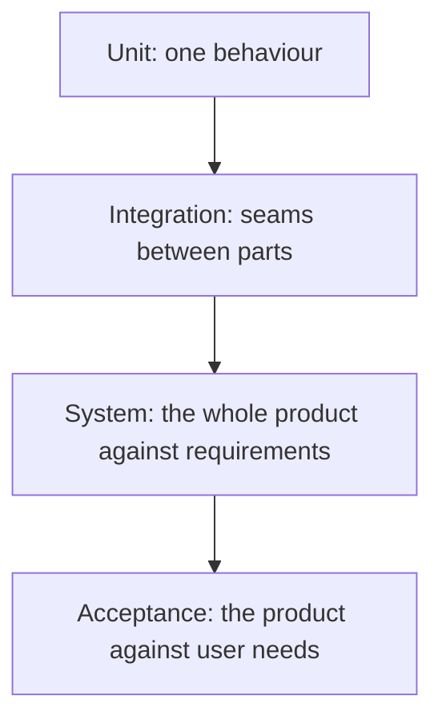
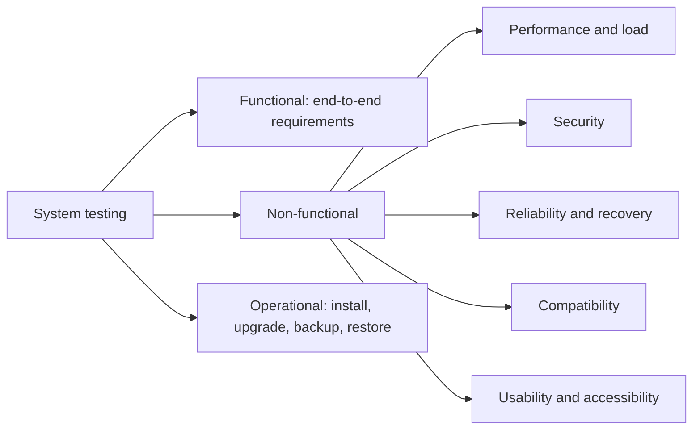

# System Testing

**System testing** exercises the fully integrated system as a whole, against the
specified requirements, in an environment that resembles production. It is the first
level where the thing under test is the product rather than a part of it.

The distinction from [acceptance testing](Acceptance%20Testing.md) is the reference point.
System testing checks the system against the **specification**, which is
[verification](../Quality%20Fundamentals/Verification%20and%20Validation.md). Acceptance
checks it against the **need**, which is validation.

## What it covers

The non-functional and operational branches are the reason this level cannot be skipped
by having many integration tests. Behaviour under load, recovery after a node dies, and
whether the upgrade path preserves data are only observable on a whole system.

## Environment fidelity

The results are only as trustworthy as the environment's resemblance to production.

| Dimension | Cheap approximation | What it hides |
|---|---|---|
| **Data volume** | 100 rows | Missing indexes, query plans that collapse at scale |
| **Topology** | Single node | Load balancing, session affinity, split brain |
| **Configuration** | Debug settings | Caching, timeouts, TLS, feature flags |
| **Integrations** | Everything simulated | Real latency, throttling, partial outages |
| **Security** | Auth disabled | Permission defects, token expiry handling |

The list doubles as a checklist for explaining a "works in test, fails in production"
incident. In most cases the answer is one row of this table.

## Running the level well

- **Trace to requirements.** Each system test should map to a requirement or a risk, so
  the coverage question is answerable. See [traceability](../Testing%20Fundamentals/Traceability.md).
- **Start with a smoke suite.** If the [smoke tests](../Functional%20Testing/Smoke%20Testing.md)
  fail, the build does not enter system testing at all, which protects the expensive
  level from wasting time on a broken deployment.
- **Automate the repeatable, explore the rest.** The regression portion belongs in the
  pipeline. Reserve human time for
  [exploratory sessions](../Testing%20Techniques/Exploratory%20Testing.md) on the assembled
  product, where most surprising defects are found.
- **Include the boring operational paths.** Install, upgrade, rollback, backup and
  restore. These are untested in most projects and are exactly what fails during an
  incident, when attention is scarcest.

## Cost and placement

System tests are slow, broad and comparatively fragile, so they sit near the top of the
automation pyramid. A failure here
means "something in the product is wrong" and usually needs investigation to localise,
which is the opposite of a unit failure.

Consequences for the suite:

- Keep it small and about whole journeys, not about permutations of input validation.
- Push every check that a lower level could have made down to that level.
- Treat flakiness here as urgent, because a distrusted system suite quietly becomes a
  suite nobody reads.

## Check Your Understanding

<quiz>
What distinguishes system testing from acceptance testing?

- [ ] System testing is automated, acceptance testing is manual
- [x] System testing verifies the whole product against its specification, acceptance validates it against the user's actual need
> Correct. Same assembled system, different reference point, so a product can pass one and fail the other.
- [ ] System testing covers only non-functional requirements
- [ ] Acceptance testing runs before system testing
</quiz>

<quiz>
A feature passes system testing then fails immediately in production under real traffic. What is the most likely cause?

- [ ] The unit tests were incomplete
- [x] The test environment differed from production in data volume, topology or configuration, so the failure mode was not observable there
> Correct. Environment fidelity determines how much the results of this level can be trusted.
- [ ] The acceptance criteria were not traceable
- [ ] The smoke suite ran before the system suite
</quiz>
