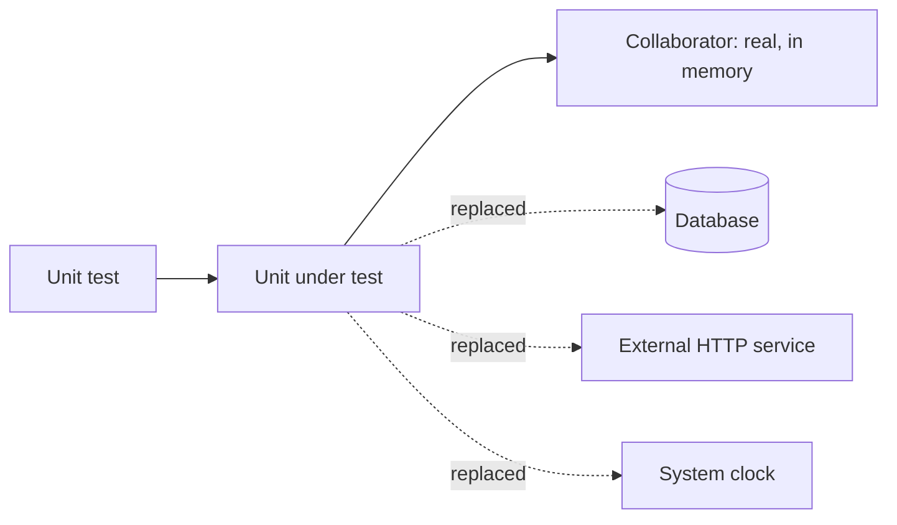
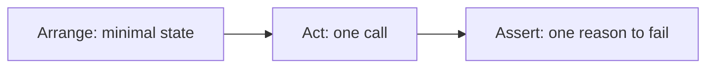

# Unit Testing

A **unit test** exercises one small piece of behaviour in isolation, fast enough that
running hundreds of them is unremarkable. It is the base of the
test pyramid and the level where
most defects should be caught, because it is the level where a failure points directly at
the change that caused it.

## What counts as a unit

The unhelpful answer is "one class or function". The useful answer is **one unit of
behaviour**, which may involve several collaborating objects as long as the test does not
cross a process boundary.



The dotted lines are what makes it a unit test: anything slow, shared or non-deterministic
is replaced with a [test double](../Test%20Doubles/index.md).

| Boundary | Real in a unit test? |
|---|---|
| Pure functions, value objects, domain logic | Yes, always |
| Another class in the same module | Usually yes |
| Database, file system, network | No |
| Clock, random source, environment | No, inject them |

Making "one class" the definition leads to a mock for every collaborator, and a suite
that breaks on every refactor while verifying nothing about behaviour.

## The shape of a unit test



```python
def test_free_shipping_at_threshold():
    assert shipping_cost(50) == 0

def test_charged_just_below_threshold():
    assert shipping_cost(49.99) == 5
```

Two tests, not one with two assertions, because a single test that fails on the first
assertion hides whether the second also broke.

## What makes them worth having

| Property | Consequence |
|---|---|
| **Fast** | Milliseconds each, so they run on save and in every commit |
| **Isolated** | A failure names one behaviour, so debugging is nearly free |
| **Deterministic** | No shared state, no clock, no network, so no flakiness |
| **Cheap to write** | Which is why the pyramid puts most tests here |
| **Design feedback** | Hard to test usually means too many dependencies, see TDD |

See [FIRST principles](../Test%20Quality/FIRST%20Principles.md) for the same properties
stated as a checklist.

## Test behaviour, not structure

The single most common way unit suites go bad.

| Testing structure | Testing behaviour |
|---|---|
| Asserts a private method was called | Asserts the returned total is correct |
| Verifies the order of internal calls | Verifies the observable outcome |
| Breaks on every refactor | Survives refactoring, fails on real regressions |
| Named `test_calculate_internal_2` | Named `applies_discount_above_threshold` |

A suite that breaks whenever the implementation changes, without any behaviour changing,
teaches the team that tests are an obstacle. That is how suites get deleted.

## What unit tests cannot do

They test units, so they cannot see anything that emerges between them: wiring mistakes,
schema drift, serialisation mismatches, transaction boundaries, real latency. A system
with perfect unit coverage and no
[integration tests](Integration%20Testing.md) still fails on first contact with the
database.

That is the argument for the whole pyramid rather than for the base alone.

## Practical guidance

- One behaviour per test, named after the behaviour.
- No conditionals or loops in test bodies. If a test needs branching, it is two tests.
- Prefer real collaborators over mocks wherever they are fast and deterministic.
- Cover boundaries, not just the happy path. See
  [boundary value analysis](../Testing%20Techniques/Boundary%20Value%20Analysis.md).
- Keep the whole suite under a threshold a developer will tolerate on every save. Once it
  is slow, it stops being run, and an unrun suite has no value at all.

## Check Your Understanding

<quiz>
Why is "one class per unit test" a misleading definition?

- [ ] Because classes are too large to test individually
- [x] Because it pushes teams to mock every collaborator, producing tests that verify internal structure and break on every refactor
> Correct. The better boundary is one unit of behaviour, keeping fast, deterministic collaborators real.
- [ ] Because unit tests should always include the database
- [ ] Because it makes tests too slow to run on save
</quiz>

<quiz>
A team has 95% unit coverage and the first deployment fails because a column name in the schema does not match the mapping. What does this show?

- [ ] The unit tests were poorly written
- [x] Unit tests cannot detect problems that emerge between components, which is what integration testing exists for
> Correct. Every level has a blind spot, and the pyramid exists because no single level covers everything.
- [ ] Coverage should have been measured at the branch level
- [ ] The mapping code needed more mocks
</quiz>
