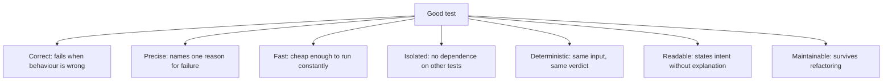
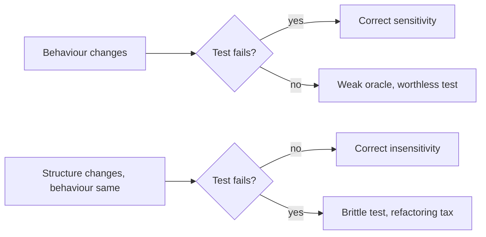

# Characteristics of Good Tests

A test suite is an asset while it earns more than it costs, and a liability the moment it
does not. These are the properties that decide which one you have.



The compact version of the same list is the
[FIRST principles](FIRST%20Principles.md).

## The four questions a test must survive

| Question | If the answer is no |
|---|---|
| **Would it fail if the behaviour were wrong?** | It is decoration. See [mutation testing](../Testing%20Approaches/Mutation%20Testing.md) |
| **Would it stay green through a refactor?** | It tests structure, not behaviour, and will be deleted eventually |
| **Does a failure tell you what broke?** | Every failure becomes an investigation |
| **Can a stranger read it in thirty seconds?** | Nobody will maintain it |

The first two together are the whole game: a test must be sensitive to behaviour change and
insensitive to structure change. Most bad tests fail one of those and usually fail the same
one, by asserting on how the code works rather than what it produces.

## Readable tests

```python
def test_rejects_expired_card():
    card = a_card(expiry="2020-01")
    result = checkout.pay(cart_of(50), card)
    assert result.declined_because == "card_expired"
```

| Practice | Effect |
|---|---|
| Name after the behaviour | The failure line already explains the problem |
| Visible arrange, act, assert | The scenario reads top to bottom |
| Builders with defaults | Only the relevant values appear |
| No logic in the test | An `if` in a test means two tests |
| One reason to fail | Nothing hides behind a first failed assertion |

A test needing a comment to explain what it checks is a test that should be renamed.

## Sensitivity, in both directions



Practically: assert on outputs and observable effects, use real collaborators where they
are fast, and reserve interaction verification for cases where the interaction genuinely is
the requirement.

## Suite-level properties

Good individual tests do not guarantee a good suite.

- **Fast enough to run constantly.** Wall clock time decides whether it is run at all.
- **No redundancy.** Many old tests re-check the same rule through different paths, and
  deleting them costs nothing.
- **Parallel safe**, which requires [isolation](Test%20Isolation.md).
- **Zero tolerated flakiness.** One [flaky test](Flaky%20Tests.md) trains everyone to re-run
  until green.
- **Owned like production code.** Reviewed, refactored, deleted when obsolete.

## Check Your Understanding

<quiz>
Which pair of properties best defines a good test?

- [ ] High coverage and fast execution
- [x] Sensitive to behaviour change and insensitive to structural change
> Correct. A test that misses real defects is worthless, and one that breaks on every refactor becomes a tax the team eventually removes.
- [ ] Written before the code and reviewed by a tester
- [ ] Independent of any test double
</quiz>

<quiz>
A test needs a comment explaining what it verifies. What does that indicate?

- [ ] The behaviour is inherently complex and needs documentation
- [x] The test is not readable enough, and the fix is usually a better name and clearer arrange-act-assert structure
> Correct. A test should state its intent through its name and its shape.
- [ ] The test should be split into integration and unit versions
- [ ] The comment should be moved into the assertion message
</quiz>
