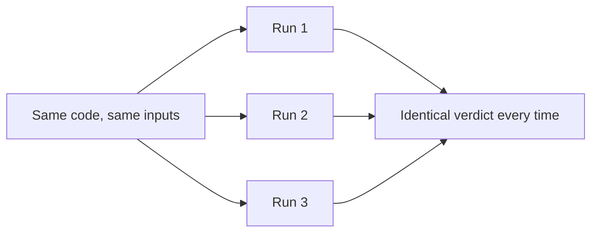
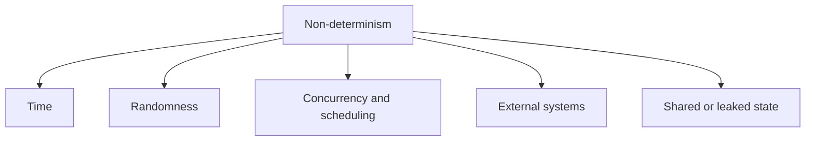
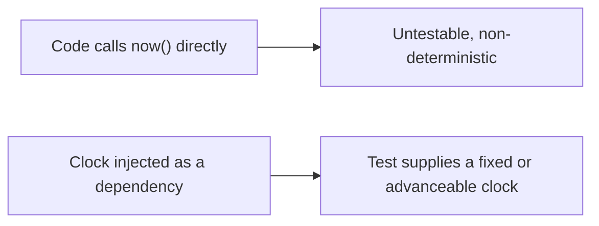

# Deterministic Tests

A test is **deterministic** when the same code and the same inputs always produce the same
verdict. Anything else is a coin flip, and a suite of coin flips carries no information.



## The five sources of non-determinism



### Time

The most common by far. Anything using the current clock is a test whose result depends on
when it runs.

| Symptom | Cause |
|---|---|
| Fails at midnight or month end | Date arithmetic against the real clock |
| Fails in CI but not locally | Different time zone or locale |
| Fails once a year | Leap day, daylight saving transition |
| Passes today, fails next month | An expiry date hardcoded as a near-future value |

The fix is always to inject the clock and control it. A test that needs "two hours later"
should advance a fake clock, never sleep.

### Randomness

Generated identifiers, shuffles, sampling and unseeded random values. Inject the source, or
seed it and record the seed with the failure so it can be reproduced.

### Concurrency

Tests asserting on results produced by another thread, or on ordering the scheduler does
not guarantee. Fixes: wait on a condition rather than a duration, make the assertion about
the final state instead of the sequence, and never use `sleep` to wait for concurrency.

### External systems

Real networks, third-party APIs, shared environments. All of them fail sometimes for
reasons unrelated to the code. Simulate them at the fast levels and verify the real contract
separately with
[contract testing](../Testing%20Approaches/Contract%20Testing.md).

### Shared state

Covered in [test isolation](Test%20Isolation.md). Order-dependent failures look identical to
non-determinism from the outside.

## Making time testable



```python
def test_token_expires_after_one_hour():
    clock = FakeClock("2026-01-01T10:00:00Z")
    token = issue_token(clock)
    clock.advance(hours=1, seconds=1)
    assert not token.is_valid(clock)
```

Fast, exact, and it also tests the boundary, which a `sleep`-based version could never do.

## Hidden non-determinism

Worth knowing, because it produces failures that look inexplicable:

- **Collection ordering.** Hash iteration order, `SELECT` without `ORDER BY`, set
  iteration. Sort before asserting, or assert on membership.
- **Floating point.** Accumulated rounding differs by execution order. Compare with a
  tolerance, or use decimal types for money.
- **Locale.** Number formats, date formats, string casing and collation.
- **Timeouts sized for a fast machine.** A one-second timeout passing locally will fail on a
  loaded CI runner.

## Check Your Understanding

<quiz>
A test verifying token expiry uses `sleep(3600)`. What are the two problems?

- [ ] It fails in parallel runs and consumes memory
- [x] It makes the suite an hour slower and still depends on real time, so it is both slow and non-deterministic under load
> Correct. Injecting an advanceable clock makes it instant, exact, and able to test the boundary precisely.
- [ ] It requires network access to a time server
- [ ] It cannot assert on the token contents
</quiz>

<quiz>
A test asserting on a list of results passes locally and fails intermittently in CI. Which hidden source is most likely?

- [ ] Floating point accumulation
- [x] Collection ordering, such as a query without an explicit sort or hash iteration order
> Correct. Sort before asserting, or assert on membership rather than sequence.
- [ ] Locale differences in number formatting
- [ ] Timeout values sized for a fast machine
</quiz>
