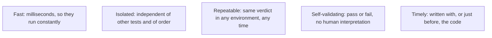
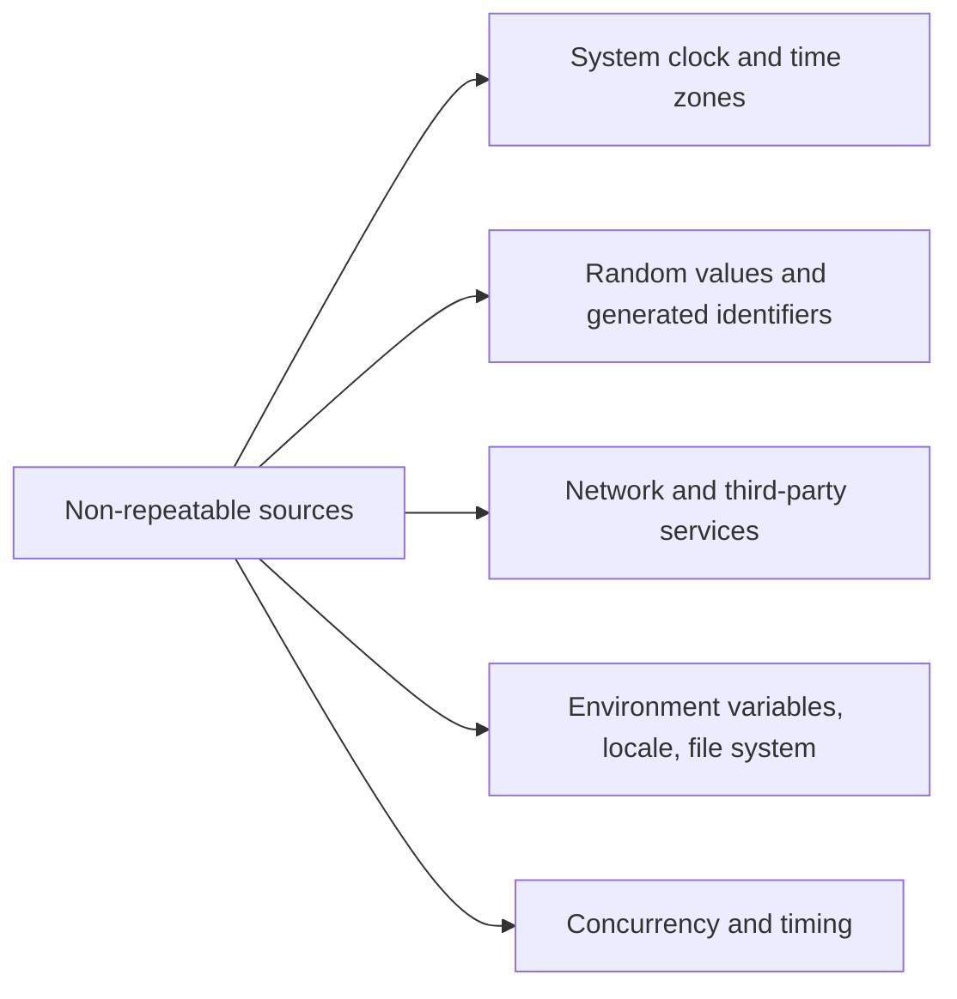

# FIRST Principles

**FIRST** is a five-letter checklist for unit tests, from Robert Martin's *Clean Code*. It
is the compact form of the
[characteristics of good tests](Characteristics%20of%20Good%20Tests.md).

## Fast

A suite that takes minutes stops being run on save, and one that takes an hour stops being
run before merges. Speed is not a convenience, it decides whether the suite exists in
practice.

What makes tests slow, in order of frequency: real network calls, real databases, `sleep`
in the test body, oversized fixtures, and starting a framework or container per test.

## Isolated

Each test sets up what it needs and leaves nothing behind. No shared mutable state, no
dependence on execution order, no reliance on data another test created.

The check is mechanical: run the suite in random order and in parallel. Anything that fails
is not isolated. See [test isolation](Test%20Isolation.md).

## Repeatable

Same result on a developer machine, in CI, on a Monday, in another time zone, offline.

The fix is always the same: inject the source and control it. See
[deterministic tests](Deterministic%20Tests.md).

## Self-validating

The test decides. No log inspection, no comparing output by eye, no "check the report
afterwards". A test whose result requires human interpretation cannot gate a pipeline and
will be skipped.

This also rules out the weak assertion: a test asserting only that nothing threw is not
self-validating in any useful sense, because it cannot fail for wrong behaviour. See
[testing oracle](../Testing%20Fundamentals/Testing%20Oracle.md).

## Timely

Written with the code, ideally just before it, as in
[TDD](../Testing%20Approaches/Test-Driven%20Development.md). Tests deferred to later are
written against code that is already hard to test, if they are written at all, and a test
never seen failing may be permanently green by accident.

## Using it as a diagnostic

| Symptom | Principle violated | Usual fix |
|---|---|---|
| Suite takes twenty minutes | Fast | Remove I/O, inject the clock, parallelise |
| Passes alone, fails in the suite | Isolated | Remove shared state, unique data per test |
| Fails only in CI, or only after midnight | Repeatable | Control the clock, time zone and environment |
| Someone has to read the output to judge it | Self-validating | Write a real assertion |
| No tests exist for last quarter's code | Timely | Write tests with the change, not after |

## Check Your Understanding

<quiz>
A test passes on its own and fails when the full suite runs. Which FIRST principle is violated?

- [ ] Fast
- [x] Isolated, since the test depends on state left behind by another test or on execution order
> Correct. Running the suite in random order and in parallel is the standard way to detect this.
- [ ] Timely
- [ ] Self-validating
</quiz>

<quiz>
Why is a test that only asserts no exception was thrown a violation of self-validation?

- [ ] Because exceptions are not deterministic
- [x] Because it cannot fail for incorrect behaviour, so the pass verdict carries no information about correctness
> Correct. Self-validating means the test itself decides correctness, which requires a real oracle.
- [ ] Because assertions must include a failure message
- [ ] Because exception handling belongs at the integration level
</quiz>
