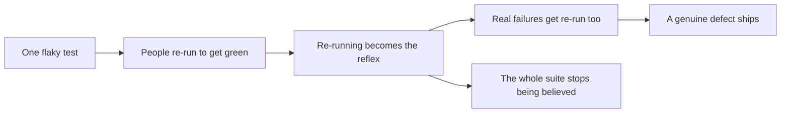
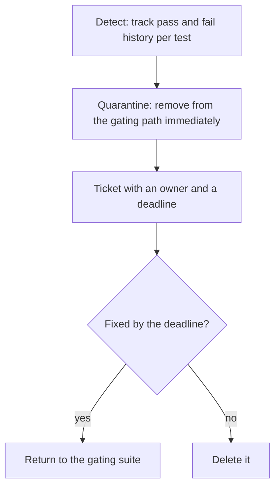

# Flaky Tests

A **flaky test** passes and fails on the same code. It is the single most destructive
problem a test suite can have, because its damage is not limited to itself.

A suite with a few tolerated flaky tests is worse than a smaller suite with none, because
it costs the same to run and provides no signal anyone acts on.

## Causes, ranked by frequency

| Cause | Typical form | Fix |
|---|---|---|
| **Timing** | Fixed `sleep` waiting for something asynchronous | Wait for a condition, with a generous timeout |
| **Shared state** | Order dependence, leftover data | [Isolation](Test%20Isolation.md): unique data or rollback |
| **Real time** | Date arithmetic against the system clock | Inject the clock |
| **Concurrency** | Assertions on scheduling order | Assert final state, not sequence |
| **External systems** | Third-party sandbox flakiness | Simulate locally, verify contracts separately |
| **Resource limits** | Ports, memory, connection pools under parallel load | Ephemeral resources per worker |
| **Ordering assumptions** | Query results without an explicit sort | Sort, or assert on membership |
| **Test pollution in the code under test** | Caches and singletons retaining state | Reset, or remove the global |

Note that most of these are the test's fault, but not all. A test that fails under
concurrency sometimes has found a real race condition, and deleting it hides a production
defect. Investigate before concluding it is noise.

## A policy that works

The two decisions that make this work:

- **Quarantine immediately.** A flaky test in the gating path is worse than no test, so it
  leaves the gate the moment it is identified, without debate.
- **Delete on the deadline.** A quarantine with no expiry is a graveyard, and a graveyard of
  disabled tests is indistinguishable from having deleted them, except that it also looks
  like coverage.

## Detecting it automatically

- **Re-run failures once, and record it.** Not to hide the failure, but to label the test as
  flaky in the history rather than silently passing it.
- **Track per-test pass rate over time.** Anything below 100% on unchanged code is flaky by
  definition.
- **Run the suite repeatedly against an unchanged commit**, nightly. Every failure in that
  run is flakiness, with no ambiguity.
- **Randomise order and run in parallel** by default, so coupling surfaces early instead of
  after the suite has grown.

## Measuring the problem

A single number is enough to make it manageable: the proportion of pipeline runs that fail
for reasons unrelated to the change. Once that is visible, flakiness becomes a tracked
defect rather than an ambient irritation everyone works around.

## Check Your Understanding

<quiz>
Why is a flaky test worse than having no test at all?

- [ ] It consumes more CI runtime than a passing test
- [x] It trains the team to re-run until green, so genuine failures are dismissed too and trust in the whole suite collapses
> Correct. The damage extends well beyond the flaky test itself.
- [ ] It reduces the coverage percentage of the module
- [ ] It cannot be run in parallel with other tests
</quiz>

<quiz>
Why must quarantine come with a deadline?

- [ ] Because quarantined tests slow the pipeline
- [x] Because an open-ended quarantine becomes a graveyard of disabled tests that still looks like coverage while protecting nothing
> Correct. Fix by the deadline or delete, so the suite's real coverage stays honest.
- [ ] Because frameworks re-enable quarantined tests automatically
- [ ] Because quarantined tests cannot be tracked in version control
</quiz>
