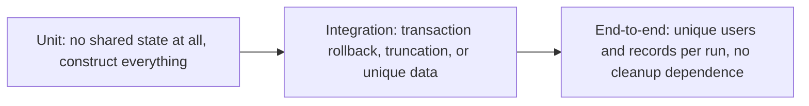
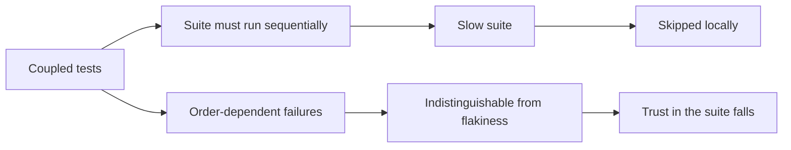

# Test Isolation

A test is **isolated** when its result depends only on itself: not on which tests ran
before it, not on what they left behind, not on whether it runs alone or in parallel with
two hundred others.

Isolation is what makes a suite parallelisable, reorderable and trustworthy. Without it,
failures become dependent on scheduling, which is indistinguishable from randomness.

```mermaid
graph TD
    A[Test A creates user "admin"] --> DB[(Shared state)]
    B[Test B assumes "admin" exists] --> DB
    B --> P{Runs after A?}
    P -->|yes| PASS[Passes]
    P -->|no| FAIL[Fails for reasons unrelated to the code]
```

## Where coupling comes from

| Source | Example | Fix |
|---|---|---|
| **Shared database rows** | Fixtures loaded once for the whole suite | Per-test data, transactions, or truncation |
| **Static or global state** | A singleton cache or registry retaining values | Reset between tests, or avoid the singleton |
| **File system** | Tests writing to the same path | Temporary directories per test |
| **Time** | A test that depends on "today" | Inject the clock |
| **Ports and processes** | Two tests binding the same port | Ephemeral ports, containers per worker |
| **Environment variables** | One test setting a flag another reads | Set and restore, or pass configuration explicitly |
| **Ordering assumptions** | A test relying on identifier 1 existing | Create what you need, assert on what you created |

## Strategies at each level



| Strategy | Where | Caveat |
|---|---|---|
| Fresh objects per test | Unit | Trivial, just avoid module-level mutable state |
| Transaction per test, rolled back | Integration | Cannot test code that commits itself |
| Truncate between tests | Integration | Must cover every table, including newly added ones |
| Unique data per test | Any | Requires discipline, but parallelises perfectly |
| Schema or container per worker | Integration and above | Slowest to start, most robust |

Unique data per test is the most durable choice: generate a unique identifier per test and
namespace everything it creates. Nothing to clean up, nothing to collide.

## Detecting coupling

Three mechanical checks, all cheap to add to a pipeline:

1. **Randomise test order** on every run. Most frameworks support it with a flag.
2. **Run in parallel**, which surfaces shared resources immediately.
3. **Run each test alone**, occasionally, to catch tests that only pass because of setup
   performed by their neighbours.

A suite that only passes in one specific order is not a regression suite. It is a script
that happens to end in green.

## The cost of not isolating



Isolation is therefore not a stylistic preference. It is the property that lets the suite be
fast, and speed is what keeps it alive.

## Check Your Understanding

<quiz>
What is the cheapest mechanical way to detect coupling between tests?

- [ ] Measuring per-test coverage overlap
- [x] Randomising test execution order and running the suite in parallel
> Correct. Both immediately surface dependence on ordering or shared resources.
- [ ] Comparing runtimes between local and CI environments
- [ ] Increasing assertion counts per test
</quiz>

<quiz>
Why is isolation a prerequisite for a fast suite rather than merely good style?

- [ ] Isolated tests execute fewer statements
- [x] Only isolated tests can run in parallel, and parallelism is usually the largest available speedup for a growing suite
> Correct. Coupled tests force sequential execution, which caps how fast the suite can ever be.
- [ ] Isolated tests require fewer test doubles
- [ ] Isolation removes the need for database containers
</quiz>
