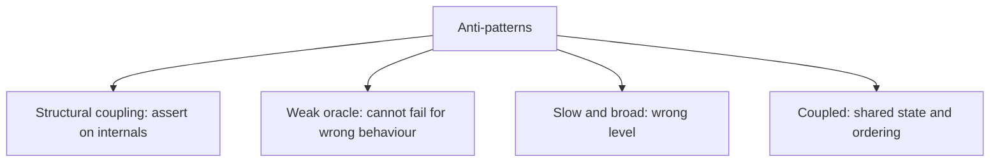
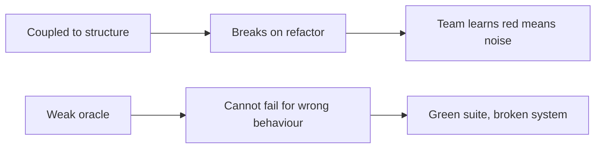

# Testing Anti-Patterns

Recurring test designs that look reasonable and cost more than they return. Most of them
share one root: the test is coupled to how the code works rather than to what it does.

## The catalogue

| Anti-pattern | What it looks like | Why it hurts | Instead |
|---|---|---|---|
| **Over-mocking** | Every collaborator mocked, setup longer than the test | Breaks on refactor, passes while the system is broken | Real objects where fast, [fakes](../Test%20Doubles/Fakes.md) for infrastructure |
| **Assertion-free test** | Calls the code, asserts nothing or only "not null" | Detects crashes only | A real [oracle](../Testing%20Fundamentals/Testing%20Oracle.md) |
| **Testing the mock** | Assertions verify only that configured stubs returned what they were told to | Verifies the test setup | Assert on the unit's output |
| **Ice cream cone** | Mostly end-to-end and manual, almost no unit tests | Slow, ambiguous, flaky | Restore the [pyramid](../Automated%20Testing/Test%20Automation%20Pyramid.md) |
| **Copy-paste suite** | Twenty near-identical tests differing by one value | Every change touches twenty places | Parameterised cases |
| **Mystery guest** | Depends on external fixture files or pre-existing rows | Unreadable, order-dependent | Build the data in the test |
| **Chained tests** | Test B depends on Test A's leftovers | Order-dependent, not parallelisable | [Isolation](Test%20Isolation.md) |
| **Conditional test logic** | `if` and loops deciding what to assert | Nobody knows what actually ran | Split into separate tests |
| **Sleeping test** | `sleep(2)` to wait for something | Slow and still [flaky](Flaky%20Tests.md) | Wait for a condition |
| **Coverage farming** | Tests for getters and generated code | Inflates the number, catches nothing | [Mutation testing](../Testing%20Approaches/Mutation%20Testing.md) on real logic |
| **The giant** | One test exercising a whole workflow with thirty assertions | First failure hides the rest | One behaviour per test |
| **Happy path only** | No error, permission or boundary cases | Misses where most defects live | Negative and boundary cases |
| **Blind snapshot approval** | "Update all snapshots" as a reflex | The baseline records the bug | Read every diff, keep snapshots small |
| **Ignored tests** | A growing list of skipped tests | Looks like coverage, protects nothing | Fix or delete |

## The two roots

Every entry in the table above lands in one of these two, and the second is the more
dangerous because it is invisible. A brittle suite is annoying and obvious. A suite with no
real assertions is comfortable and useless, and it takes
[mutation testing](../Testing%20Approaches/Mutation%20Testing.md) or a production incident
to reveal it.

## Cheap diagnostics

| Check | Reveals |
|---|---|
| Run the suite in random order and in parallel | Chained tests, shared state |
| Delete a line of production logic and run the tests | Weak oracles, assertion-free tests |
| Do a small refactor with no behaviour change | Structural coupling |
| Look at the ratio of setup to assertion | Over-mocking, mystery guests |
| Count skipped and quarantined tests | Hidden loss of coverage |

The second one takes two minutes and is remarkably revealing. If a suite stays green after
a real behaviour is broken, the problem is not in the code.

## Check Your Understanding

<quiz>
Which anti-pattern is most dangerous because it is invisible?

- [ ] The ice cream cone, since it makes the suite slow
- [x] Weak oracles and assertion-free tests, since the suite stays green while the system is broken
> Correct. Brittle tests announce themselves loudly, weak tests never do.
- [ ] Copy-paste tests, since they multiply maintenance cost
- [ ] Sleeping tests, since they slow the pipeline
</quiz>

<quiz>
What is the quickest way to find out whether a suite has real assertions?

- [ ] Measure branch coverage on the affected module
- [x] Break a piece of production behaviour deliberately and check that tests fail
> Correct. This is manual mutation testing, and it takes minutes.
- [ ] Count assertions per test and compare against a threshold
- [ ] Run the suite in random order
</quiz>
