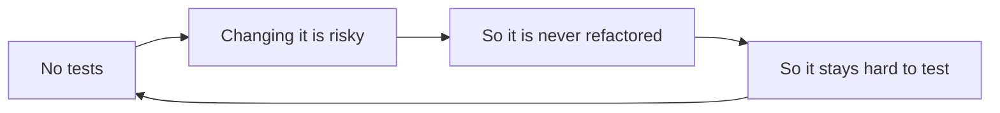
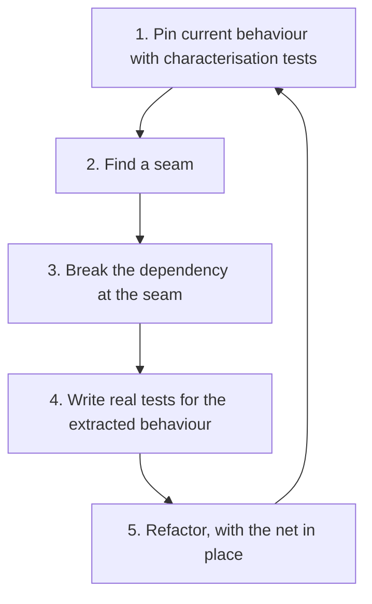
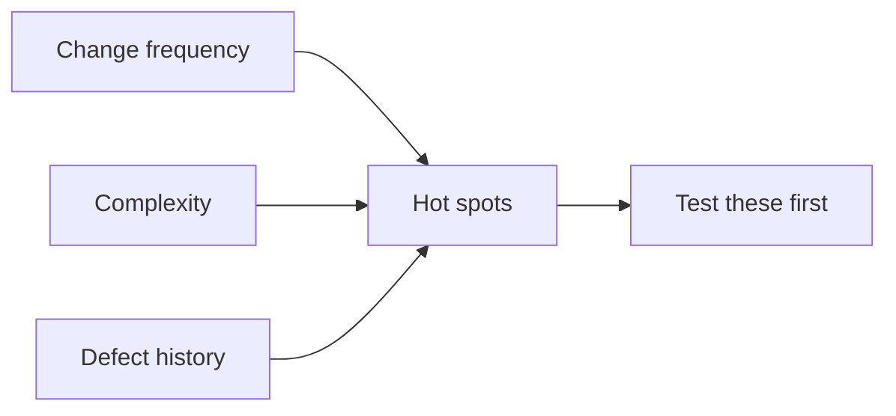

# Testing Legacy Code

Michael Feathers' definition is the useful one: **legacy code is code without tests**. Age
and language are irrelevant. What matters is that you cannot change it and know whether you
broke something.

That creates the deadlock this page is about.



## Breaking the deadlock

The way out is a safety net that requires no understanding of what the code *should* do,
only of what it currently does.



## Characterisation tests

A **characterisation test** records what the code does today, whether or not that is
correct. It is not a specification. It is a tripwire.

Write it by calling the code, seeing what comes out, and asserting exactly that. A
[snapshot or golden master](../Testing%20Approaches/Snapshot%20Testing.md) is the usual
form for large outputs.

```python
def test_characterise_invoice_total():
    # Not necessarily correct. This is what it does today.
    assert legacy_invoice_total(order_fixture) == 1247.53
```

If the recorded behaviour later turns out to be a bug, you now have the best possible
starting point: a failing test that documents the old behaviour, and a decision to make
about who depended on it.

## Finding seams

A **seam** is a place where behaviour can be changed without editing the code around it.
Legacy code resists testing because dependencies are hard-wired, and every technique here
is about introducing one seam with minimal risk.

| Obstacle | Minimal-risk move |
|---|---|
| Constructor does I/O | Extract the work into a method, or pass the collaborator in |
| Static singleton | Add a setter or a factory the test can control |
| `new` inside the method | Extract a factory method, override it in a test subclass |
| Hard-wired clock | Extract a `now()` method and override, then inject properly later |
| Giant method | Extract a pure function for the part you need to test |
| Global configuration | Read it once at a boundary and pass it down |

The order matters: make the smallest change that creates a seam, pin behaviour with tests
through that seam, and only then restructure.

## Where to start



Do not attempt to retrofit tests across the whole system. Cover the code that changes often
and breaks often, which is a small fraction of the codebase and produces nearly all the
value.

The complementary rule: **the boy scout rule for tests.** Every time you touch a file, leave
it with more test coverage than it had. Over a year this covers exactly the code that
matters, since the code nobody touches is the code nobody breaks.

## Practical guidance

- **Never refactor and change behaviour in the same commit.** With no tests, the two are
  impossible to separate afterwards.
- **Add a test with every bug fix**, which is the cheapest coverage available and always on
  code proven to matter.
- **Use approval tests for big outputs.** Reports, generated files and complex objects are
  pinned in one line each.
- **Accept imperfect tests here.** A slow, broad characterisation test that catches
  regressions beats a beautiful unit test that does not exist.
- **Keep the net until it is replaced.** Delete characterisation tests only when real
  behaviour-based tests cover the same ground.

## Check Your Understanding

<quiz>
What is a characterisation test?

- [ ] A test derived from the original specification of the legacy system
- [x] A test that records what the code currently does, correct or not, so that unintended changes are detected during refactoring
> Correct. It is a tripwire, not a specification, and it is what makes refactoring untested code safe.
- [ ] A performance test establishing a baseline for legacy code
- [ ] A test that documents which parts of the system are deprecated
</quiz>

<quiz>
Where should retrofitting tests to a large untested codebase begin?

- [ ] With the largest modules, since they contain the most code
- [x] With the hot spots: code that changes often, is complex, and has a history of defects
> Correct. Code nobody touches is code nobody breaks, so it returns the least per test written.
- [ ] With the newest code, which is easiest to understand
- [ ] Uniformly, to reach a consistent coverage percentage
</quiz>
