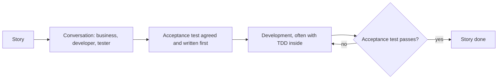
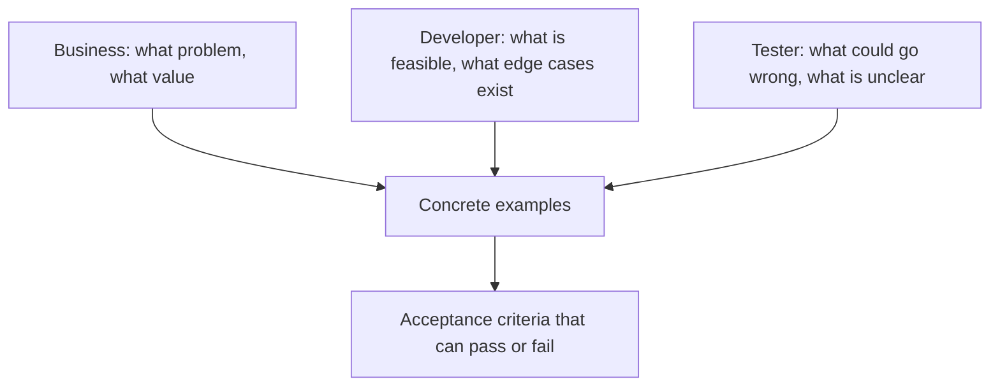

# Acceptance Test-Driven Development

**Acceptance Test-Driven Development (ATDD)** writes the acceptance test for a story before
the story is built, with the business, development and testing perspectives all present.
The test becomes the definition of done: the story is finished when it passes.

## ATDD, BDD and TDD

They are frequently confused because they overlap in practice.

| | [TDD](Test-Driven%20Development.md) | ATDD | [BDD](Behavior-Driven%20Development.md) |
|---|---|---|---|
| **Written by** | Developer | The three perspectives together | The three perspectives together |
| **Level** | Unit | Story acceptance | Story behaviour |
| **Language** | Code | Business language | Business language, often Gherkin |
| **Answers** | Does this unit behave? | Is this story done? | Do we agree what this means? |
| **Loop length** | Minutes | Days | Days |

The clean summary: ATDD is about *when* the acceptance test is written and who agrees on
it. BDD adds an emphasis on language and shared examples. TDD runs inside both, at the unit
level.

## The three amigos

Each perspective asks questions the others do not. The developer discovers the edge cases,
the tester finds the ambiguities, the business decides what the answer should be. Holding
the conversation takes half an hour and routinely prevents days of rework.

## Turning criteria into a test

Story: *as a customer I want free shipping on larger orders.*

| Weak criterion | Testable criterion |
|---|---|
| Shipping should be free for big orders | An order totalling 50 or more has shipping cost 0 |
| Small orders pay shipping | An order totalling 49.99 has shipping cost 5 |
| Refunds should behave sensibly | Refunding an order below the threshold refunds the goods only, not the shipping |

The third row is typical of what the conversation produces: nobody wrote the refund
interaction down, and the tester's question surfaced it before implementation started.

## Practice notes

- **Write the test before the code, not after the demo.** Written afterward, it documents
  what was built rather than what was wanted, which is the entire failure mode ATDD exists
  to prevent.
- **Keep it at the story level.** A handful of acceptance tests per story, with unit tests
  covering permutations underneath.
- **Bind below the interface where you can.** Acceptance tests driven through the browser
  are slow and fragile, and most acceptance criteria can be verified at the service level.
- **Make failure meaningful.** A red acceptance test should say which business rule is
  unmet, not which selector was missing.
- **Do not let it replace exploratory testing.** Agreed criteria cover what people thought
  of, which is exactly the coverage exploratory work is there to extend.

## Check Your Understanding

<quiz>
What is the defining characteristic of ATDD?

- [ ] Acceptance tests are automated through the user interface
- [x] The acceptance test is agreed and written before development, by business, development and testing together, and defines done
> Correct. Writing it first is what turns it into a shared specification rather than a record of what was built.
- [ ] Acceptance tests are written in Gherkin syntax
- [ ] Developers write unit tests before acceptance tests
</quiz>

<quiz>
During a three amigos conversation the tester asks what happens to shipping cost on a partial refund. Nobody has an answer. What has just happened?

- [ ] The story is too large and should be split
- [x] A requirement gap was found before any code was written, at the cheapest possible point to resolve it
> Correct. Surfacing these questions early is the main return on the conversation.
- [ ] The acceptance criteria are too detailed for a single story
- [ ] The question belongs in exploratory testing after release
</quiz>
