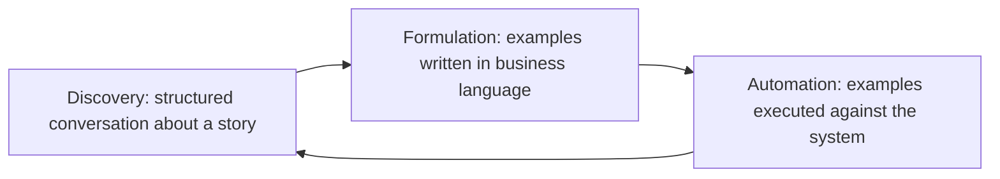
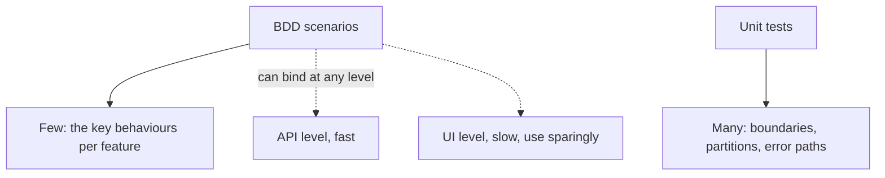

# Behavior-Driven Development

**Behaviour-Driven Development (BDD)** grew out of
[TDD](Test-Driven%20Development.md) as an answer to a recurring problem: developers
understood how to test, but tests described implementation rather than behaviour, and
non-developers could not read them.

Its core is not a syntax. It is a conversation, held before code exists, that produces
concrete examples everyone agrees on.

See also the
[methodologies view of BDD](../../Methodologies/Development%20Practices/Behaviour-Driven%20Development.md).

## The three practices



Most of the value sits in Discovery. A conversation between a business representative, a
developer and a tester, working through concrete examples, surfaces requirement gaps at the
cheapest possible moment. Teams that adopt only the Automation part get an expensive test
syntax and none of the benefit.

## Given, When, Then

```gherkin
Feature: Free shipping

  Scenario: order reaches the free shipping threshold
    Given a cart totalling 50
    When the customer views the checkout
    Then the shipping cost is 0

  Scenario: order below the threshold
    Given a cart totalling 49.99
    When the customer views the checkout
    Then the shipping cost is 5
```

| Clause | Contains |
|---|---|
| **Given** | The starting state, in business terms |
| **When** | One action, the thing being described |
| **Then** | The observable outcome, not internal state |

Rules that keep scenarios useful:

- **Declarative, not imperative.** "Given a cart totalling 50", never "Given I click Add
  to Cart three times, then click the basket icon".
- **One behaviour per scenario.** Multiple `When` clauses usually mean two scenarios.
- **Business vocabulary only.** No selectors, endpoints, tables or status codes. If a
  business reader cannot read it, the scenario has failed its purpose.
- **Examples, not exhaustive coverage.** Edge case permutations belong in unit tests, where
  they are cheaper and clearer.

## Where BDD scenarios sit in the suite



Binding scenarios below the user interface, at the service or API level, keeps them fast
and stable while remaining readable. Driving every scenario through a browser is the most
common reason a BDD suite becomes too slow to run.

## Failure modes

| Failure | Consequence |
|---|---|
| Scenarios written after the code | Verbose integration tests with a parser attached, and no shared understanding gained |
| Written by developers alone | Business language without business input, so the requirement gaps remain |
| Imperative UI scripts | Break on every interface change and are unreadable |
| Hundreds of scenarios | Slow suite, and nobody reads them as documentation any more |
| Step definitions with hidden logic | The readable text no longer describes what runs |

The first row is the one worth watching. If nobody outside the development team ever reads
or contributes to a scenario, the Gherkin is pure overhead and plain unit tests would serve
better.

## Check Your Understanding

<quiz>
Where does most of BDD's value come from?

- [ ] The Gherkin syntax, which makes tests self-documenting
- [x] The discovery conversation before coding, where concrete examples expose requirement gaps between business, development and testing
> Correct. Adopting only the automation gives an expensive syntax with none of the shared understanding.
- [ ] The ability to run scenarios through the user interface
- [ ] Automatic generation of step definitions from stories
</quiz>

<quiz>
Which scenario is written correctly?

- [ ] Given I click "Add", then click "Add" again, and click the cart icon
- [x] Given a cart totalling 50, when the customer views the checkout, then the shipping cost is 0
> Correct. Declarative and in business terms, so it survives interface changes and can be read by anyone.
- [ ] Given POST /cart returns 201 with two line items
- [ ] Given the cart table contains two rows for user 42
</quiz>
