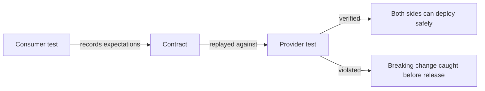
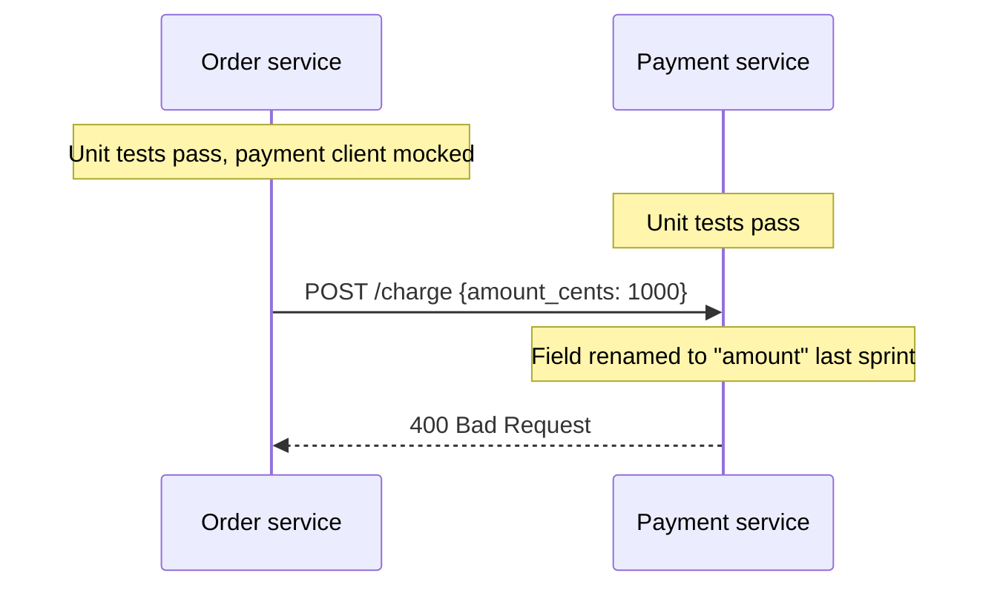
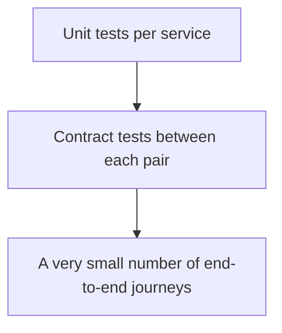

# Contract Testing

**Contract testing** verifies that two services agree on the interface between them, without
running both in one environment. Each side is tested independently against a shared, machine
checkable description of what the consumer needs and what the provider promises.

It exists because the alternatives are both bad: mocking the other service proves nothing
about the other service, and running the whole estate end to end is slow, flaky and gets
worse with every service added.

## The problem it solves

Both services are internally correct and the system is broken. No amount of testing inside
either one detects it, because each was tested against its own assumption.

## Consumer-driven contracts

The dominant style. The consumer's tests generate the contract, so it describes what is
actually used rather than everything the provider offers.

| Step | Who | Output |
|---|---|---|
| 1. Consumer writes a test against a local simulated provider | Consumer team | Expected request and response |
| 2. The interaction is recorded | Tooling | A contract file |
| 3. The contract is published | Pipeline | A broker or repository |
| 4. The provider replays the contract against the real service | Provider team | Pass or fail |
| 5. Deployment is gated on verification | Pipeline | Safe independent deploys |

Because contracts record only what consumers depend on, a provider can freely add fields,
add endpoints, and change anything nobody consumes. It fails only when it breaks something
in use, which is exactly the signal wanted.

## What a contract covers

| Covered | Not covered |
|---|---|
| Request shape: path, method, headers, body fields used | Whether the business logic is correct |
| Response shape and types for the fields consumed | Performance and reliability |
| Status codes the consumer branches on | Whether the data is meaningful |
| Error response structures | Anything the consumer never requests |

Contract testing is about compatibility, not correctness. Both sides still need their own
functional tests.

## Where it fits

In a microservice estate this is the layer that replaces most cross-service end-to-end
testing. Ten services with pairwise end-to-end coverage is an unmanageable environment
problem. The same confidence via contracts requires each team to run only its own service.

The same technique also fixes the [fake](../Test%20Doubles/Fakes.md) fidelity problem
inside a single codebase: run one shared contract suite against both the real
implementation and the in-memory fake, and drift fails immediately.

## Practice notes

- **Contracts belong in the pipeline, not in a document.** A written interface agreement
  that is not executed drifts within weeks.
- **Gate deployment on verification.** Publishing a contract nobody verifies is worse than
  nothing, because it implies a guarantee that does not exist.
- **Version and record which contracts a provider satisfies**, so it is decidable whether a
  given provider version can deploy against the consumers currently in production.
- **Do not encode business assertions in contracts.** Values in a contract are examples of
  shape, not statements of correct behaviour.

## Check Your Understanding

<quiz>
Why is mocking a downstream service in your own tests not a substitute for contract testing?

- [ ] Mocks are slower than contract verification
- [x] The mock encodes your assumptions about the other service, so it passes even when the real service has changed
> Correct. A contract is verified against the real provider, which is what makes it evidence rather than assumption.
- [ ] Mocks cannot simulate error responses
- [ ] Contract tests replace the need for unit tests on both sides
</quiz>

<quiz>
A provider adds a new optional field to a response. What should consumer-driven contract verification do?

- [ ] Fail, because the response no longer matches the recorded example exactly
- [x] Pass, because contracts describe only what consumers actually use, so additions that break nobody are allowed
> Correct. This is why consumer-driven contracts do not obstruct provider evolution.
- [ ] Fail, and require every consumer to re-publish its contract
- [ ] Pass only if every consumer has been redeployed first
</quiz>
