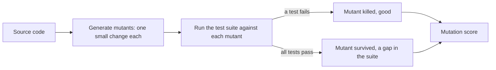
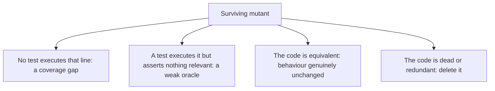

# Mutation Testing

**Mutation testing** measures how good a test suite is at detecting defects, by
deliberately introducing small faults into the code and checking whether any test fails.

It answers the question [coverage](../Testing%20Fundamentals/Test%20Coverage.md) cannot:
the code ran, but would the tests have noticed if it were wrong?



**Mutation score** = killed mutants / total viable mutants.

## Typical mutations

| Original | Mutant |
|---|---|
| `a > b` | `a >= b`, `a < b` |
| `a + b` | `a - b` |
| `if (x)` | `if (true)`, `if (false)` |
| `return value` | `return null`, `return 0` |
| A method call with a side effect | Call removed |
| `&&` | `\|\|` |

These are chosen to mimic the mistakes people actually make, which is why a surviving
mutant so reliably corresponds to a case a real defect could slip through.

## What a survivor tells you



The second branch is the valuable one. It finds tests that run code and never check the
result, which is exactly the blind spot a coverage percentage hides.

The third branch, equivalent mutants, is the technique's main cost: some mutants cannot be
killed by any test because they do not change behaviour, and deciding that requires human
judgement. It is why a 100% mutation score is neither achievable nor a sensible target.

## A worked example

```python
def is_adult(age):
    return age >= 18
```

```python
def test_adult():
    assert is_adult(30) is True
```

100% statement and branch coverage. Now mutate `>=` to `>`: the test still passes, so the
mutant survives, and the report points at the missing boundary case. Adding
`assert is_adult(18) is True` kills it.

That is [boundary value analysis](../Testing%20Techniques/Boundary%20Value%20Analysis.md)
being discovered automatically, which is a fair summary of what mutation testing does.

## Making it affordable

Running the whole suite once per mutant is expensive, so mutation testing is usually
applied selectively.

| Tactic | Effect |
|---|---|
| **Incremental mode** | Mutate only changed code in a pull request |
| **Critical modules only** | Pricing, auth, tax, safety logic, not the whole codebase |
| **Coverage-guided selection** | Only run the tests that cover the mutated line |
| **Nightly rather than per commit** | Full runs where the runtime does not block anyone |
| **Threshold on the delta** | Fail if new code lowers the score, rather than chasing an absolute |

## Using it well

- **Treat it as a suite audit, not a code metric.** The output is a list of test weaknesses
  to fix, not a number to maximise.
- **Read the survivors individually.** Each is either a missing test, a weak assertion,
  dead code, or an equivalent mutant, and all four are worth knowing.
- **Do not chase 100%.** Equivalent mutants make it unreachable, and the last few percent
  cost far more than they return.
- **Apply it where failure is expensive.** A high mutation score on a settings page proves
  nothing worth the compute.

## Check Your Understanding

<quiz>
What does mutation testing measure that coverage does not?

- [ ] Which requirements have no corresponding test
- [x] Whether the tests would actually fail if the code were wrong, rather than merely executing it
> Correct. Coverage measures reach, mutation score measures the power of the assertions.
- [ ] How long the test suite takes to run
- [ ] Whether the tests are independent of each other
</quiz>

<quiz>
A mutant survives on a line that is fully covered by tests. What is the most likely explanation?

- [ ] The mutation tool generated an invalid mutant
- [x] The tests execute the line but assert nothing that depends on its result, so the oracle is too weak
> Correct. This is the exact blind spot a high coverage percentage hides.
- [ ] The line is unreachable at runtime
- [ ] The suite ran the tests in the wrong order
</quiz>
