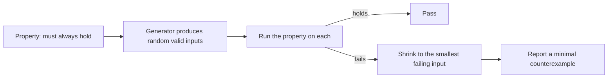

# Property-Based Testing

**Property-based testing** asserts a property that must hold for *all* valid inputs, then
lets a generator produce hundreds of inputs trying to break it. Instead of the tester
choosing examples, the machine searches.



Shrinking is what makes the technique practical. A failure on a 400-element list is
useless. The library reduces it automatically to the smallest input that still fails,
which is usually one or two elements and immediately diagnosable.

## Finding properties

The hard part is not the tooling, it is deciding what must always be true. The standard
patterns:

| Pattern | Form | Example |
|---|---|---|
| **Round trip** | `decode(encode(x)) == x` | Serialisation, parsing, compression |
| **Invariant** | Something always true of the output | A sorted list is a permutation of the input and is ordered |
| **Idempotence** | `f(f(x)) == f(x)` | Normalisation, deduplication, applying a migration twice |
| **Commutativity** | Order does not matter | Adding items to a cart |
| **Oracle comparison** | Matches a simpler, slower implementation | An optimised routine against the naive one |
| **Metamorphic** | A relation between two runs | More income never yields less tax |
| **Never crashes** | No unexpected exception for any valid input | Parsers, validators |

Round trip and invariant cover most real uses. See
[testing oracle](../Testing%20Fundamentals/Testing%20Oracle.md) for why these relations are
so useful when the exact expected output is unknown.

```python
@given(st.lists(st.integers()))
def test_sort_is_permutation_and_ordered(xs):
    result = my_sort(xs)
    assert sorted(result) == sorted(xs)          # nothing lost or invented
    assert all(a <= b for a, b in zip(result, result[1:]))
```

Those two assertions fully specify sorting, and the generator will supply the empty list,
single elements, duplicates and negatives without anyone remembering to.

## Where it earns its cost

| Strong fit | Weak fit |
|---|---|
| Parsers, serialisers, encoders | Interface layout and wording |
| Data structures and algorithms | Workflows with heavy external coordination |
| Money, tax, pricing and rounding | Behaviour with no expressible invariant |
| Validation and normalisation | Anything where setup dominates the test |
| Concurrent data structures, with the right tooling | One-off migrations |

## Working with it

- **Keep example-based tests too.** They document intent and pin specific known cases.
  Property tests describe the shape of correctness, examples describe the requirement.
- **Constrain the generator to valid inputs.** A property that fails because the generator
  produced a negative age is a specification problem, not a defect.
- **Pin every counterexample as a regression test.** Random search may not find it again,
  and it is now a known case.
- **Fix the seed in CI or record failures.** A property test that fails once and passes on
  re-run is worse than useless if the input is lost.
- **Watch runtime.** Hundreds of cases per property adds up, so bound the case count in the
  fast pipeline stage and run deeper searches nightly.

## Check Your Understanding

<quiz>
What makes shrinking essential to property-based testing?

- [ ] It reduces the number of generated inputs, keeping the suite fast
- [x] It reduces a failing input to the smallest one that still fails, turning an unreadable random case into a diagnosable counterexample
> Correct. Without shrinking, failures arrive as large random inputs that nobody can reason about.
- [ ] It removes invalid inputs that the generator produced by mistake
- [ ] It converts property failures into example-based tests automatically
</quiz>

<quiz>
Which is a well-formed property for a `normalise` function?

- [ ] normalise(x) is never empty
- [x] normalise(normalise(x)) == normalise(x), since normalisation should be idempotent
> Correct. Idempotence is a standard property pattern and catches a real class of defect.
- [ ] normalise(x) runs in under one millisecond
- [ ] normalise(x) equals the value the current implementation returns
</quiz>
