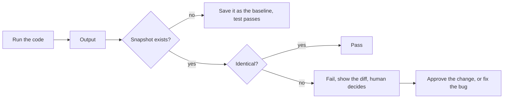
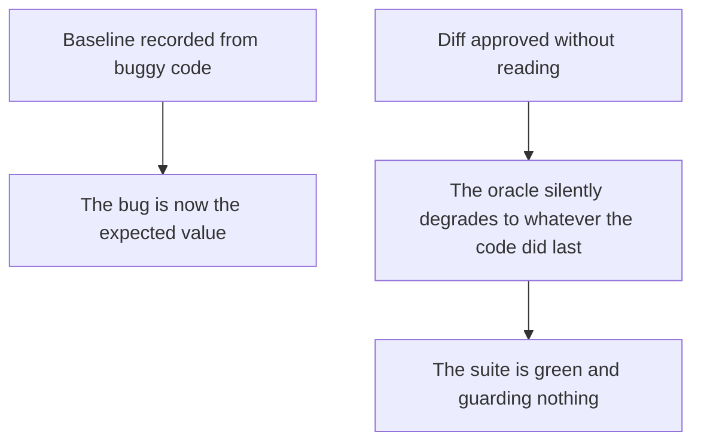

# Snapshot Testing

**Snapshot testing**, also called approval or golden master testing, records the output of
some code once, stores it, and fails future runs when the output differs.

The appeal is the cost: one line of test code covers an output of arbitrary size, with no
expected value written by hand.

## Where it fits

| Good fit | Poor fit |
|---|---|
| Rendered markup and component output | Business rules with a known correct answer |
| Serialisation formats, generated files | Anything where the expected value is short and obvious |
| Reports, invoices, generated documents | Outputs containing timestamps, identifiers, ordering noise |
| Compiler and formatter output | Behaviour that changes legitimately on every run |
| [Legacy code](../Test%20Quality/Testing%20Legacy%20Code.md) with no tests at all | Code being actively designed |

The legacy case is the strongest. Capturing current behaviour as a golden master gives a
refactoring safety net in an afternoon, without needing to understand what the code should
do. The snapshot says only "do not change behaviour", which is precisely the guarantee
refactoring requires.

## The oracle problem

A snapshot is a [consistency oracle](../Testing%20Fundamentals/Testing%20Oracle.md): it
asserts the output has not changed, never that it is correct. Both failure modes follow
from that.

The second is what actually kills snapshot suites. Once "update all snapshots" becomes a
routine keystroke, the tests provide no protection while still consuming runtime.

## Keeping snapshots useful

- **Read every diff.** If a diff is too large to read, the snapshot is too large.
- **Keep them small and focused.** One component or one document fragment, not an entire
  page. Small snapshots produce readable diffs.
- **Normalise the noise.** Freeze the clock, stub identifier generation, sort collections,
  mask volatile fields. Any snapshot that changes on its own trains people to approve
  blindly.
- **Commit them and review them.** Snapshots belong in version control, and a snapshot
  change in a pull request deserves the same scrutiny as a code change.
- **Do not snapshot what an assertion states better.** `assert total == 120` is clearer,
  smaller, and cannot be blindly re-approved.

## Snapshot and visual regression

Visual regression testing is snapshot testing over rendered images, and it inherits the
same properties: cheap to create, powerful at catching unintended change, and dependent on
somebody actually reading the diff. It adds environment sensitivity, since fonts and
rendering differ across platforms, which is why it is normally pinned to a container.

## Check Your Understanding

<quiz>
What kind of oracle is a snapshot?

- [ ] A specified oracle, since the baseline states the requirement
- [x] A consistency oracle: it asserts the output has not changed, not that it is correct
> Correct. A baseline recorded from buggy code locks the bug in as the expected value.
- [ ] A metamorphic oracle, since it compares two runs
- [ ] A heuristic oracle, since it only detects obvious problems
</quiz>

<quiz>
A team routinely regenerates all snapshots when tests fail. What is the effect?

- [ ] Snapshots become slower to compare over time
- [x] The tests stop guarding anything, since the baseline now records whatever the code last did, including defects
> Correct. Blind approval is the standard way snapshot suites become pure cost.
- [ ] Coverage of the snapshot-tested code drops
- [ ] The snapshots become incompatible with version control
</quiz>
