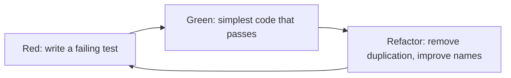
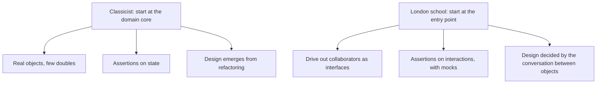

# Test-Driven Development

**Test-Driven Development (TDD)** writes a failing test before the code that makes it pass.
The tests are the visible output, but the real product is design pressure: code that is hard
to test is hard to use, and TDD surfaces that before the code has callers.

The [methodologies section](../../Methodologies/Development%20Practices/Test-Driven%20Development.md)
covers TDD as an [XP](../../Methodologies/Extreme%20Programming/index.md) practice. This page
looks at it as a testing approach.

## The cycle

| Step | Rule | Why |
|---|---|---|
| **Red** | One small test, watched failing | A test never seen failing may be testing nothing |
| **Green** | The least code that passes, even if ugly | Keeps the step small enough that a failure points at the last edit |
| **Refactor** | Improve design with tests green | The design work lives here, not in Green |

Minutes per loop. An hour-long cycle means the step was too big.

## Inside-out and outside-in

Two schools, both TDD, differing in where they start.

| | Classicist | London school |
|---|---|---|
| **Doubles** | Few, mostly at real boundaries | Many, one per collaborator |
| **Verification** | [State](../Test%20Doubles/Stubs.md) | [Interaction](../Test%20Doubles/Mocks.md) |
| **Refactoring cost** | Low | Higher, tests know the call structure |
| **Good for** | Rich domain logic | Coordination-heavy, layered code |

Most teams do well starting classicist and reaching for interaction verification only where
the interaction genuinely is the requirement.

## What it produces beyond tests

- **Testable design.** Dependencies get injected because otherwise the test cannot be
  written, which yields loosely coupled code as a side effect.
- **Coverage that means something.** Every line exists because a test demanded it, so there
  is no untested code to backfill later.
- **Executable specification.** The test states intent in a form that fails when the code
  drifts from it.
- **Small steps.** Debugging time drops because the change since the last green state is
  minutes old.

## Where it is misapplied

| Symptom | Cause |
|---|---|
| Tests break on every refactor | Testing implementation instead of behaviour, usually over-mocking |
| Well-tested mess | The refactor step is being skipped |
| Tests written after the code, never seen red | May be permanently green by accident |
| Six mocks per test | The unit has too many dependencies, and TDD is reporting a design problem |

TDD also fits poorly where the correct output is unknown in advance, such as exploratory
data work or spikes. Spike first, throw the spike away, then drive the real implementation
with tests.

## Check Your Understanding

<quiz>
Why must the test be observed failing before the production code is written?

- [ ] Because coverage tools require an initial failing run
- [x] Because a test never seen failing might pass for the wrong reason, and would then verify nothing
> Correct. Red proves the test is actually connected to the behaviour it claims to check.
- [ ] Because the refactor step only runs after a failure
- [ ] Because it is required for the London school approach
</quiz>

<quiz>
A team writes tests first, keeps them green, and never refactors. What results?

- [ ] Clean code, since every line was test driven
- [x] A well-tested but poorly designed codebase, because the design improvement lives in the skipped refactor step
> Correct. Green only asks for code that passes. Duplication and bad names are removed in Refactor.
- [ ] Tests that gradually start failing on their own
- [ ] Coverage falling below the gate threshold
</quiz>
