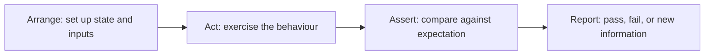
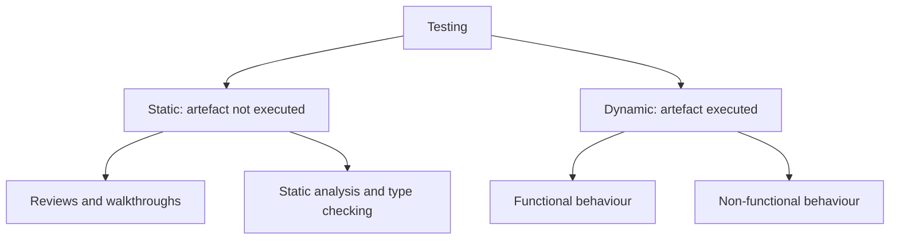

# Software Testing

**Software testing** is the activity of exercising a system, or reading it, to gather
information about whether it behaves as it should. Its purpose is not to prove
correctness. Its purpose is to reduce uncertainty about risk before someone else finds
the answer for you.

## What a test really is

Every test, from a one line assertion to a week of exploratory work, has the same four
parts.

The comparison in step three needs a source of truth about what *should* happen. That
source is the [test oracle](Testing%20Oracle.md), and it is the part most often missing
when people say they cannot test something.

## Checking and exploring

Testing splits into two activities that need different skills and produce different
value.

| | Checking | Exploring |
|---|---|---|
| **Question** | Does the known expectation still hold? | What have we not thought about? |
| **Answer known in advance** | Yes | No |
| **Best performed by** | Machines, repeatedly | Humans, with intent |
| **Finds** | Regressions | New risks, misunderstandings, design flaws |
| **Examples** | Unit suite, contract tests, CI gates | Exploratory testing, bug hunts |

Automating checking frees human attention for exploring. A team that automates nothing
spends its people re-verifying what already worked yesterday.

## Static and dynamic

Static testing can start before any code exists, on requirements and designs, which is
where the cheapest defects are found. Dynamic testing is the only way to observe
behaviour that emerges at runtime: timing, concurrency, resource growth, real
integrations.

## Why testing cannot be exhaustive

A function taking two 32 bit integers has roughly 1.8 x 10^19 input combinations. At a
million cases per second, exhausting it takes longer than recorded history. Add state,
ordering and concurrency and the space stops being countable in any useful sense.

So every test suite is a sample, and the only question that matters is whether it is a
*well chosen* sample. That is the job of
[test case design](Test%20Case%20Design.md) techniques such as
[equivalence partitioning](../Testing%20Techniques/Equivalence%20Partitioning.md) and
[boundary value analysis](../Testing%20Techniques/Boundary%20Value%20Analysis.md), which
pick cases by where defects actually cluster instead of at random.

## What testing produces

- **Information for a decision.** Ship or hold, and what the risk is either way.
- **A regression net.** Confidence that a change did not break what worked, which is what
  makes refactoring and continuous delivery possible.
- **Design pressure.** Code that resists testing is usually code with too many
  dependencies. See TDD.
- **Defect data.** Feedback that [quality assurance](../Quality%20Fundamentals/Quality%20Assurance.md)
  turns into process change.

The second point is worth stating plainly: without a test suite, the cost of changing
software rises until change stops. Testing is what keeps a codebase modifiable.

## Check Your Understanding

<quiz>
What is the most accurate statement of testing's purpose?

- [ ] To prove the software contains no defects
- [x] To reduce uncertainty about risk by gathering information on how the system behaves
> Correct. Testing samples behaviour, so it can demonstrate defects but never their absence.
- [ ] To satisfy a coverage threshold agreed with management
- [ ] To document the requirements in executable form only
</quiz>

<quiz>
Which work is best given to humans rather than automated?

- [ ] Re-running the regression suite on every commit
- [ ] Verifying a JSON schema has not changed
- [x] Exploring a new feature to discover risks nobody wrote down
> Correct. Machines are better at checking known expectations, humans at finding unknown ones.
- [ ] Comparing rendered output against an approved snapshot
</quiz>
