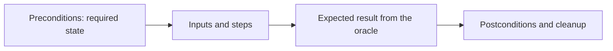
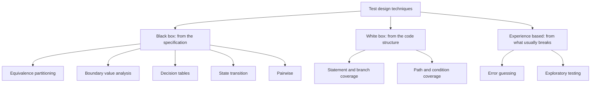

# Test Case Design

Test case design is choosing which of the effectively infinite possible inputs to
actually run. Since [exhaustive testing is impossible](Testing%20Principles.md), the whole
value of a suite comes from this choice.

## Anatomy of a test case

| Field | Purpose | Failure mode when missing |
|---|---|---|
| **Identifier** | Reference in reports and [traceability](Traceability.md) | Defects cannot be linked back |
| **Title** | Says what behaviour is under test | Nobody knows what a failure means |
| **Preconditions** | Required state, data, and configuration | Passes on one machine, fails on another |
| **Steps or inputs** | What is done | Not reproducible |
| **Expected result** | The oracle's verdict | The test can only detect crashes |
| **Postconditions** | State left behind, cleanup | Later tests break, isolation lost |

## Choosing cases: the technique families

Each family answers a different question. Black box asks what the system promised, white
box asks which code has never run, experience based asks what has bitten us before. A
suite built from only one family has a predictable blind spot.

## A worked example

Requirement: shipping is free for orders of 50 or more, otherwise it costs 5. Orders
above 1000 are rejected.

Partitions and boundaries:

| Partition | Representative | Boundaries to test | Expected |
|---|---|---|---|
| Below free threshold | 20 | 0, 49.99 | Charge 5 |
| At or above threshold | 200 | 50, 50.01 | Free |
| Above maximum | 1500 | 1000.01 | Rejected |
| Invalid | -10, "abc", empty | | Rejected with a validation error |

Twelve cases instead of thousands of random amounts, and every defect that shifts a
comparison operator by one is caught, because the operators live exactly at 50 and 1000.

## Rules that keep cases useful

- **One reason to fail.** A case asserting six unrelated things reports a vague failure
  and hides the other five once the first breaks.
- **Name the behaviour, not the method.** `rejects_expired_card` survives a refactor,
  `test_validate_2` does not.
- **Derive from a condition, not from the implementation.** Cases written by reading the
  code inherit the code's misunderstandings.
- **Make expected results explicit and specific.** "Returns successfully" is not an
  oracle. See [testing oracle](Testing%20Oracle.md).
- **Keep data self-contained.** A case that depends on a row someone loaded last year is
  a future flaky test.
- **Prefer few strong cases to many weak ones.** Suite value is defects found, not cases
  counted.

## How many cases is enough

Coverage of *conditions* is the useful measure, not coverage of lines. Aim for:

1. Every equivalence partition represented once.
2. Every boundary of every partition tested on both sides.
3. Every decision rule and every state transition exercised at least once.
4. Extra depth only where risk is high, using defect history and change frequency.

If a case cannot be tied to a condition or a risk, it is a candidate for deletion, and
deleting it makes the suite faster and no weaker.

## Check Your Understanding

<quiz>
Why do boundary values deserve dedicated cases when a representative value from the partition already passed?

- [ ] Because boundaries execute more code paths
- [x] Because off-by-one mistakes in comparison operators live exactly at the boundary, and a mid-partition value cannot detect them
> Correct. A case at 200 passes whether the check is greater-than or greater-or-equal at 50. A case at exactly 50 does not.
- [ ] Because coverage tools weight boundaries more heavily
- [ ] Because boundaries are the only values users enter
</quiz>

<quiz>
What is the strongest objection to writing test cases by reading the implementation?

- [ ] It takes longer than reading the specification
- [x] The cases inherit the implementation's misunderstandings, so a wrong behaviour is confirmed rather than exposed
> Correct. White box techniques are for finding untested structure, not for deriving expected results.
- [ ] It produces too many cases to maintain
- [ ] It prevents the use of boundary value analysis
</quiz>
