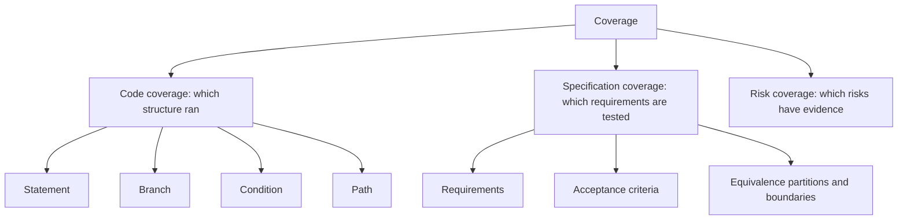
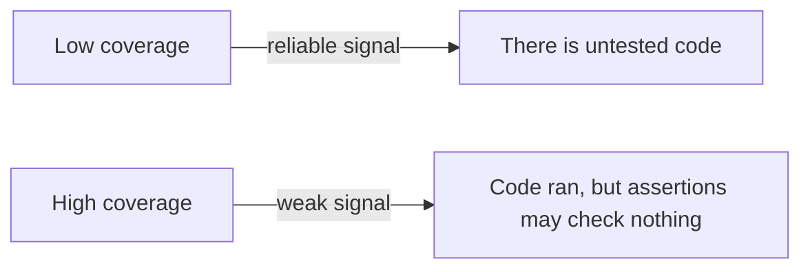
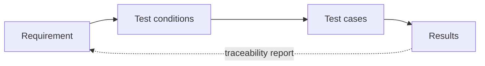

# Test Coverage

**Coverage** measures how much of something was exercised by the tests. The something
matters more than the number: code coverage, requirement coverage and risk coverage
answer different questions, and only the first is easy to measure.

## Kinds of coverage



Tools report the left branch because it is mechanical. Stakeholders care about the right
branches, which is why a coverage percentage alone rarely answers the question that was
asked.

## Code coverage criteria, from weak to strong

Given:

```python
def price(qty, member):
    if qty > 10 or member:
        return 0.9
    return 1.0
```

| Criterion | Requires | Cases needed here |
|---|---|---|
| **Statement** | Every line executed | 2 |
| **Branch (decision)** | Every decision outcome taken | 2 |
| **Condition** | Every atomic condition both true and false | 2, but may miss combinations |
| **Modified condition/decision (MC/DC)** | Each condition shown to independently affect the outcome | 3 |
| **Path** | Every path through the function | Explodes with loops and branches |

100% statement coverage is achievable with a single call to `price(20, False)` plus
`price(1, False)`, and neither case ever sets `member` to `True`. That is the standard
demonstration that statement coverage is a weak signal.

## What coverage can and cannot tell you



Coverage is a **negative** indicator. Low coverage proves a gap. High coverage proves
only execution, not verification. A test that calls every function and asserts nothing
reports 100%.

To find out whether the assertions actually check anything, use
[mutation testing](../Testing%20Approaches/Mutation%20Testing.md), which changes the code
and reports which mutations the suite failed to catch. Mutation score measures the suite's
power, coverage measures only its reach.

## Coverage as a target

Once a percentage becomes a goal, it stops measuring quality and starts measuring
compliance. The predictable adaptations:

- Tests written for trivial getters, because they are cheap coverage.
- Assertions dropped where they are awkward, since execution alone scores.
- Hard, risky code left untested, because it is expensive coverage per line.

Better uses of the number:

| Use | Why it works |
|---|---|
| Gate on coverage of **changed lines** only | Cheap to satisfy honestly, targets the risky code, no legacy debt to backfill |
| Review uncovered lines in code review | A human decides whether the gap matters |
| Track the trend, not the absolute | Direction is informative, the level is arbitrary |
| Pair with mutation score on critical modules | Reach plus power, which is the actual question |

## Requirement and risk coverage

The coverage that stakeholders mean.



This needs [traceability](Traceability.md) rather than a coverage tool, and it answers
"which requirements have no evidence", which is the question a release decision actually
turns on.

## Check Your Understanding

<quiz>
A module reports 100% statement coverage. What can be concluded?

- [ ] Its behaviour is verified and defect free
- [x] Every line was executed by some test, which says nothing about whether any assertion checked the result
> Correct. Coverage measures reach, not verification. A suite with no assertions can still report 100%.
- [ ] All branches and conditions were exercised
- [ ] Its requirements are fully tested
</quiz>

<quiz>
Why is gating on coverage of changed lines better than gating on total project coverage?

- [ ] Because changed lines are always the simplest code
- [x] It targets the newly risky code, is achievable without backfilling legacy tests, and is harder to satisfy with trivial tests elsewhere
> Correct. A project-wide threshold pushes teams to farm easy coverage in untouched code.
- [ ] Because tools cannot measure total coverage reliably
- [ ] Because it guarantees a high mutation score
</quiz>
