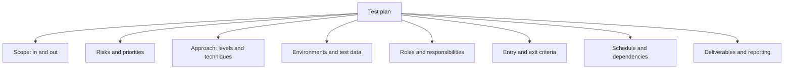
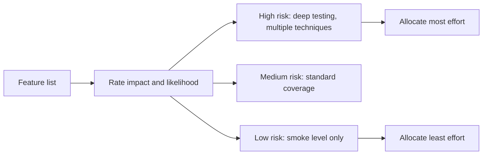

# Test Plan

A **test plan** is the answer to a single question: for *this* release or project, what
will be tested, by whom, in what environment, and what has to be true before anyone calls
it done.

It is not the same as a [test strategy](Test%20Strategy.md). Strategy is the standing
approach across projects, a plan is specific, dated and disposable.

## What belongs in one

| Section | The useful content | The useless content |
|---|---|---|
| **Scope** | Named features in, and explicitly what is out | "The whole system" |
| **Risks** | Ranked list with impact and likelihood, driving effort | A generic risk register copied forward |
| **Approach** | Which [levels](../Test%20Levels/Unit%20Testing.md) and techniques per area, and why | A textbook summary of all testing types |
| **Environments** | Concrete environments, data, and who provisions them | "A test environment will be available" |
| **Criteria** | Measurable entry and exit conditions | "Testing complete when quality is acceptable" |
| **Schedule** | Dependencies and the critical path for testing | A date with no dependency analysis |

The rule of thumb: if a section would read identically on the previous project, it is
boilerplate and should be deleted or moved to the strategy document.

## Risk driven, not feature driven

Since effort is finite, the plan's real job is allocating it.

| Impact \ Likelihood | Low | High |
|---|---|---|
| **High** | Test thoroughly, defects are rare but severe | Highest priority, test first and deepest |
| **Low** | Smoke test only | Standard coverage, defects are cheap |

This is what makes a plan defensible when a date slips: it shows exactly what gets cut
and what that costs, instead of cutting whatever is scheduled last.

## Sizing the plan to the context

| Context | Reasonable plan |
|---|---|
| Regulated or safety critical | Full formal document, reviewed and version controlled, traceable to requirements |
| Large multi-team release | Short master plan plus per-area sections, mainly about integration and environments |
| Agile product team | One page per release, or a living wiki page, plus per-story acceptance criteria |
| Small internal tool | A checklist in the ticket |

A ninety page plan that nobody reads has negative value: it consumes writing time and
provides the illusion of preparation.

## Entry and exit criteria

State them before the pressure arrives.

- **Entry**: build deployed, smoke suite green, test data loaded, feature flagged ready.
- **Exit**: planned high-risk conditions executed, no open critical or high defects,
  agreed coverage met, remaining risks written down and explicitly accepted by a named
  person.

The last item matters more than the rest. Testing stops rather than finishes, and the
plan should force someone to sign for what remains unknown.

## Keeping it alive

A plan written once and never touched is wrong within a week. Treat it as a living
artefact: update scope when features move, re-rank risks when defects cluster somewhere
unexpected, and record what actually happened at completion so the next plan starts from
evidence rather than optimism.

## Check Your Understanding

<quiz>
Which content signals that a test plan section is boilerplate worth deleting?

- [ ] It names specific environments and who provisions them
- [x] It would read identically on any other project in the organisation
> Correct. Generic content belongs in the standing strategy, not in a plan for a specific release.
- [ ] It ranks features by impact and likelihood
- [ ] It lists what is explicitly out of scope
</quiz>

<quiz>
Why should a test plan be organised around risk rather than around the feature list?

- [ ] Because risk analysis is required by ISO standards
- [x] Because effort is finite, and ranking by impact and likelihood decides where it goes and what gets cut when the schedule slips
> Correct. Without it, cuts fall on whatever was scheduled last rather than on what matters least.
- [ ] Because features change too often to plan against
- [ ] Because risk-based plans need fewer test cases overall
</quiz>
