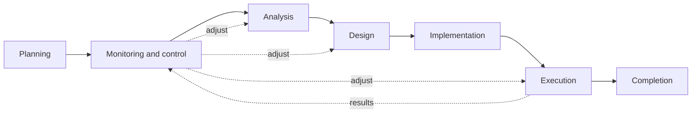
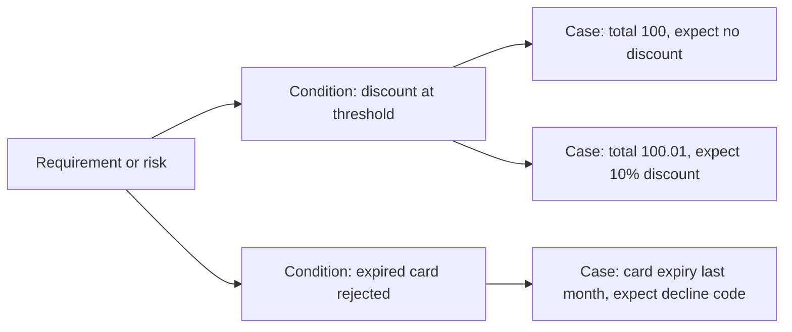
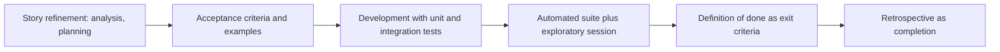

# Test Process

The test process is the set of activities that turn a testing objective into evidence for
a decision. The activity names come from the ISTQB fundamental test process, but the
activities themselves happen in every team, including teams that never write the words
down.

Monitoring runs alongside everything else rather than between two steps, which is why it
sits on the feedback path.

## The activities

| Activity | Question | Output |
|---|---|---|
| **Planning** | What are we testing, why, and how much is enough? | [Test plan](Test%20Plan.md), entry and exit criteria |
| **Monitoring and control** | Are we on track, and what do we change? | Progress reports, re-prioritised scope |
| **Analysis** | What should we test? | Test conditions, risks, [traceability](Traceability.md) links |
| **Design** | How do we test each condition? | [Test cases](Test%20Case%20Design.md), test data needs |
| **Implementation** | What must exist before we run? | Executable tests, fixtures, environments, data |
| **Execution** | What actually happened? | Results, logs, defects |
| **Completion** | What did we learn and what is left? | Summary report, archived assets, lessons |

## Analysis and design are different things

The most commonly collapsed pair, and collapsing them is why teams end up with test cases
that nobody can trace to anything.

- **Analysis** produces *test conditions*: things worth testing. "Discount applies above
  the threshold", "expired card is rejected", "export handles an empty range".
- **Design** produces *test cases*: concrete inputs, steps and expected results for those
  conditions.

Keeping them separate makes coverage arguable at the condition level, which is the level
stakeholders can actually reason about.

## Entry and exit criteria

Criteria are what stop the process being run by whoever shouts loudest near the deadline.

| | Typical criteria |
|---|---|
| **Entry** | Build deployed to the test environment, smoke test green, test data loaded, feature marked ready by the developer |
| **Exit** | All planned high-risk conditions executed, no open critical or high defects, coverage target met, known risks documented and accepted |

Exit criteria should include an explicit "risks accepted" item. Testing rarely finishes,
it stops, and naming what was not covered is more honest and more useful than a green
tick.

## The process in an agile team

The activities do not disappear, they compress and repeat per story instead of running
once per project.

The [definition of done](../../Methodologies/Scrum/Definition%20of%20Done.md) is the
agile form of exit criteria, and the
[three amigos](../../Methodologies/Agile/User%20Stories.md) conversation is the agile
form of test analysis. Writing a fifty page test plan per sprint is not.

## Where the process leaks

- **Design without analysis.** Cases exist, but nobody can say which requirement is
  uncovered.
- **Implementation underestimated.** Environments and test data commonly cost more than
  writing the cases, and are the usual reason execution starts late.
- **No completion step.** Nothing is archived, no lessons recorded, so the next release
  repeats the same discovery.
- **Criteria negotiated at the end.** Exit criteria agreed under deadline pressure are
  not criteria, they are permission.

## Check Your Understanding

<quiz>
What separates test analysis from test design?

- [ ] Analysis is manual, design is automated
- [x] Analysis identifies what is worth testing as test conditions, design turns each condition into concrete cases with inputs and expected results
> Correct. Conditions are traceable to requirements and risks, cases are executable.
- [ ] Analysis happens after execution, design before it
- [ ] They are two names for the same activity
</quiz>

<quiz>
Why should exit criteria include an explicit statement of accepted risk?

- [ ] To transfer responsibility for defects to the product owner
- [x] Because testing stops rather than finishes, so naming what was not covered gives the decision maker real information
> Correct. A bare pass or fail hides the shape of what remains unknown.
- [ ] Because coverage metrics are unreliable
- [ ] Because regulators require a risk register in all projects
</quiz>
