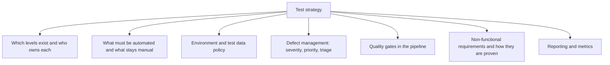
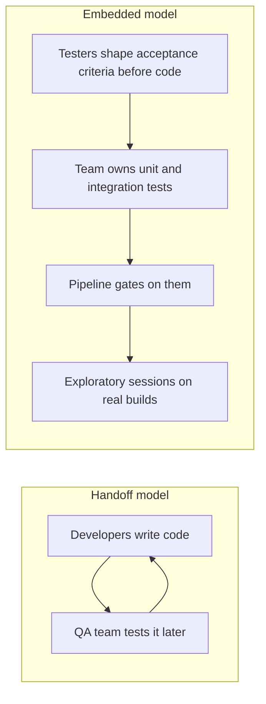

# Test Strategy

A **test strategy** is the standing approach to testing across an organisation or product:
the defaults that apply unless a specific project argues otherwise. A
[test plan](Test%20Plan.md) applies the strategy to one release.

| | Test strategy | Test plan |
|---|---|---|
| **Scope** | Organisation or product line | One release or project |
| **Lifespan** | Years, revised occasionally | Weeks, discarded after |
| **Content** | Levels, automation policy, environments, standards | Scope, risks, schedule, criteria |
| **Question** | How do we test here, in general? | What are we testing this time? |

## What a strategy decides

Each of these is a decision that should not be re-argued per project. Teams that lack a
strategy relitigate all seven every time, usually under deadline pressure and usually
badly.

## Strategy archetypes

| Archetype | Basis for choosing tests | Fits |
|---|---|---|
| **Risk based** | Impact and likelihood analysis | Most commercial products, the sensible default |
| **Requirements based** | One or more tests per requirement | Contractual or regulated delivery |
| **Model based** | Tests generated from a state or behaviour model | Protocols, embedded, complex state machines |
| **Reactive** | Tests devised against the built system, mostly exploratory | Poorly specified or fast-changing products |
| **Standards compliant** | A mandated standard dictates the process | Aviation, medical, automotive |
| **Regression averse** | Heavy automated regression, broad suites | Long-lived systems with frequent releases |

Real strategies mix them: risk based for allocation, standards compliant where a
regulator applies, reactive for the areas nobody could specify up front.

## The ownership question

The single decision with the largest effect on outcomes.

The handoff model creates a queue, and the queue is always compressed when the date
slips. The embedded model puts the checks where the knowledge is, and reserves human
testing skill for the work that cannot be automated.

## Automation policy

The strategy should state what is automated by default, otherwise every team invents its
own answer.

- **Always automated**: unit tests, contract tests, build and deployment checks,
  regression paths that gate a release.
- **Usually automated**: API level functional tests, key end-to-end journeys, performance
  smoke checks.
- **Rarely automated**: usability, exploratory work, one-off migration verification,
  anything whose expected result needs judgement.

See the test automation pyramid
for how the proportions should fall, and note that an inverted pyramid is usually the
symptom of a missing strategy rather than a deliberate choice.

## Signs the strategy is failing

| Symptom | Likely cause |
|---|---|
| Every project designs its own test process | No strategy exists, only plans |
| Release testing takes longer each time | Regression is manual and growing |
| Nobody trusts the suite | Flakiness tolerated, no policy on quarantine |
| Non-functional issues found in production | Strategy never said how they would be proven |
| Environments are the bottleneck | No environment or test data policy |

## Check Your Understanding

<quiz>
What distinguishes a test strategy from a test plan?

- [ ] Strategies are written by managers, plans by testers
- [x] A strategy sets standing defaults across projects, a plan applies them to one release with its specific scope, risks and dates
> Correct. Strategy is durable and general, a plan is dated and disposable.
- [ ] A plan covers automation, a strategy covers manual testing
- [ ] They differ only in length
</quiz>

<quiz>
Release testing takes longer with every release and the team keeps adding people to it. What does this most likely indicate about the strategy?

- [ ] The risk analysis is too detailed
- [x] Regression checking is largely manual and grows with the product, so it should be automated and gated in the pipeline
> Correct. Manual regression scales linearly with features while release cadence does not, and that gap only widens.
- [ ] Exit criteria are too strict
- [ ] Too many testers are involved in acceptance criteria
</quiz>
