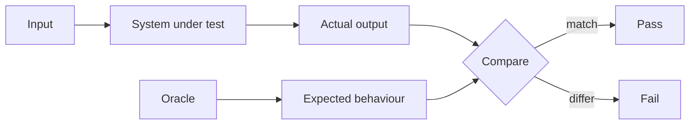
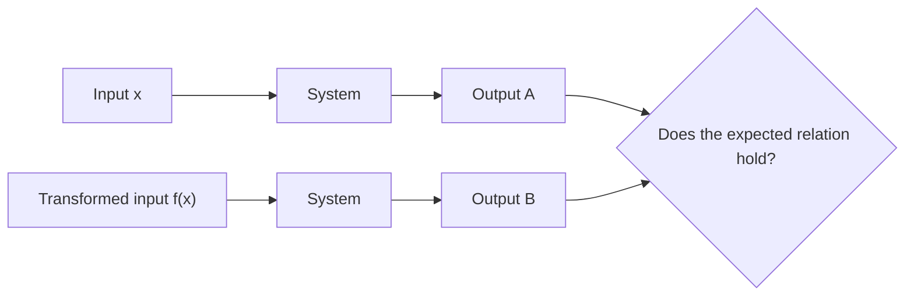
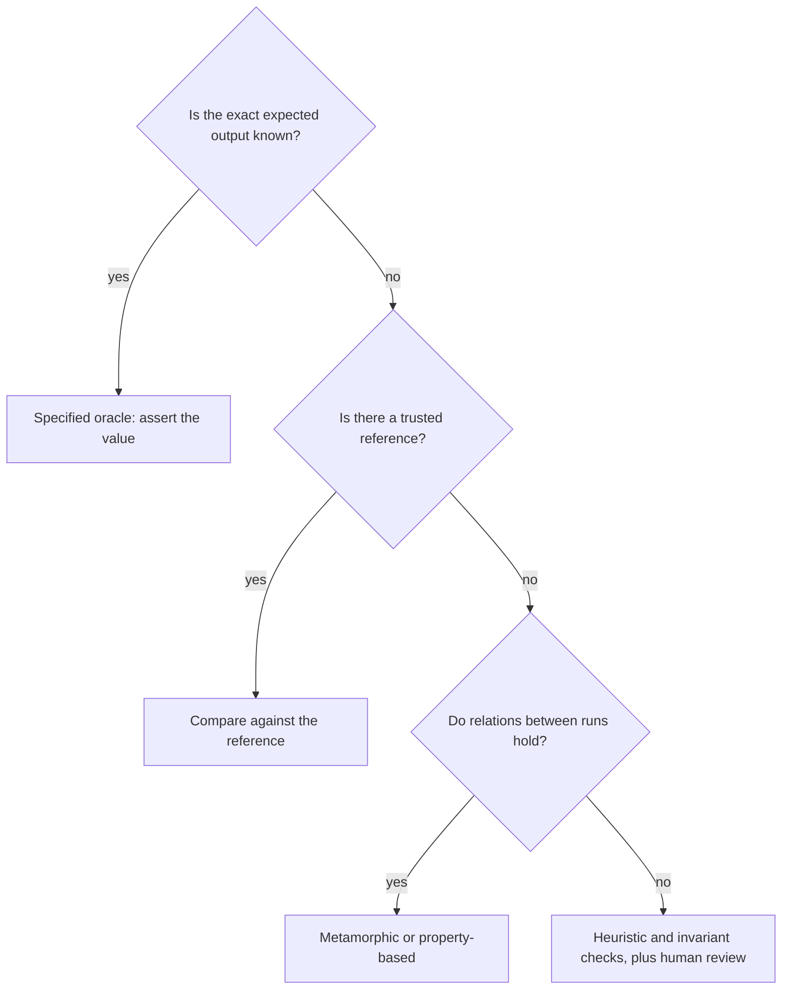

# Testing Oracle

A **test oracle** is whatever tells you the observed behaviour is right or wrong. Without
one, a test can only detect crashes: the system produced *something*, and nobody can say
whether it was correct.

The oracle problem is that for many interesting systems the expected output is expensive,
ambiguous, or genuinely unknown.

## Kinds of oracle

| Oracle | How it decides | Cost | Risk |
|---|---|---|---|
| **Specified** | A requirement or acceptance criterion states the result | Low | Only as correct as the specification |
| **Human judgement** | A person inspects and decides | High | Subjective, does not scale, tires |
| **Reference implementation** | Compare against a trusted other system or an older version | Medium | Inherits the reference's bugs |
| **Consistency** | Compare a new run against a previously approved output | Low | Approves whatever was there, including bugs |
| **Metamorphic** | Assert a relation between two runs rather than an absolute value | Medium | Needs a real relation to exist |
| **Heuristic** | Plausibility rules, for example "no 500s, no negative totals, latency under budget" | Low | Partial, misses subtle wrongness |

## When there is no obvious expected value

Three techniques carry most of the load.

### Metamorphic relations

You may not know the correct output, but you know how outputs must relate.

| System | Relation that must hold |
|---|---|
| Search ranking | Adding an irrelevant filter never increases the result count |
| Route finder | Reversing origin and destination gives a similar distance |
| Tax calculator | Higher gross income never yields lower total tax |
| Sort | Output is a permutation of the input and is ordered |

This is the backbone of
[property-based testing](../Testing%20Approaches/Property-Based%20Testing.md), which
generates the inputs and checks the relation across all of them.

### Golden files and approval

Record a known-good output and compare future runs against it. Cheap and effective for
rendered documents, serialisation formats and reports, and the basis of
[snapshot testing](../Testing%20Approaches/Snapshot%20Testing.md).

The trap is that the approved file is only as correct as the moment someone approved it.
If updates are routinely accepted without reading the diff, the oracle degrades into
"whatever the code did last time", and it will happily lock in a bug.

### Partial and heuristic oracles

Sometimes "not obviously wrong" is all that is available, and it is still worth having:
no unhandled exceptions, invariants intact, totals non-negative, response within budget,
schema still valid. Weak oracles catch a surprising share of real failures because most
defects are not subtle.

## Choosing an oracle deliberately

## Oracle failures worth recognising

- **Asserting only that nothing crashed.** The most common non-oracle. It cannot detect
  a wrong number.
- **Asserting the implementation back at itself.** Computing the expected value with the
  same function the test is checking passes for every possible bug.
- **Blind snapshot approval.** The oracle becomes the defect.
- **Over-specified assertions.** Asserting an entire response body including timestamps
  and identifiers turns every harmless change into a failure, and the team learns to
  re-approve without reading. That is how an over-strict oracle becomes no oracle at all.

## Check Your Understanding

<quiz>
A test calls the API, asserts the response is not null, and asserts no exception was thrown. What is the weakness?

- [ ] It is too slow to run in CI
- [x] It has almost no oracle, so it detects crashes but cannot detect a wrong result
> Correct. Without a statement of what the value should be, the test cannot fail for incorrect behaviour.
- [ ] It duplicates the unit tests
- [ ] It depends on production data
</quiz>

<quiz>
The correct output of a ranking algorithm is not known in advance. Which oracle strategy fits best?

- [ ] Assert equality against a hard-coded expected ranking
- [x] Metamorphic relations, for example that adding a restrictive filter never increases the number of results
> Correct. When absolute values are unknown, relations between runs are still checkable.
- [ ] Assert only that the call returns HTTP 200
- [ ] Compare against the same algorithm's output computed inside the test
</quiz>
