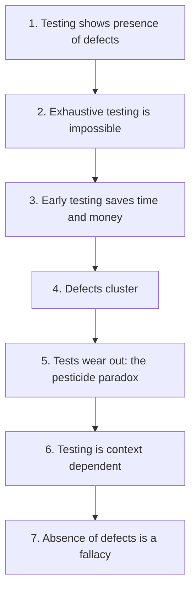
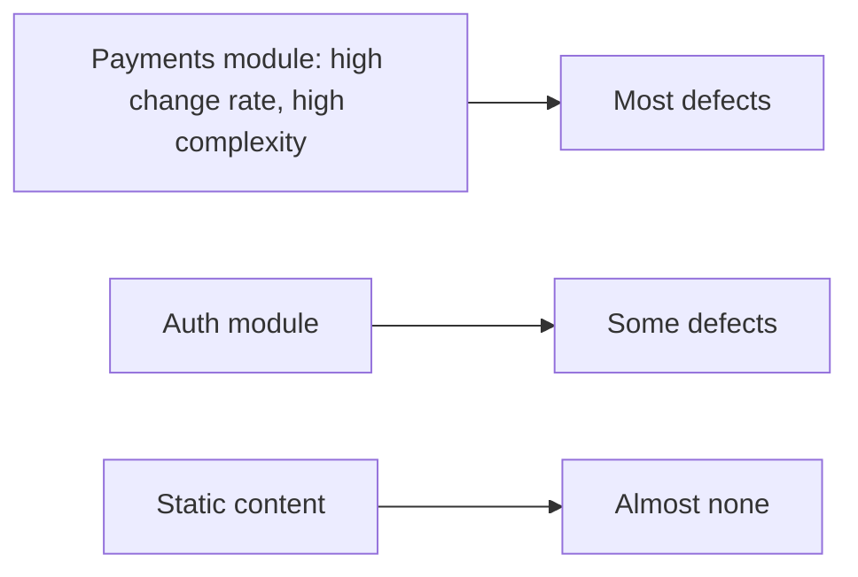

# Testing Principles

Seven principles, stable since the earliest testing literature and still the fastest way
to explain why a testing strategy is failing.

## 1. Testing shows the presence of defects, never their absence

A passing suite says the cases you ran behaved. It says nothing about the cases you did
not run. "All tests green" is evidence, not proof.

Practical consequence: report results as risk reduced, not as correctness achieved.

## 2. Exhaustive testing is impossible

The input space of any non-trivial system is unreachably large once state, ordering and
timing are included. So testing is always sampling, and effort must be aimed by risk
rather than spread evenly.

Practical consequence: [test design techniques](Test%20Case%20Design.md) exist to pick a
small sample with a high chance of hitting defects.

## 3. Early testing saves time and money

The cost of a defect grows with the amount of work built on top of it. Reviewing a
requirement costs a conversation, fixing the same misunderstanding in production costs
an incident. See [cost of quality](../Quality%20Fundamentals/Cost%20of%20Quality.md).

Practical consequence: shift left.
Test the requirements and the design, not just the build.

## 4. Defects cluster

Defects are not uniformly distributed. A minority of modules holds a majority of the
bugs, usually the ones that are complex, recently changed, or heavily coupled.

Practical consequence: use defect history and change frequency to decide where the next
test hour goes. Equal coverage of unequal risk wastes most of the effort.

## 5. The pesticide paradox

Re-running the same tests stops finding new defects, exactly as repeatedly using one
pesticide stops killing the insects that survived it. The suite has already found what it
can find.

Practical consequence: refresh and vary tests, add
exploratory sessions,
property-based tests, or
mutation testing to check whether the
suite is still capable of failing.

## 6. Testing is context dependent

An avionics system, a banking ledger and a marketing site need different levels,
techniques and evidence. There is no universal correct amount of testing.

Practical consequence: derive the [test strategy](Test%20Strategy.md) from the risk
profile, not from what the previous project did.

## 7. Absence of defects is a fallacy

A system can be defect free against its specification and still fail its users, because
the specification was wrong. Fixing every known bug does not make an unwanted product
wanted. See [verification and validation](../Quality%20Fundamentals/Verification%20and%20Validation.md).

Practical consequence: validate with real users, early and repeatedly. Zero open bugs is
not a success criterion by itself.

## Reading the principles as diagnostics

| Symptom | Principle being violated |
|---|---|
| "The tests pass, so it works" | 1 and 7 |
| Test plans that promise full coverage of all inputs | 2 |
| Testing only starts after code complete | 3 |
| Every module gets the same test effort | 4 |
| Suite has not caught a real bug in a year | 5 |
| The same test process is mandated for every project | 6 |
| Zero known bugs but falling usage | 7 |

## Check Your Understanding

<quiz>
A large regression suite has not found a genuine defect in twelve months, yet it takes forty minutes to run. Which principle explains this?

- [ ] Defects cluster
- [x] The pesticide paradox: repeating the same tests eventually stops revealing new defects
> Correct. The suite still guards against regression, but it needs new and varied cases to find anything new.
- [ ] Exhaustive testing is impossible
- [ ] Testing is context dependent
</quiz>

<quiz>
A manager asks for equal test coverage across all twenty modules. What is the strongest objection?

- [ ] Coverage cannot be measured per module
- [x] Defects cluster, so equal effort across unequal risk spends most of the budget where defects are unlikely
> Correct. Effort should follow complexity, change rate and defect history.
- [ ] Coverage targets always cause flaky tests
- [ ] Modules cannot be tested independently
</quiz>
