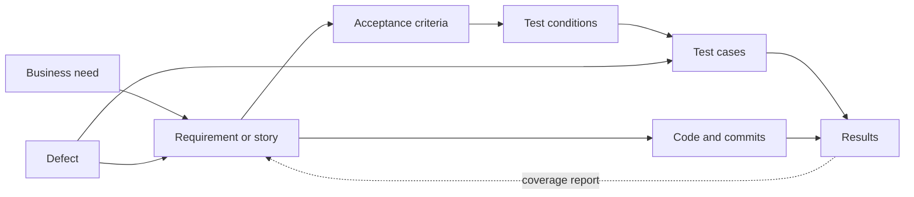
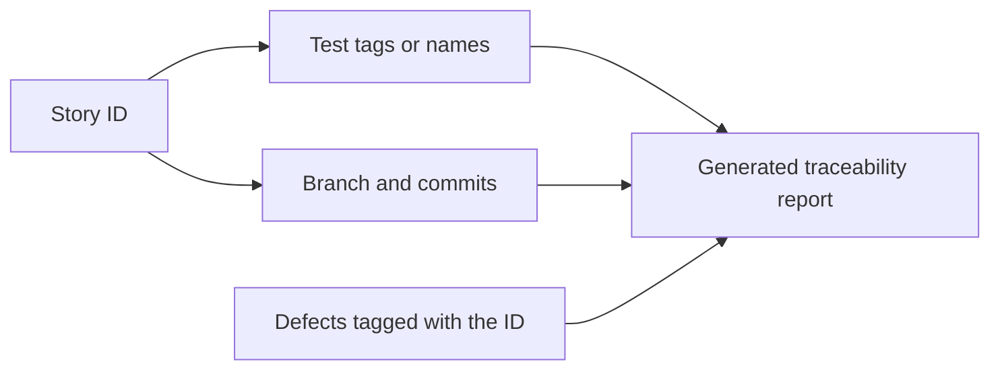

# Traceability

**Traceability** is the ability to follow a thread from a need, through the requirement
and the code, to the tests and results that prove it works, and back again. It exists to
answer two questions that are otherwise unanswerable at release time:

- *Forward*: does this requirement have evidence?
- *Backward*: why does this test exist, and what breaks if it fails?

## The chain

Every arrow is a link that must be recorded somewhere. The dotted arrow is what the chain
was built for.

## The traceability matrix

At its simplest, a table with requirements on one axis and tests on the other.

| Requirement | Conditions | Cases | Last result | Gap |
|---|---|---|---|---|
| R-101 free shipping above 50 | 3 | 8 | Pass | none |
| R-102 reject orders above 1000 | 2 | 4 | Pass | none |
| R-103 refunds reverse loyalty points | 2 | 0 | not run | **untested** |
| R-104 export last calendar month | 1 | 2 | 1 fail | open defect D-77 |

The value is entirely in the last two columns. R-103 is the row that changes a release
decision, and no code coverage tool would ever surface it.

## What traceability buys

| Question | Answered by |
|---|---|
| What is untested before we ship? | Forward trace from requirements |
| Which tests must re-run after this change? | Trace from code to tests, the basis of impact analysis |
| Why does this odd test exist? | Backward trace to the requirement or defect that caused it |
| Which requirement does this defect endanger? | Defect linked to requirement |
| What evidence do we give an auditor? | The matrix itself |

Impact analysis is the underrated one. Without it, every change triggers the full
regression suite, which is why suites become too slow to run.

## Doing it without a documentation project

Heavyweight matrices maintained by hand rot within a sprint. The lightweight version
gets most of the benefit:

- **Reference the story or requirement identifier in the test name or a tag.** For
  example `test_R103_refund_reverses_loyalty_points`, or a `@story("R-103")` annotation.
- **Reference the identifier in the commit message and branch name.** The version control
  history then links code to requirement for free.
- **Link defects to the failing test and the requirement**, which most trackers do
  natively.
- **Generate the matrix** from those tags rather than maintaining a spreadsheet.

The rule: traceability that is a by-product of normal work survives, traceability that is
a separate document does not.

## Where it is mandatory

Regulated domains, aviation, medical devices, automotive, finance, require demonstrable
traceability from requirement to verification evidence. There the matrix is a deliverable
and is audited, so the tooling investment is justified by compliance rather than by
convenience.

Everywhere else, aim for enough traceability to answer "what is untested" and "what must
re-run", and stop there.

## Check Your Understanding

<quiz>
Which question does traceability answer that code coverage cannot?

- [ ] Which lines of code were executed by the suite
- [x] Which requirements have no test evidence at all
> Correct. Coverage sees code. A requirement nobody implemented or tested is invisible to it.
- [ ] Whether the assertions in a test are meaningful
- [ ] How long the regression suite takes to run
</quiz>

<quiz>
What makes traceability survive in a fast-moving team?

- [ ] Assigning an owner to maintain the matrix spreadsheet
- [x] Making it a by-product of normal work, with story identifiers in test names, commits and defects, and the matrix generated from those
> Correct. Anything maintained as a separate document drifts out of date within a sprint.
- [ ] Requiring a full matrix review before every release
- [ ] Limiting traceability to non-functional requirements
</quiz>
