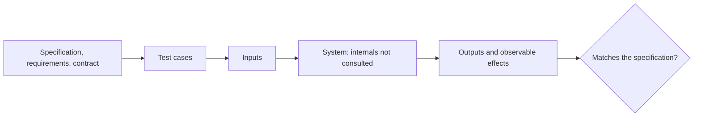
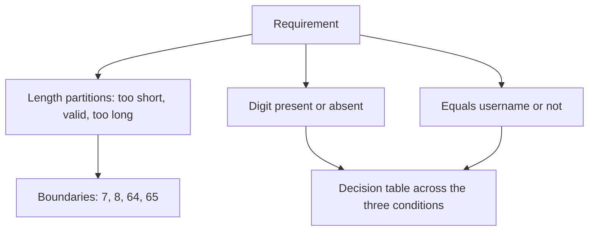

# Black Box Testing

**Black box testing** derives tests from what the system is supposed to do, without
looking at how it does it. The tester sees inputs, outputs and observable behaviour, and
treats the internals as opaque.

The source of truth is the specification, never the code. That independence is the whole
point: tests written from the implementation inherit the implementation's
misunderstandings and confirm bugs instead of exposing them.

## Techniques in the family

| Technique | Use when | Finds |
|---|---|---|
| [Equivalence partitioning](Equivalence%20Partitioning.md) | Inputs fall into classes treated alike | Whole classes handled wrongly |
| [Boundary value analysis](Boundary%20Value%20Analysis.md) | Partitions have edges | Off-by-one and comparison operator defects |
| [Decision table testing](Decision%20Table%20Testing.md) | Several conditions combine into rules | Missing or contradictory business rules |
| [State transition testing](State%20Transition%20Testing.md) | Behaviour depends on history | Illegal transitions, stuck states |
| [Pairwise testing](Pairwise%20Testing.md) | Many independent configuration options | Defects caused by option interactions |
| Use case testing | Journeys matter more than fields | Broken flows across correct components |
| Error guessing | Experience says where it breaks | Nulls, empty lists, huge inputs, odd encodings |

Combining two or three of these covers far more than exhausting any one of them.

## Strengths and blind spots

| Strengths | Blind spots |
|---|---|
| Tests survive refactoring, since they depend only on behaviour | Cannot see untested code that no specified input reaches |
| Can be written before the code exists | Cannot detect dead code or hidden branches |
| Needs no programming knowledge of the internals | Redundant cases are invisible: many inputs may hit one path |
| Applies at every [test level](../Test%20Levels/Unit%20Testing.md) | Depends entirely on specification quality |

The classic gap: a function has a special case for a magic value that no requirement
mentions. No black box technique will ever generate that value, and only
[white box testing](White%20Box%20Testing.md) sees the branch.

That is why the two are complements rather than rivals, and why measuring
[coverage](../Testing%20Fundamentals/Test%20Coverage.md) of a black box suite is worth
doing: the uncovered lines are exactly the specification's blind spots.

## A worked pass

Requirement: password must be 8 to 64 characters, contain a digit, and must not equal the
username.

| Case | Length | Digit | Equals username | Expected |
|---|---|---|---|---|
| 1 | 7 | yes | no | Reject, too short |
| 2 | 8 | yes | no | Accept |
| 3 | 64 | yes | no | Accept |
| 4 | 65 | yes | no | Reject, too long |
| 5 | 12 | no | no | Reject, needs a digit |
| 6 | 12 | yes | yes | Reject, equals username |

Six cases, derived only from the requirement, covering every rule and every edge. No
knowledge of the implementation was needed to write them, which means they are still
valid after the validator is rewritten.

## Check Your Understanding

<quiz>
Why should black box test cases be derived from the specification rather than from reading the code?

- [ ] Because reading code takes longer than reading requirements
- [x] Because cases derived from the implementation inherit its misunderstandings, so a wrong behaviour is confirmed rather than exposed
> Correct. Independence from the implementation is what gives black box testing its diagnostic value.
- [ ] Because the code may be written in an unfamiliar language
- [ ] Because coverage tools only work on specification-derived tests
</quiz>

<quiz>
A function contains a branch triggered by a value no requirement mentions. Which statement is true?

- [ ] Boundary value analysis will find it if the boundaries are chosen well
- [x] No black box technique will reliably generate that input, which is why coverage measurement or white box testing is needed alongside
> Correct. Black box testing cannot see structure the specification never described.
- [ ] Pairwise testing covers it by combining options
- [ ] The branch is unreachable by definition
</quiz>
