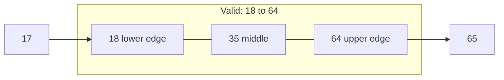
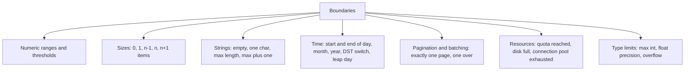

# Boundary Value Analysis

**Boundary value analysis (BVA)** tests the values at the edges of each
[equivalence partition](Equivalence%20Partitioning.md), because that is where defects
concentrate. Every range check is written as one of `<`, `<=`, `>`, `>=`, and choosing the
wrong one is the single most common coding mistake in existence.



A test at 35 passes whether the check is `age >= 18` or `age > 18`. Only a test at exactly
18 tells them apart.

## Two-value and three-value BVA

| Approach | Values per boundary | Example at boundary 18 |
|---|---|---|
| **Two-value** | The boundary and the value just outside | 17, 18 |
| **Three-value** | Just below, the boundary, just above | 17, 18, 19 |

Two-value is the normal choice and catches every off-by-one in a comparison operator.
Three-value is used where the risk justifies it, since it also catches a boundary shifted
by one in the wrong direction.

## Worked example

Free shipping applies from 50 up to a maximum order of 1000.

| Value | Partition edge | Expected |
|---|---|---|
| 49.99 | just below free threshold | shipping charged |
| 50.00 | threshold | free shipping |
| 50.01 | just above | free shipping |
| 999.99 | just below maximum | accepted |
| 1000.00 | maximum | accepted |
| 1000.01 | just above | rejected |
| 0 | minimum possible order | rejected or empty cart handling |
| -1 | invalid | rejected |

Eight values catch every plausible operator mistake in two range checks.

## Boundaries are not only numeric



The collection boundaries, zero items, one item, and exactly the page size, deserve
special attention. Empty and single-element cases break more code than any numeric range,
because loops and index arithmetic degenerate there.

## The floating point trap

`49.99` and `50.00` behave, but money in floating point does not.

```python
0.1 + 0.2 == 0.3   # False
```

If the code compares currency as a float, a boundary case can fail for reasons unrelated
to the operator. Test the boundary anyway: the resulting failure is a real defect, and the
fix is integer minor units or a decimal type rather than a looser assertion.

## Practice notes

- **Derive boundaries from the requirement, not from the code.** A boundary read out of the
  implementation reproduces its mistake.
- **Boundaries multiply.** Two ranges give four edges, not two. Keep them as separate
  single-purpose cases so a failure names one edge.
- **Watch for undocumented boundaries.** Field widths, database column sizes, request body
  limits and timeouts are boundaries nobody wrote in the requirement, and they surface
  first in production.
- **Combine with partitions, never alone.** BVA tests the edges. Partition representatives
  confirm the interior actually behaves.

## Check Your Understanding

<quiz>
The rule is "free shipping for orders of 50 or more", and a test at 200 passes. What defect can still be present?

- [ ] The maximum order limit is wrong
- [x] The comparison could be strictly greater than 50, so an order of exactly 50 is charged, and only a case at 50 detects it
> Correct. Mid-partition values cannot distinguish between the two operators.
- [ ] Shipping cost could be negative
- [ ] The currency could be wrong
</quiz>

<quiz>
Which boundary is most often missing from a suite and breaks the most code?

- [ ] The maximum value of a numeric range
- [x] Collection sizes of zero and one, where loops and index arithmetic degenerate
> Correct. Empty and single-element cases are the classic omission, and they are cheap to add.
- [ ] Values one above the maximum integer
- [ ] Strings containing unicode characters
</quiz>
