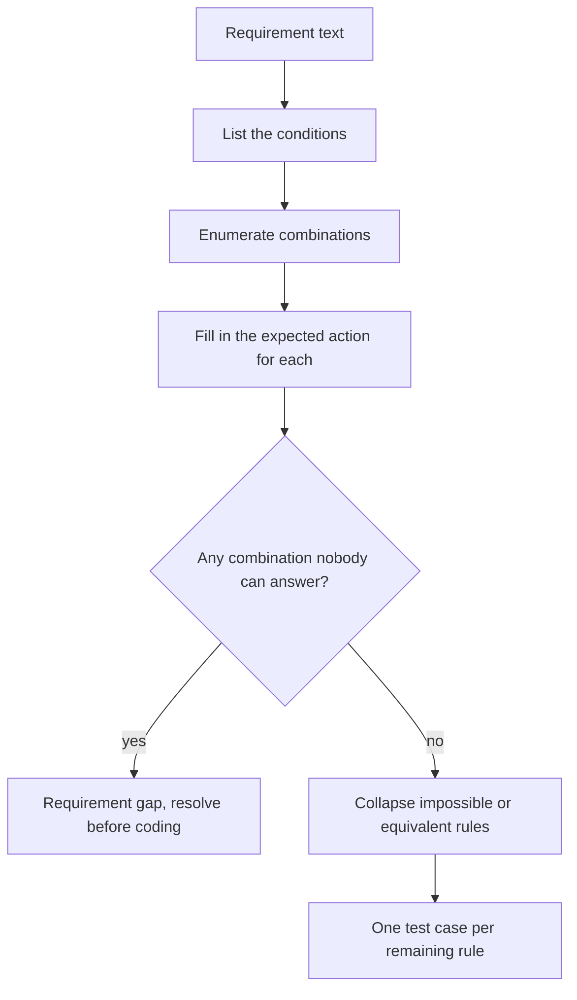

# Decision Table Testing

A **decision table** lays out every combination of conditions and the action each
combination should produce. It is the technique for business rules, where the difficulty is
not the individual condition but the interaction of several.

Its main value appears before any code exists: filling in the table forces someone to
answer the combinations the requirement forgot.

## Structure

| | Rule 1 | Rule 2 | Rule 3 | Rule 4 |
|---|---|---|---|---|
| **Condition: account in good standing** | T | T | F | F |
| **Condition: order above 100** | T | F | T | F |
| **Action: apply free shipping** | yes | no | no | no |
| **Action: require prepayment** | no | no | yes | yes |

Conditions on top, actions below, one column per rule. With *n* binary conditions there
are 2^n columns, which is exactly why the table exposes gaps: humans specify the
interesting corners and silently skip the rest.

## Building one

The `ASK` branch is the payoff. A table with an unanswerable column is a defect found at
the cheapest possible moment, before the code exists.

## Worked example: loan approval

Conditions: credit score above 700, existing customer, requested amount above 50000.

| | R1 | R2 | R3 | R4 | R5 | R6 | R7 | R8 |
|---|---|---|---|---|---|---|---|---|
| Score > 700 | T | T | T | T | F | F | F | F |
| Existing customer | T | T | F | F | T | T | F | F |
| Amount > 50000 | T | F | T | F | T | F | T | F |
| **Approve automatically** | yes | yes | no | yes | no | no | no | no |
| **Send to manual review** | no | no | yes | no | yes | yes | no | no |
| **Reject** | no | no | no | no | no | no | yes | yes |

Eight rules, eight test cases, complete coverage of the rule space. R5 and R6 having the
same actions is a hint that "amount" does not matter when the score is low and the
customer is known, which is worth confirming rather than assuming.

## Collapsing the table

Full enumeration grows as 2^n and becomes unusable past about five conditions. Two
reductions:

| Reduction | How | Caution |
|---|---|---|
| **Don't-care entries** | Mark conditions that cannot affect the outcome with a dash and merge those columns | Only merge when the irrelevance is confirmed, not assumed |
| **Infeasible combinations** | Delete columns that cannot occur, such as "cart empty" plus "total above 100" | Record why, otherwise a real case gets deleted by mistake |

For genuinely large condition sets, switch to
[pairwise testing](Pairwise%20Testing.md), which covers all pairs of condition values with
a fraction of the cases.

## Where it fits

- **Business rules** with several interacting flags: pricing, eligibility, discounts,
  permissions, insurance rating, tax treatment.
- **Requirement review**, as a static technique, before implementation.
- **Regression protection**, since each rule becomes one clearly named test that fails for
  exactly one reason.

It is a poor fit where behaviour depends on history rather than on the current condition
values. That is [state transition testing](State%20Transition%20Testing.md).

## Check Your Understanding

<quiz>
What is the main benefit of building a decision table before implementation?

- [ ] It reduces the number of tests needed to one per condition
- [x] Enumerating the combinations exposes cases the requirement never answered, at the cheapest moment to fix them
> Correct. The unanswerable column is a requirement defect found before any code exists.
- [ ] It replaces boundary value analysis for numeric rules
- [ ] It proves the rules are internally consistent
</quiz>

<quiz>
A rule set depends on what the user did earlier in the session, not only on current values. What should be used?

- [ ] A larger decision table with one condition per past action
- [x] State transition testing, since the behaviour depends on history rather than on a combination of present conditions
> Correct. Decision tables model combinations, state models model history.
- [ ] Pairwise testing over the past actions
- [ ] Equivalence partitioning of the session length
</quiz>
