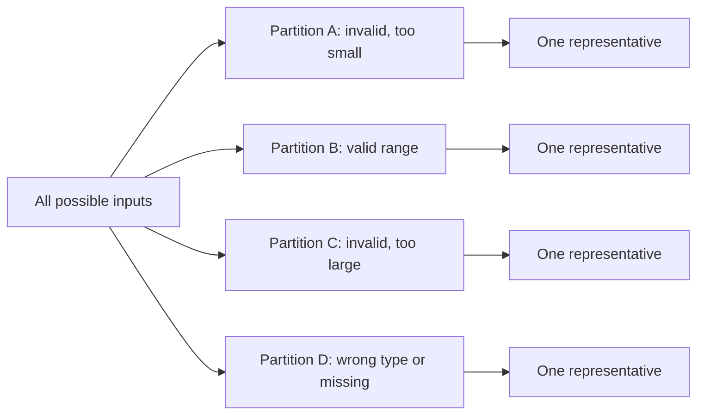
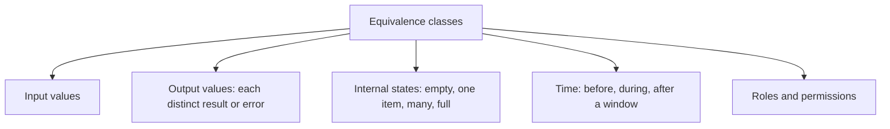
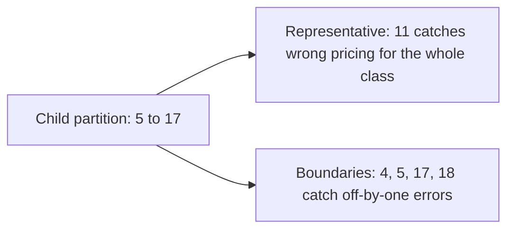

# Equivalence Partitioning

**Equivalence partitioning** divides the input space into groups the system should treat
identically, then tests one representative from each group. The assumption: if one member
of a partition works, the others in that partition probably do too, and if one fails, they
all fail.

It is the technique that turns an infinite input space into a handful of cases.

## Finding the partitions

Age based ticket pricing: under 5 free, 5 to 17 child, 18 to 64 adult, 65 and over senior,
ages outside 0 to 120 are invalid.

| Partition | Range | Valid | Representative |
|---|---|---|---|
| Negative | age < 0 | no | -3 |
| Infant | 0 to 4 | yes | 2 |
| Child | 5 to 17 | yes | 11 |
| Adult | 18 to 64 | yes | 35 |
| Senior | 65 to 120 | yes | 70 |
| Impossible | age > 120 | no | 150 |
| Non-numeric | "abc", empty, null | no | "abc" |

Seven cases replace 121 valid integers plus every malformed input. Every distinct
behaviour is represented once.

## Partition the output too

Inputs are the obvious axis, but partitions exist wherever the system distinguishes cases.

A cart with zero items, one item and many items is three partitions even though "number of
items" is not a validated field. The empty case is the one most often missing.

## Valid and invalid partitions

Two rules that catch real defects:

1. **Cover every valid partition**, and it is fine to combine several valid values in one
   test, since they should all be accepted.
2. **Test invalid partitions one at a time.** An input that is both negative and
   non-numeric may be rejected by the first check, leaving the second one untested. This is
   error masking, and it is why invalid cases are not combined.

## Pairing with boundaries

Equivalence partitioning says *which* groups matter. It does not say *where* the groups end,
and the edges are where comparison operators live.

Always use the two together. See
[boundary value analysis](Boundary%20Value%20Analysis.md), which exists exactly to test the
edges partitioning leaves untouched.

## Where the assumption breaks

The technique rests on "the system treats these alike", which is a claim about the
implementation, not a fact.

- A special case hidden inside a partition, for example a hard-coded rule for a specific
  customer identifier, is invisible to it.
- Performance can differ wildly inside one functional partition, since a list of 10 and a
  list of 10 million are the same partition to a validator.
- String inputs partition on more axes than they look: length, encoding, whitespace,
  casing, and unicode normalisation are each their own class.

Measuring [coverage](../Testing%20Fundamentals/Test%20Coverage.md) on a partition-derived
suite is the cheapest way to spot those hidden branches.

## Check Your Understanding

<quiz>
Why should invalid input partitions be tested one at a time rather than combined?

- [ ] Because combined invalid inputs are unrealistic for users
- [x] Because the first validation to reject the input masks the others, leaving those checks untested
> Correct. Valid values may be combined freely, invalid ones must be isolated to avoid error masking.
- [ ] Because each invalid partition needs its own boundary values
- [ ] Because test tools cannot report multiple failures per case
</quiz>

<quiz>
A representative value from every partition passes. What still needs testing?

- [ ] Nothing, all classes are covered
- [x] The boundaries between partitions, where off-by-one and comparison operator defects live
> Correct. Partitioning selects which classes matter, boundary value analysis tests where they end.
- [ ] Only the invalid partitions
- [ ] Only performance under load
</quiz>
