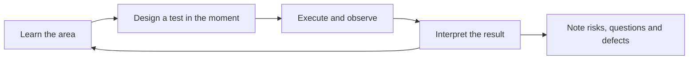
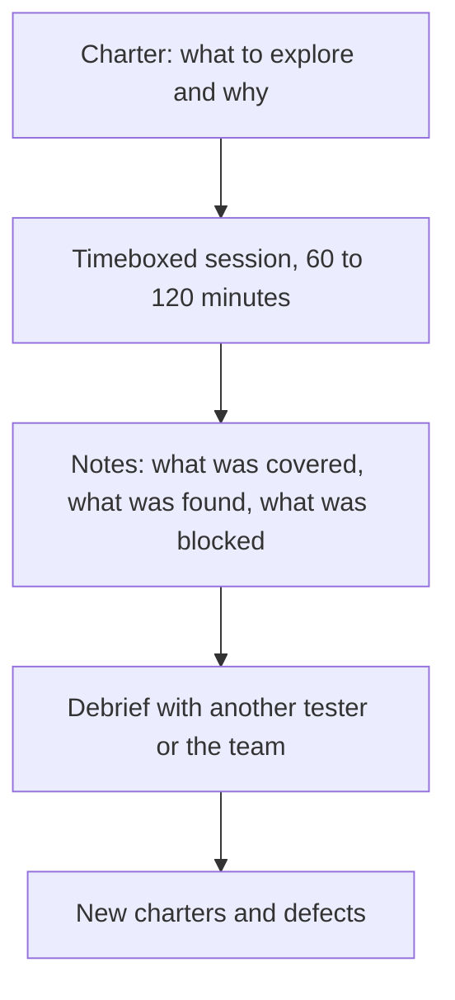

# Exploratory Testing

**Exploratory testing** is simultaneous learning, test design and test execution. The
tester decides the next test based on what the last one revealed, instead of following a
script written before the system existed.

It is not ad hoc clicking. The difference is intent, a charter, and a record of what was
covered.

## Scripted and exploratory compared

| | Scripted checking | Exploratory testing |
|---|---|---|
| **Designed** | Before execution | During execution |
| **Answers** | Does the known expectation still hold? | What have we not thought about? |
| **Best performed by** | Machines | Skilled humans |
| **Finds** | Regressions | New risks, ambiguities, design flaws |
| **Repeatable** | Exactly | Not exactly, and that is the point |

The two are complements. Automating the checking is what buys the human time to explore,
which is the practical argument for the
automation pyramid as well.

## Session-based test management

The technique that makes exploratory work accountable without turning it back into a
script.

A charter is one sentence with a target, a resource and an information goal:

> Explore **bulk CSV import** using **files with malformed encodings and mixed line
> endings** to discover **how partial failures are reported and whether any rows are
> silently dropped**.

Session notes record areas covered, bugs, issues and questions, and the split between
testing, bug investigation and setup time. That last number is usually the argument for
fixing the test environment.

## Heuristics that generate good tests

| Heuristic | Prompt |
|---|---|
| **Boundaries** | Zero, one, many, maximum, one over the maximum |
| **Interruption** | Close the tab, kill the network, hit back, double submit |
| **Sequencing** | Do things out of order, repeat, skip a step |
| **Data extremes** | Very long strings, unicode, emoji, right-to-left text, nulls |
| **Time** | Midnight, month end, daylight saving change, expired tokens, clock skew |
| **Permissions** | The same action as a different role, or with a stale session |
| **Resource limits** | Slow connection, full disk, quota reached, concurrent users |
| **Follow the money** | Anything touching totals, currency, tax, refunds |

The double submit and the browser back button are worth naming individually. Between them
they account for a remarkable share of duplicate orders and lost data in real systems.

## When it is most valuable

- **New features**, where nobody yet knows what can go wrong.
- **After a large refactor**, where the risk is exactly what nobody predicted.
- **Poorly specified areas**, where scripted cases cannot be derived from anything.
- **After a production incident**, exploring the neighbourhood of the failure for siblings.
- **Before release**, as a final risk sweep on the assembled system.

## Making the case for it

The common objection is that it is unmeasurable. It is not, provided sessions are used:
charters completed, areas covered, bugs found per session, and the setup-to-testing ratio
are all reportable.

The opposite risk is worth naming too. Exploratory testing depends on the skill and domain
knowledge of the person doing it, so it does not scale by adding people, and it never
substitutes for a regression suite. Findings that matter should become automated checks,
otherwise the same defect returns and nobody notices.

## Check Your Understanding

<quiz>
What separates exploratory testing from unstructured ad hoc testing?

- [ ] Exploratory testing uses automated tools
- [x] It is bounded by a charter, timeboxed into sessions, and recorded, so coverage and findings are reportable
> Correct. The design happens during execution, but the activity is still accountable.
- [ ] Exploratory testing is performed only by developers
- [ ] Exploratory testing follows a script agreed in advance
</quiz>

<quiz>
An exploratory session finds a serious defect in refund handling. What should happen next, beyond fixing it?

- [ ] Repeat the same session weekly to check it stays fixed
- [x] Turn the finding into an automated regression check, since exploratory sessions are not repeatable and the human should move on to new ground
> Correct. Exploration finds new risks, automation is what stops known ones from returning.
- [ ] Convert all future exploratory work into scripted cases
- [ ] Raise the charter's timebox to cover the area permanently
</quiz>
