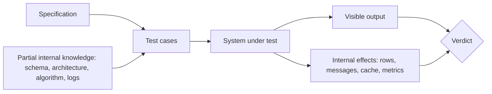

# Gray Box Testing

**Gray box testing** designs tests from the specification, as
[black box testing](Black%20Box%20Testing.md) does, while using partial knowledge of the
internals to choose better inputs and to assert on more than the visible output.

The extra arrow into the verdict is the defining feature. A black box test can only judge
what a user could see. A gray box test can also check that the order row was written, the
event was published, and the cache was invalidated.

## What the partial knowledge is used for

| Knowledge | Better inputs | Better assertions |
|---|---|---|
| Database schema | Values that violate a constraint, or hit a unique index | Assert on stored rows, not only on the response |
| Caching layer | Repeat requests, cache-busting parameters | Assert a stale value is not served after an update |
| Algorithm used | Inputs that trigger the worst case, such as hash collisions | Assert performance stays within budget |
| Message flows | Duplicate and out-of-order deliveries | Assert the consumer stayed idempotent |
| Pagination or batching | Sizes exactly at the batch boundary | Assert nothing is dropped between batches |
| Known error handling | Inputs that force each failure path | Assert the failure was logged and retried |

None of this reads the implementation line by line. It uses the shape of the system,
which is usually documented in the architecture rather than the code.

## Where it fits between the other two

| | Black box | Gray box | White box |
|---|---|---|---|
| **Test basis** | Specification | Specification plus architecture | Code structure |
| **Typical level** | Any | Integration, API, end-to-end | Unit |
| **Sees internal state** | No | Selectively | Fully |
| **Survives refactoring** | Yes | Mostly | Often not |
| **Main risk** | Misses unspecified behaviour | Coupling to internals that change | Confirms the code does what the code does |

Gray box is the default at the [integration](../Test%20Levels/Integration%20Testing.md) and
API levels, because at those levels the visible response alone is a weak oracle.

## A worked example

Endpoint: `POST /orders` returns `201` with an order identifier.

Black box assertions:

- status is 201
- body contains an identifier

Gray box assertions add:

- an `orders` row exists with the correct total and status `pending`
- an `order_created` event is on the queue exactly once
- the customer's cached basket was cleared
- re-sending the same idempotency key creates no second row

The last one is the important case, and it is only designable by someone who knows an
idempotency key exists. A pure black box tester would never think to send it twice.

## Keeping it from becoming brittle

The failure mode is asserting on internals that are implementation detail rather than
contract.

- **Assert on the effects that other components depend on**, such as persisted state and
  published events. Those are contracts.
- **Do not assert on private structures**, such as the exact shape of a cache key or an
  intermediate table used only inside the module.
- **Prefer public interfaces for setup** where possible. A test that inserts rows directly
  to arrange state will silently drift when the write path changes.
- **Record why the knowledge was used.** "Batch size is 100, so 100 and 101 are tested" is
  worth a comment, otherwise the case looks arbitrary later.

## Check Your Understanding

<quiz>
What most clearly distinguishes gray box from black box testing?

- [ ] Gray box testing is always automated
- [x] It uses partial internal knowledge to pick sharper inputs and to assert on internal effects such as stored rows and published events
> Correct. It keeps the specification as the test basis but widens the oracle beyond the visible response.
- [ ] It requires reading every line of the implementation
- [ ] It applies only at the unit level
</quiz>

<quiz>
Which gray box assertion is most likely to become brittle?

- [ ] The order row is persisted with the correct total
- [ ] Exactly one order-created event is published
- [x] An internal cache key has a specific string format used only inside the module
> Correct. Private structures are implementation detail, so asserting on them couples the test to something free to change.
- [ ] Re-sending the same idempotency key creates no second row
</quiz>
