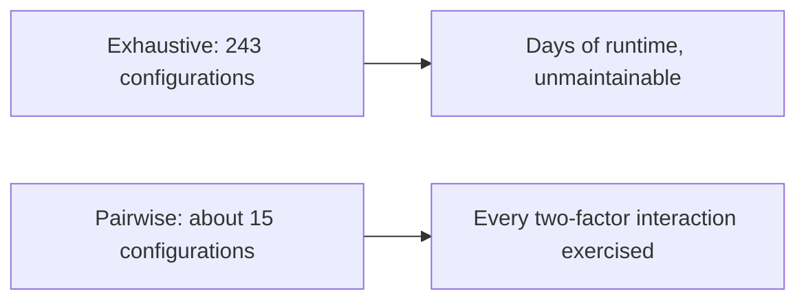
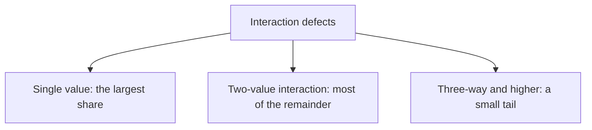

# Pairwise Testing

**Pairwise testing**, also called all-pairs or 2-way combinatorial testing, covers every
*pair* of parameter values instead of every full combination. It exists because
configuration spaces explode and because most interaction defects involve only two factors.

## The explosion it solves

| Parameter | Values |
|---|---|
| Browser | Chrome, Firefox, Safari |
| Operating system | Windows, macOS, Linux |
| Language | English, German, Japanese |
| Account type | Free, Pro, Enterprise |
| Payment method | Card, Transfer, Invoice |

Full coverage is 3 x 3 x 3 x 3 x 3 = 243 configurations. Every pair of values from every
pair of parameters can be covered in around 15, roughly a 94% reduction with most of the
defect-finding power retained.

## Why pairs are enough

Empirical studies of defect reports across several domains found that the large majority of
interaction failures are triggered by a single parameter value or by one pair. Three-way
and higher interactions exist but are a small tail.

So pairwise is not a compromise on principle, it is aimed at where the defects actually
are. Where the tail matters, safety-critical or high-value paths, raise the strength to
3-way for the parameters involved rather than for all of them.

## Producing the set

Do not build the array by hand. Generators exist for every language and produce a covering
array in seconds. The work that stays human is:

| Input to the generator | Why it matters |
|---|---|
| **Parameters and values** | Values usually come from [equivalence partitioning](Equivalence%20Partitioning.md), not from listing every possible value |
| **Constraints** | Impossible combinations, such as Safari on Linux, must be excluded or the suite tests nonsense |
| **Seeded rows** | Known-important configurations, such as the most common customer setup, should be forced into the set |
| **Strength** | 2 by default, higher for a critical subset |

Constraints are the step most often skipped, and skipping it produces a tidy array full of
configurations that cannot exist.

## What it does not do

- **It is not an oracle.** It selects configurations. Each still needs expected results.
- **It ignores order.** If behaviour depends on sequence, use
  [state transition testing](State%20Transition%20Testing.md).
- **It assumes parameters are independent.** Where one parameter changes the meaning of
  another, model that with a [decision table](Decision%20Table%20Testing.md) instead.
- **It misses three-way defects by design.** That is the accepted trade, and it should be a
  stated decision rather than an accident.

## Where it pays off

| Good fit | Poor fit |
|---|---|
| Browser, OS and device matrices | Business rules with dependent conditions |
| Feature flag combinations | Behaviour that depends on history |
| Installation and configuration options | Single-input validation, where partitions and boundaries suffice |
| API parameters that are genuinely independent | Anything with fewer than three parameters, where full coverage is cheap |

The feature flag case is the modern one worth naming: a system with twenty independent
flags has more than a million states, is shipped daily, and is almost never tested in
combination.

## Check Your Understanding

<quiz>
Why does covering all pairs find most interaction defects despite testing a small fraction of combinations?

- [ ] Because pairs are chosen randomly, which samples the space evenly
- [x] Because empirically most interaction failures are triggered by one value or by a single pair of values, with higher-order interactions forming a small tail
> Correct. Pairwise targets where defects are concentrated rather than spreading effort uniformly.
- [ ] Because two-parameter systems are the most common in practice
- [ ] Because generators eliminate redundant test cases entirely
</quiz>

<quiz>
Which step is most often skipped when generating a pairwise set, and what does it cost?

- [ ] Choosing the strength, which makes the suite too large
- [x] Declaring constraints, which produces configurations that cannot exist and wastes the suite on nonsense
> Correct. Impossible combinations such as Safari on Linux must be excluded before generation.
- [ ] Seeding known configurations, which breaks the covering array
- [ ] Naming the parameters, which makes reports unreadable
</quiz>
