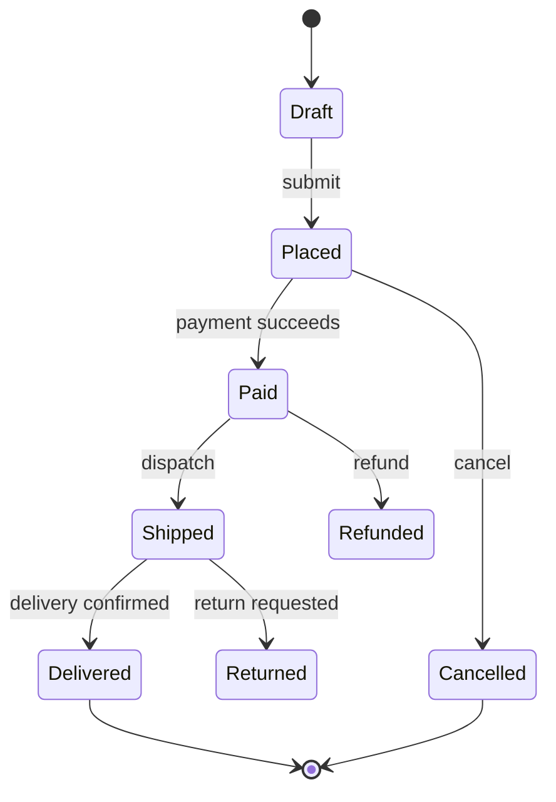
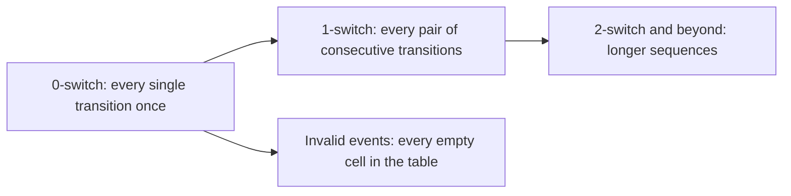
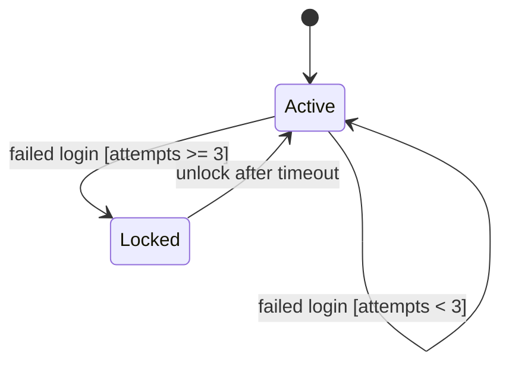

# State Transition Testing

**State transition testing** applies when the response to an event depends on what happened
before. The system is modelled as states and transitions, and tests are derived from the
model rather than from individual inputs.

Use it whenever the same action gives different results at different times: order
lifecycles, payment flows, login attempts and lockout, subscriptions, connection handling,
document approval.

## The model

Four things come from this picture, and each is a class of test:

| Element | Test question |
|---|---|
| **States** | Is each state reachable, and correct when reached? |
| **Transitions** | Does each arrow work? |
| **Events in the wrong state** | Is each *missing* arrow rejected? |
| **Guards** | Does a conditional transition respect its condition? |

## The state table

The transition diagram shows what is allowed. The table shows everything, which is where
the defects hide.

| State \ Event | submit | pay | cancel | ship |
|---|---|---|---|---|
| **Draft** | Placed | **invalid** | Draft deleted | **invalid** |
| **Placed** | **invalid** | Paid | Cancelled | **invalid** |
| **Paid** | **invalid** | **invalid: double charge** | Refunded | Shipped |
| **Shipped** | **invalid** | **invalid** | **invalid: already gone** | **invalid** |

The bold cells are the valuable tests. Most state defects are not a broken transition, they
are an accepted transition that should have been refused. "Pay an already paid order" and
"cancel a shipped order" are real incidents, not theoretical ones.

## Coverage levels

| Level | Covers | Cost |
|---|---|---|
| **All states** | Each state entered at least once | Weakest, misses most transitions |
| **0-switch** | Each transition once | The normal target |
| **1-switch** | Each valid pair of transitions in sequence | Catches defects that need two steps |
| **Invalid events** | Each state and event combination that must be refused | Where the incidents live |

0-switch plus invalid events is a good default. Go to 1-switch for money, safety or
anything with a retry loop, since order-dependent bugs need at least two steps to appear.

## Guards and extended state

Real systems carry data alongside the state, and transitions carry conditions.

Test both sides of every guard, which is
[boundary value analysis](Boundary%20Value%20Analysis.md) applied to the transition
condition: attempts at 2 and at 3, not at 1 and 7.

## Practice notes

- **Build the model from the requirement**, then check it against the code. A disagreement
  is either a defect or an undocumented state, and both are worth knowing.
- **Look for states the model forgot.** "Payment pending with the provider" and "partially
  refunded" are the ones teams discover in production.
- **Test the timeouts.** Anything that leaves a state on its own after a delay is a
  transition with no event, and it is routinely untested.
- **Reject rather than ignore.** An invalid event should produce a clear error, not a silent
  no-op, otherwise the caller cannot tell what happened.

## Check Your Understanding

<quiz>
Which tests derived from a state model most often prevent real incidents?

- [ ] Tests that each state can be reached
- [x] Tests that each invalid state and event combination is refused, such as paying an already paid order
> Correct. Valid transitions get exercised by ordinary use, refusals usually do not.
- [ ] Tests of the initial state only
- [ ] Tests of the diagram's layout consistency
</quiz>

<quiz>
Why choose 1-switch coverage over 0-switch for a payment flow?

- [ ] It requires fewer test cases overall
- [x] It exercises pairs of consecutive transitions, catching order-dependent defects that a single transition cannot reveal
> Correct. Defects like a retry after a partial failure need at least two steps to appear.
- [ ] It removes the need to test guard conditions
- [ ] It guarantees every state is reachable
</quiz>
