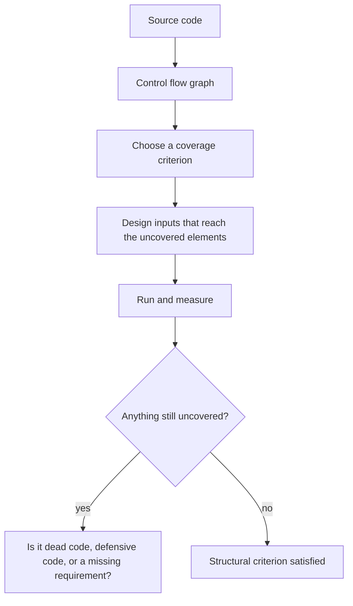
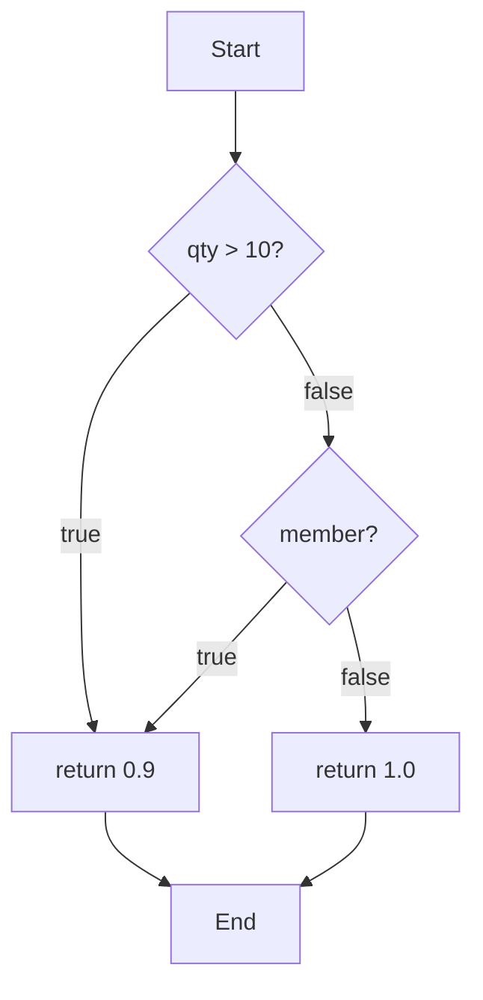

# White Box Testing

**White box testing**, also called structural or glass box testing, derives tests from the
internal structure of the code: its statements, branches, conditions, paths and data flow.
The question it answers is not "does it meet the specification" but "which parts of this
code have never been executed, and why".



The last box is where the value is. Uncovered code is one of three things: unreachable and
deletable, defensive and deliberate, or a real behaviour nobody specified or tested.

## Coverage criteria, weakest to strongest

```python
def discount(qty, member):
    if qty > 10 or member:
        return 0.9
    return 1.0
```

| Criterion | Requirement | Minimum cases here |
|---|---|---|
| **Statement** | Every executable line runs | 2 |
| **Branch (decision)** | Every decision outcome taken at least once | 2 |
| **Condition** | Each atomic condition evaluates both true and false | 2 |
| **Decision/condition** | Both of the above together | 2 |
| **MC/DC** | Each condition shown to independently change the outcome | 3 |
| **Path** | Every executable path through the routine | Explodes with loops |

Two cases, `discount(20, False)` and `discount(1, False)`, give 100% statement and branch
coverage while never once setting `member` to `True`. That is the standard demonstration
that a high percentage is not the same as a strong test.

MC/DC is required for the highest criticality levels in avionics software precisely
because it is the weakest criterion that still forces each condition to matter.

## Control flow and paths



Path coverage is complete but usually unreachable: a loop that may run zero to n times
multiplies the path count by n, and a routine with a few nested branches inside a loop has
more paths than there is time to test. This is the same exhaustiveness wall described in
the [testing principles](../Testing%20Fundamentals/Testing%20Principles.md), one level
down.

## Data flow testing

A second structural family, tracking each variable from definition to use.

| Anomaly | Meaning | Usually indicates |
|---|---|---|
| **Define then define** | Assigned twice with no use between | Dead assignment or a lost update |
| **Use before define** | Read before assignment | Undefined behaviour, null defect |
| **Define then never use** | Computed and discarded | Dead code or a missing use |

Most of this is now caught by compilers and static analysers, which is the cheapest form
of white box checking available and requires no test cases at all.

## Where it belongs

- **Unit level, mostly.** Structure is visible and cheap to steer there.
- **After black box design, not instead of it.** Write cases from the specification, then
  measure coverage, then use white box thinking on what is left.
- **On critical modules.** Payment, authorisation, pricing, safety logic justify branch or
  MC/DC targets. A settings page does not.
- **Paired with [mutation testing](../Testing%20Approaches/Mutation%20Testing.md)** where
  it matters, since coverage proves execution and mutation score proves the assertions can
  actually fail.

The characteristic failure of white box testing used alone: the suite confirms that the
code does what the code does. Missing requirements are structurally invisible, because
code that was never written has no branches to cover.

## Check Your Understanding

<quiz>
A module reports 100% branch coverage. What follows?

- [ ] Every requirement has a corresponding test
- [x] Every decision outcome was executed, which says nothing about missing functionality or about whether assertions checked anything
> Correct. Structural coverage cannot see code that was never written, and cannot judge assertion strength.
- [ ] Every path through the module was executed
- [ ] The module satisfies MC/DC
</quiz>

<quiz>
Why is MC/DC required in safety-critical domains rather than plain branch coverage?

- [ ] It executes more lines of code per test
- [x] It forces each individual condition to be shown independently affecting the outcome, so a condition that never influences the result is exposed
> Correct. Branch coverage can be satisfied while one condition in a compound decision is never exercised in both states.
- [ ] It is the only criterion that detects dead code
- [ ] It guarantees path coverage as a side effect
</quiz>
