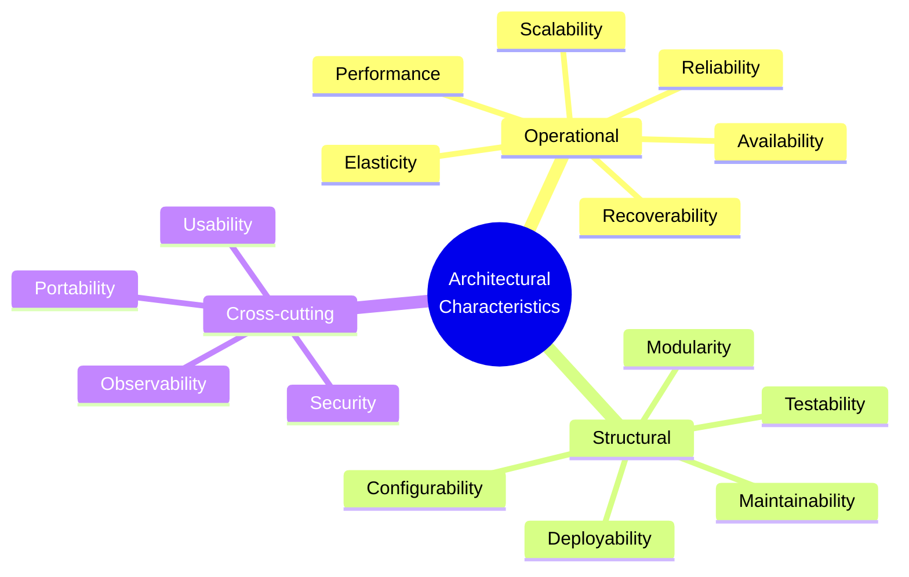

# Architectural Characteristics

An architectural characteristic is a capability the system must have that is **not** a feature: availability, scalability, testability, security, and so on. Features describe *what* the system does; characteristics describe *how well* it must do it. They are also called quality attributes, non-functional requirements, or "the -ilities".

### What makes something an architectural characteristic

A requirement qualifies when all three of these hold:

1. **It is non-domain.** It specifies an operational or design consideration, not a business rule. "Refunds are allowed within 30 days" is a feature; "refund requests must complete in under 500 ms" is a characteristic.
2. **It influences structure.** If the requirement can be met without changing the architecture, it is a coding concern, not an architectural one. Needing elasticity forces stateless services; needing auditability forces an event log.
3. **It is critical or important to success.** Everything is desirable. Only a few things are worth restructuring the system for.

### The three families

- **Operational** characteristics concern the system while it runs, and overlap heavily with operations and DevOps concerns.
- **Structural** characteristics concern the code itself and are felt mainly by the people changing it.
- **Cross-cutting** characteristics fit neither box cleanly but constrain the whole system.

### Characteristics trade against each other

No architecture maximises everything. Every characteristic you push adds cost and usually pulls another one down.

| Push this | And this usually suffers |
| --- | --- |
| Availability (replication) | Consistency, cost |
| Performance (caching, denormalisation) | Consistency, maintainability |
| Scalability (distribution) | Simplicity, debuggability, latency |
| Security (encryption, checks) | Performance, usability |
| Modularity (many services) | Deployability of a change spanning modules, performance |
| Configurability (many knobs) | Testability, understandability |

Because of this, a good architecture is not the one with the most characteristics but the one with the **least worst** set of trade-offs for its context.

### Keep the list short

Teams that name twenty "critical" characteristics have named none. A practical rule: pick at most **seven** driving characteristics, and among those name the top one or two explicitly, because those are the ones that win arguments when two characteristics conflict.

Prefer *implicit* characteristics (security, availability) to be stated anyway, unstated assumptions are the ones that get designed away.

### Make them measurable

A characteristic that cannot be measured cannot be verified, and will be claimed rather than achieved. Turn each one into an objective definition:

- Bad: "the system must be highly available."
- Good: "99.95% successful responses measured monthly per region, excluding scheduled maintenance."
- Bad: "the code must be maintainable."
- Good: "no module has cyclomatic complexity above 15; no cycles between top-level packages."

### Fitness functions

A **fitness function** is any automated check that measures how close the architecture is to a desired characteristic. Examples:

- A load test in CI failing the build when p99 latency exceeds 300 ms.
- A dependency test asserting that the domain package imports nothing from the persistence package.
- A chaos experiment killing an instance and asserting the service stays available.
- A scan failing the build on a dependency with a known critical CVE.

Fitness functions turn characteristics from documentation into continuously verified constraints; this is what keeps the architecture from eroding as the code changes.

### Where they come from

Characteristics are extracted from the domain, not invented by the architect:

| Domain concern | Likely characteristic |
| --- | --- |
| Time to market | Deployability, testability, maintainability |
| Mergers and acquisitions | Interoperability, scalability, portability |
| User satisfaction | Performance, availability, usability |
| Competitive advantage | Elasticity, agility, extensibility |
| Regulatory environment | Security, auditability, recoverability |

## Check Your Understanding

<quiz>
Which requirement is an architectural characteristic rather than a feature?

- [x] "Order status pages must load in under 200 ms for 99% of requests"
> Correct. It is non-domain, measurable, and influences structure (caching, read models, replication).
- [ ] "A customer may cancel an order before it ships"
- [ ] "Admins can export the order list to CSV"
- [ ] "Orders over $1000 require manager approval"
</quiz>

<quiz>
Why do architects limit the number of driving characteristics?

- [x] Because characteristics trade off against each other, so supporting many at once produces a costly design that is good at nothing
> Correct. Each characteristic adds structure and cost, and pushing one usually degrades another, so priorities must be explicit.
- [ ] Because tooling can only measure a few at a time
- [ ] Because each characteristic requires a separate deployment unit
- [ ] Because standards forbid documenting more than seven
</quiz>
